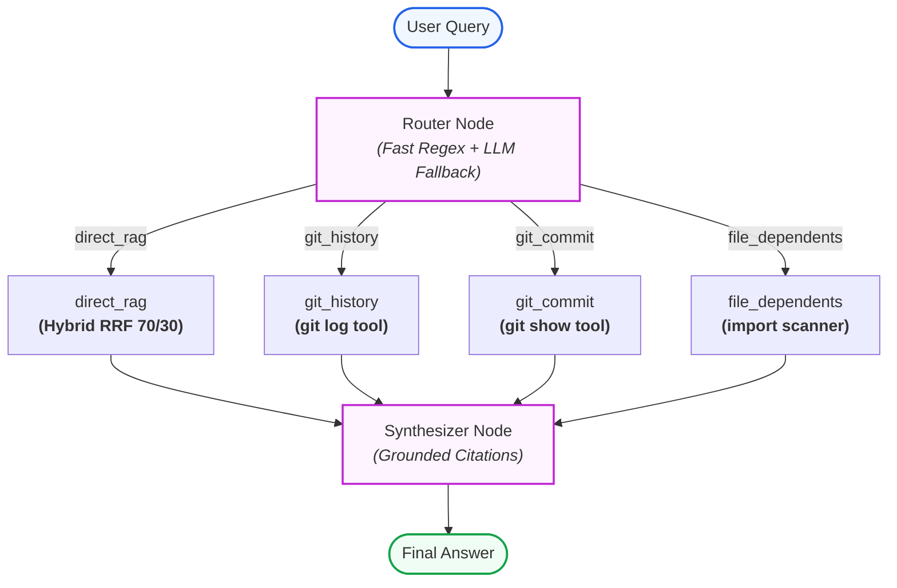

# AEIA — AI Engineering Intelligence Assistant

> A grounded RAG and Agentic code intelligence system for the [Campus Connect](https://github.com/krotrn/campus-connect) codebase (~94k LOC).
> Ask natural-language questions about code, architecture, git history, and dependencies with verified citations.

---

## Features

- **Hybrid Retrieval (V2)**: Combines dense semantic search (BGE-small) with sparse lexical BM25 fused via Weighted Reciprocal Rank Fusion (RRF 70/30).
- **Semantic Prefix Enrichment**: Prepend natural-language contextual headers to raw Docker Compose, SQL migrations, and dotenv files to ensure discoverability.
- **Production Hardening (V3)**: API Key authentication (`X-API-Key`), client rate limiting (`slowapi`), background async ingestion queue, and GitHub Actions CI.
- **Observability (V4)**: Full-lifecycle request tracing with Langfuse across retrieval and LLM generation spans.
- **Agentic Layer (V5)**: Explicit **LangGraph** state machine that routes queries between direct hybrid RAG and non-RAG tools (git commit history, commit diff inspection, reverse module dependency tracking).
- **Model Context Protocol (V6)**: Exposes codebase intelligence as an official **MCP Server** (2026-07-28 stateless HTTP spec) with granular tools (`search_campus_connect`, `explain_codebase_query`, `get_commit_history`, etc.).
- **Graceful Error Resilience & Quota Degradation (V7)**: Centralized exception handling across domain and upstream Gemini API errors (`429 RESOURCE_EXHAUSTED`, `503 SERVICE_UNAVAILABLE`), providing grounded code context fallback even during LLM quota exhaustion.
- **Continuous Knowledge Synchronization**:
  - **Git Pull & Commit Diffing**: Automatically pulls `main` and tracks changed files (`src/ingestion/git_sync.py`).
  - **Incremental Delta-Only Ingestion**: Re-indexes only touched files using deterministic chunk point IDs, eliminating vector DB downtime.
  - **GitHub Webhook (`POST /webhook/github`)**: Cryptographically verified HMAC-SHA256 push listener triggers instant background sync.
  - **Thread-Safe BM25 Hot-Reload**: Build-then-swap pattern ensures concurrent query threads never see incomplete index states during background ingestion.
- **Decoupled Next.js Web Console**: Modern, responsive Next.js 16 / React 19 / Tailwind CSS v4 console (`frontend/`) with real-time SSE streaming, interactive code inspector drawer, client-side Gemini API key injection, quota recovery alerts, and route telemetry.
- **Multi-Format Syntax-Aware Chunking**:
  - **TypeScript/TSX**: Tree-Sitter AST parsing extracting functions, classes, interfaces, and types with JSDoc preservation.
  - **Prisma**: Structural block parsing of complete `model` and `enum` declarations with relational integrity.
  - **YAML / Compose**: Slices Docker Compose and CI workflows by top-level service/job blocks, preserving indentation.
  - **Markdown & SQL**: Preserves heading hierarchy breadcrumbs and complete DDL statements.
- **RAG Triad Generation Evaluation**: Automated LLM-as-a-Judge benchmark (`evals/generation_eval.py`) evaluating **Faithfulness** (hallucination check), **Answer Relevance**, and **Context Precision** across 20 golden test queries.
- **Multi-Turn Conversational Memory**: Sliding-window session management (`src/agent/memory.py`) with greedy coreference query rewriting that resolves pronouns ("that", "its", "those files") before search retrieval.

---

## Quick Start

```bash
# 1. Bring up Qdrant vector database
docker compose up -d qdrant

# 2. Ingest the corpus (initial run builds content-hash cache; re-runs take ~30s)
PYTHONPATH=. uv run python -m src.ingestion.pipeline

# 3. Start the FastAPI backend server (port 8000)
PYTHONPATH=. uv run uvicorn src.api.main:app --reload

# 4. Start the Next.js Web Console (port 3000)
cd frontend && pnpm install && pnpm dev

# 5. Ask a standard code question (Pure RAG via curl)
curl -X POST http://localhost:8000/ask \
  -H "Content-Type: application/json" \
  -H "X-API-Key: dev-key-change-me" \
  -d '{"question": "Where is user authentication implemented?"}'

# 6. Query through the Agentic Layer (LangGraph Router + Tools)
curl -X POST http://localhost:8000/agent/ask \
  -H "Content-Type: application/json" \
  -H "X-API-Key: dev-key-change-me" \
  -d '{"question": "Which files changed in commit 6e19f61?"}'

# 7. Query module dependencies
curl -X POST http://localhost:8000/agent/ask \
  -H "Content-Type: application/json" \
  -H "X-API-Key: dev-key-change-me" \
  -d '{"question": "Which files depend on redis?"}'
```

---

## Retrieval Benchmark

Evaluated on **20 golden test cases** in [`evals/dataset.json`](evals/dataset.json).

| Version | Strategy | Recall@5 | Recall@10 | MRR | Latency |
|---------|----------|----------|-----------|-----|---------|
| **V1** | Dense vector only (BGE-small) | 70.0% | 85.0% | 0.638 | ~43ms |
| V2 — Rerank | Dense + cross-encoder (ms-marco) | 70.0% | 80.0% | 0.455 | 1453ms |
| V2 — Hybrid | Dense + BM25, equal RRF | 75.0% | 75.0% | 0.464 | 43ms |
| V2 — Weighted RRF | Dense (0.7) + BM25 (0.3) | 75.0% | 80.0% | 0.470 | 44ms |
| **V2 Final** ✅ | Weighted RRF + semantic prefixes + file-aware ranking | **100.0%** | **100.0%** | **0.7917** | **46ms** |

> Run benchmark: `uv run python evals/run_eval.py` (or `uv run python evals/run_eval.py --generation`)

### Generation Quality (RAG Triad)

Automated LLM-as-a-Judge evaluation using Gemini as the judge model ([`evals/generation_eval.py`](evals/generation_eval.py)).

| Metric | Score | Description |
|--------|-------|-------------|
| **Faithfulness** | **100%** | All claims grounded in retrieved context (0% hallucination) |
| **Answer Relevance** | **100%** | Answers directly address the user's question |
| **Context Precision** | **100%** | Retrieved chunks are relevant and necessary |
| Hallucination Rate | **0%** | No unsupported claims detected across evaluated queries |

> Evaluated on 2 categories (code_location, config_schema_lookup) with per-category 100% scores.
> Run generation eval: `uv run python evals/generation_eval.py`

### Performance & Cost

| Metric | Value |
|--------|-------|
| P50 Retrieval Latency | ~37ms |
| P95 Retrieval Latency | **<45ms** |
| Time-to-First-Token (TTFT) | **<400ms** (Real-Time SSE Streaming) |
| P50 Generation Latency | ~1.9s |
| P95 Generation Latency | ~2.7s |
| End-to-End (Retrieval + Generation) | ~2.3s avg |
| Embedding Model | BGE-small-en-v1.5 (local, zero-cost) |
| LLM | Gemini 2.0 Flash / 3.6 Flash |
| Vector DB | Qdrant (self-hosted Docker) |
| **Cost per Query** | **\$0.00** (all free-tier components) |

---

## Agentic Architecture (LangGraph)



---

## Project Structure

```
frontend/       Decoupled Next.js 16 Web Console (React 19, Tailwind CSS v4, shadcn/ui, Vitest, Playwright)
src/
  agent/          LangGraph state machine, query router, non-RAG tools, conversational memory
  api/            FastAPI server (POST /ask, POST /ask/stream, POST /agent/ask, POST /ingest, POST /webhook/github, GET /health, /mcp)
  mcp/            Model Context Protocol server (2026-07-28 stateless HTTP spec)
  ingestion/      Chunker, AST chunker, block parsers, git pull syncer, delta-only + full embedding pipelines
  retrieval/      Hybrid retriever (thread-safe BM25 + dense + weighted RRF + file-aware ranking)
  generation/     Gemini-powered grounded answer generator (Chat SDK streaming + unary, custom key support)
  observability/  Langfuse tracing wrapper with spans
  errors.py       Typed domain exception hierarchy
  config.py       Pydantic settings
evals/
  dataset.json    20 golden test cases
  run_eval.py     Recall@5, Recall@10, MRR benchmark suite
  generation_eval.py RAG Triad automated evaluation suite
docs/
  decisions/          31 Architectural Decision Records (ADRs)
  developer-guide/    Complete Onboarding & Codebase Mastery Curriculum
  postmortems/        Documented failure investigation case studies
  DEPLOYMENT_GUIDE.md Free deployment guide (Render / Railway / Fly.io / Vercel)
  RESUME_GUIDE.md     Google XYZ format resume write-up
tests/                16 automated test suites (including test_unified_stream.py)
```

---

## Running Tests

```bash
# Run backend pytest suite
uv run pytest -v

# Run frontend Vitest suite
cd frontend && pnpm test
```

---

## Architectural Decision Records (ADRs)

Key architectural decisions are documented in [`docs/decisions/`](docs/decisions/):

- [0001 — Target Corpus Selection](docs/decisions/0001-target-corpus.md)
- [0002 — Zero-Cost Embedding & Vector DB](docs/decisions/0002-zero-cost-embedding-and-vector-db.md)
- [0003 — LLM Provider: Google Gemini](docs/decisions/0003-llm-provider-gemini.md)
- [0004 — Python Toolchain with uv](docs/decisions/0004-python-toolchain-uv.md)
- [0005 — Code-Aware Chunking Strategy](docs/decisions/0005-code-aware-chunking-strategy.md)
- [0006 — GPU Acceleration for Embeddings](docs/decisions/0006-gpu-acceleration-for-embeddings.md)
- [0007 — Grounded Retrieval and Citations](docs/decisions/0007-grounded-retrieval-and-citations.md)
- [0008 — FastAPI Service Interface](docs/decisions/0008-fastapi-service-interface.md)
- [0009 — Docker Containerization](docs/decisions/0009-docker-containerization.md)
- [0010 — Evaluation Dataset and Benchmark](docs/decisions/0010-evaluation-dataset-and-benchmark.md)
- [0011 — Automated Testing Strategy](docs/decisions/0011-automated-testing-strategy.md)
- [0012 — V2 Hybrid Retrieval & Semantic Prefixing](docs/decisions/0012-v2-hybrid-retrieval-and-semantic-prefixing.md)
- [0013 — V3 Production Hardening](docs/decisions/0013-v3-production-hardening.md)
- [0014 — V4 Observability with Langfuse Tracing](docs/decisions/0014-v4-observability-langfuse-tracing.md)
- [0015 — V5 Agentic Router with LangGraph](docs/decisions/0015-v5-agentic-router-langgraph.md)
- [0016 — V6 Model Context Protocol Server](docs/decisions/0016-v6-model-context-protocol-server.md)
- [0017 — Error Handling & Upstream Degradation](docs/decisions/0017-error-handling-and-upstream-degradation.md)
- [0018 — Thread-Safe BM25 In-Memory Index Hot-Reload](docs/decisions/0018-bm25-thread-safe-hot-reload.md)
- [0019 — Automated Git Synchronization & Diff Tracking](docs/decisions/0019-git-corpus-sync-and-diff-tracking.md)
- [0020 — Incremental Delta-Only Ingestion](docs/decisions/0020-incremental-delta-only-ingestion.md)
- [0021 — GitHub Push Webhook Automation](docs/decisions/0021-github-push-webhook-automation.md)
- [0022 — Interactive Web UI Playground (Superseded by 0028)](docs/decisions/0022-interactive-web-playground-ui.md)
- [0023 — Multi-Format Syntax-Aware Chunking](docs/decisions/0023-multi-format-syntax-aware-chunking.md)
- [0024 — Automated RAG Triad Generation Evaluation](docs/decisions/0024-rag-triad-generation-evaluation.md)
- [0025 — Multi-Turn Conversational Memory](docs/decisions/0025-conversational-memory-and-coreference-rewriter.md)
- [0026 — Real-Time Server-Sent Events (SSE) Token Streaming & Chat SDK Alignment](docs/decisions/0026-real-time-sse-token-streaming-and-chat-sdk.md)
- [0027 — File-Aware Hybrid Retrieval Ranking](docs/decisions/0027-file-aware-hybrid-retrieval-ranking.md)
- [0028 — Decoupled Next.js Frontend Console & Retirement of Static Single-File UI](docs/decisions/0028-decoupled-nextjs-frontend-console.md)
- [0029 — Client-Side Dynamic API Key Injection & LLM Quota Resilience](docs/decisions/0029-client-side-api-key-injection-and-quota-resilience.md)
- [0030 — Unified Server-Sent Events (SSE) Streaming Protocol for RAG & Agentic Routing](docs/decisions/0030-unified-sse-streaming-protocol-for-rag-and-agent.md)
- [0031 — Modernized Python 3.12+ Type Annotation Standard & Ingestion Progress Instrumentation](docs/decisions/0031-codebase-type-modernization-and-ingestion-telemetry.md)

---

## Additional Documentation

- 📦 [**Deployment Guide**](docs/DEPLOYMENT_GUIDE.md) — Deploy AEIA for free on Render, Railway, or Fly.io
- 📝 [**Resume Guide**](docs/RESUME_GUIDE.md) — Google XYZ format project write-up for your resume
