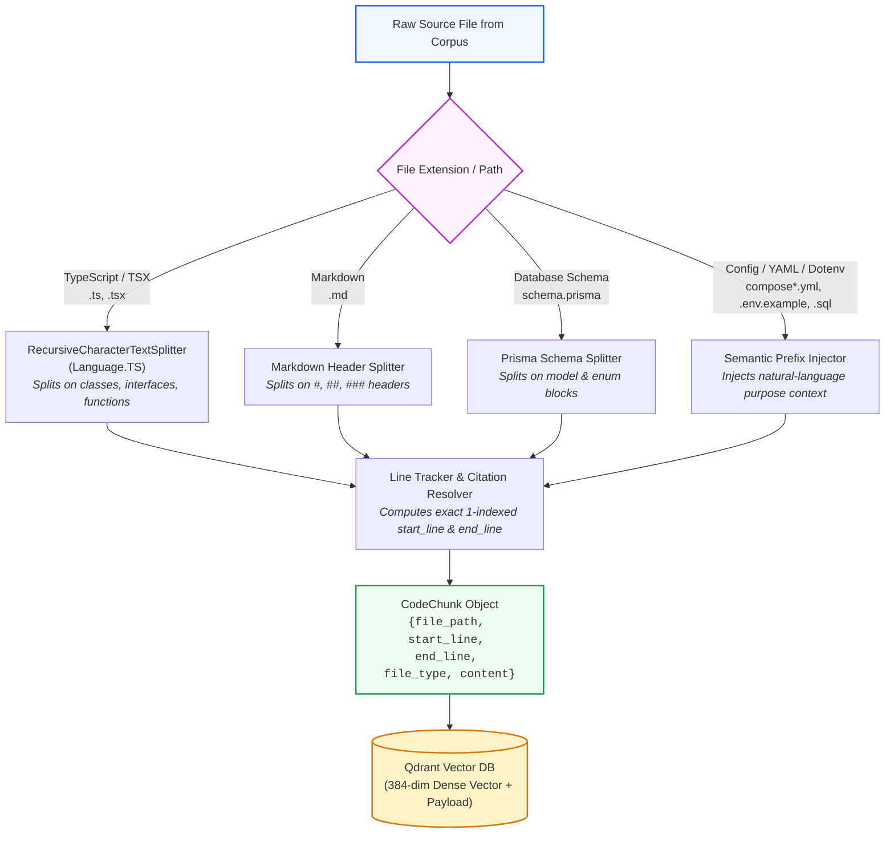

# ADR 0005: Code-Aware Chunking Strategy with Exact Line Citations

## Status
Accepted

## Date
2026-09-02

## Context
Standard RAG pipelines often use naive fixed-size chunking (e.g., 500 characters or 256 tokens with arbitrary overlap). When applied to source code, fixed-size chunking breaks functions in half, separates signatures from docstrings and implementations, and obscures semantic scope. Furthermore, to fulfill PRD Goal #1 and Use Case #2 ("Where is authentication implemented?"), the system must provide exact file and line-range citations (`[src/lib/auth.ts#L12-L45]`) rather than arbitrary character offsets.

## Decision
We implement a multi-strategy, language-aware chunker in `src/ingestion/chunker.py`:
1. **TypeScript / TSX (`.ts`, `.tsx`)**:
   - Use language-aware structural splitting (`RecursiveCharacterTextSplitter.from_language(Language.TS)`) which prioritizes splitting on interface, class, function, and export declarations before falling back to statement or line breaks.
   - Calculate exact 1-indexed `start_line` and `end_line` for each chunk by mapping chunk content back to the original source text.
2. **Markdown Documentation (`.md`)**:
   - Split along markdown headers (`#`, `##`, `###`), preserving section titles in chunk metadata so the LLM understands document hierarchy.
3. **Database Schema (`schema.prisma`)**:
   - Split on model, enum, and generator blocks (`model ... { ... }`).
4. **Configuration (`.json`, `.yml`, `.yaml`, `Dockerfile`)**:
   - Kept intact if under max chunk size (1000 tokens), or split cleanly along top-level keys.
5. **Metadata Schema**:
   Every chunk payload in Qdrant stores:
   - `file_path`: relative path within repo (e.g., `src/lib/auth.ts`)
   - `start_line`: integer
   - `end_line`: integer
   - `file_type`: `code` | `markdown` | `schema` | `config`
   - `chunk_index`: integer

## Consequences
- **Positive**: LLM answers can directly cite precise, clickable line ranges (`file.ts#L20-L45`), fulfilling core PRD requirements.
- **Positive**: Code semantics are preserved without needing a heavy compilation step.
- **Negative**: Language-aware heuristics may occasionally produce variable chunk sizes compared to strict fixed-token windows.

