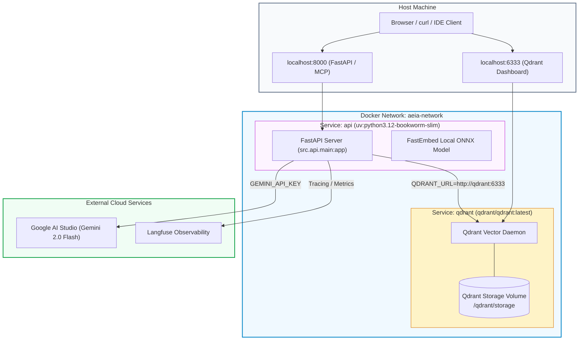

# ADR 0009: Containerization and Multi-Service Topology

## Status
Accepted

## Date
2026-09-03

## Context
PRD Functional Requirement FR1.5 requires the system to be fully Dockerized and run with a single command (`docker compose up`). The application consists of two communicating services:
1. Vector database (`qdrant/qdrant:latest`).
2. AEIA FastAPI backend application.

To keep container build times minimal and images small, the build process should leverage `uv` multi-stage dependency caching.

## Decision
1. **Container Base**: `ghcr.io/astral-sh/uv:python3.12-bookworm-slim`
   - Provides minimal Debian base with pre-installed, high-speed `uv`.
   - Compiles bytecode ahead of time (`UV_COMPILE_BYTECODE=1`).
   - Uses frozen lockfile install (`uv sync --frozen --no-dev`).
2. **Orchestration**: `compose.yml` defines both `qdrant` and `api`:
   - `api` depends on `qdrant` with healthy status.
   - `QDRANT_URL` configured as `http://qdrant:6333` inside the Docker network.
   - Port 8000 mapped to host for external API consumers.

## Consequences
- **Positive**: Entire system (database + AI API) boots in one command on any developer machine or VPS without needing local Python or dependencies.
- **Positive**: Sub-second layer caching during iterative Docker builds.

