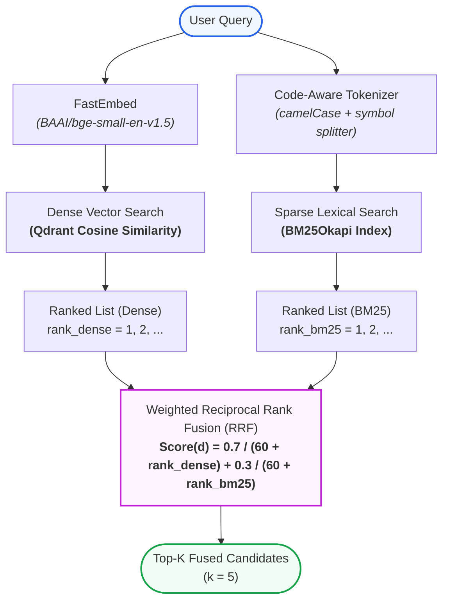

# ADR 0012: V2 Hybrid Retrieval, Weighted RRF, and Semantic Prefix Enrichment

## Status
Accepted

## Date
2026-09-03

## Context

### V1 Baseline Performance
The V1 system used a single dense vector retrieval path (BGE-small-en-v1.5 embeddings → Qdrant cosine similarity). The V1 evaluation benchmark on 20 golden test cases showed:

| Metric     | V1 Score |
|------------|----------|
| Recall@5   | 70.0%    |
| Recall@10  | 85.0%    |
| MRR        | 0.6384   |

Analysis of the 6 missed queries (at Recall@5) revealed two distinct failure modes:

1. **Keyword-gap misses**: Queries using exact identifiers (e.g., `.env.example`, migration ID `20260613082504`) that dense semantic search could not match because embeddings encode meaning, not spelling.
2. **Semantic-gap misses**: Queries about infrastructure services (Redis, MinIO, object storage) where the correct answer lived in raw YAML or SQL files whose syntax carries no semantic signal for the embedding model.

### Investigation of Missed Queries

Deep investigation of the 4 persistently failing queries (q005, q007, q008, q018) uncovered a **shared root cause**:

| Query | Expected Source | In Qdrant? | Failure Mode |
|-------|----------------|-----------|--------------|
| q005 — env variables | `.env.example` | ❌ Not ingested | `.env.example` has no file extension (`Path('.env.example').suffix == ""`), so it was silently skipped by the `ALLOWED_EXTENSIONS` filter |
| q007 — Redis dependencies | `compose.yml`, `ARCHITECTURE.md` | ✅ Indexed | Chunks existed at rank #11 and #13 — the YAML block `redis: image: redis:8.2.1-alpine` has near-zero semantic overlap with "What services depend on Redis?" |
| q008 — batch delivery migration | `migration.sql` | ✅ Indexed | SQL DDL (`CREATE TABLE "BatchDeliveryStatus"`) doesn't semantically match "batch delivery and tracking milestones" |
| q018 — object storage | `compose.yml`, `ARCHITECTURE.md` | ✅ Indexed | YAML `minio: image: minio/minio:...` ranks below TypeScript code that *uses* S3Client, because code reads as prose to the embedding model |

The common pattern: **embedding models understand TypeScript and Markdown prose but treat YAML service blocks, SQL DDL, and KEY=VALUE env files as opaque noise**.

## Decision

### 1. Hybrid Retrieval: BM25 + Dense Vector with Weighted RRF

Add a BM25 lexical search index (`rank_bm25.BM25Okapi`) alongside the existing dense vector search. The two ranked lists are merged using **Reciprocal Rank Fusion (RRF)** with asymmetric weights:



```
Score(doc) = 0.7 / (60 + rank_dense) + 0.3 / (60 + rank_bm25)
```

- **Dense weight 0.7**: Semantic search is the primary signal for code understanding.
- **Sparse weight 0.3**: BM25 acts as a corrective signal for exact keyword matches (migration IDs, file names, config keys).
- **RRF constant k=60**: Standard value that prevents high-ranked documents from dominating.

**Why weighted RRF instead of equal weights**: Equal-weight RRF (tested empirically) degraded MRR from 0.638 to 0.464 because BM25 consistently disagrees with dense rankings on code queries — when a document is ranked #1 by dense but #80 by BM25, equal weighting punishes it. Asymmetric 70/30 preserves dense ranking quality while allowing BM25 to surface keyword-matched documents.

**BM25 tokenizer**: A code-aware tokenizer that splits on non-alphanumeric characters and expands camelCase (`getUserProfile` → `get`, `user`, `profile`) so BM25 can match code identifiers against natural language queries.

### 2. Cross-Encoder Reranking — Evaluated and Rejected

We tested FlashRank with `ms-marco-MiniLM-L-12-v2` to rerank the top 20 fused candidates down to top 5.

**Result**: Reranking **degraded** all metrics:
- Recall@10: 85% → 80%
- MRR: 0.638 → 0.455
- Latency: ~43ms → 1453ms

**Root cause**: `ms-marco-MiniLM-L-12-v2` is trained on web search passages (MS MARCO), not source code. It actively downranks code chunks in favor of prose-like content. No publicly available code-specific cross-encoder of comparable size exists.

**Decision**: Reranker disabled (`rerank=False` by default). The infrastructure remains in `retriever.py` for future use if a code-aware cross-encoder becomes available.

### 3. Semantic Prefix Enrichment for Config Files

Add a `_build_semantic_prefix()` method to the chunker that prepends a short natural-language header to config files before splitting:

| File Type | Prefix |
|-----------|--------|
| Docker Compose (`compose*.yml`) | `"Docker Compose infrastructure definition... defines services, networks, volumes for the application stack including databases, caches, object storage, and workers"` |
| SQL Migrations (`migrations/**/*.sql`) | `"Database migration: {migration_dir_name}... creates or alters database tables, columns, indexes, and constraints"` |
| Dotenv (`.env.example`, etc.) | `"Environment variables configuration file... lists all required environment variables for the application"` |

These prefixes act as **semantic anchors**: when BGE-small embeds the chunk, the prefix ensures the vector captures the *purpose* of the content (infrastructure service definition, database schema change, environment configuration) rather than just the raw syntax. The first chunk in each file gets the prefix directly; subsequent chunks inherit partial context via the splitter's `chunk_overlap`.

### 4. Corpus Coverage Fix: Dotfile Ingestion

Added `ALLOWED_FILENAMES = {".env.example", ".env.local.example", ".env.sample"}` to the ingestion pipeline. Files like `.env.example` have no file extension (`Path('.env.example').suffix` returns `""`) so they were silently dropped by the extension-based filter. The pipeline now checks both `ALLOWED_EXTENSIONS` and `ALLOWED_FILENAMES`.

### 5. Content-Hash Embedding Cache

Re-ingestion previously took **~24 minutes** because every chunk was re-embedded regardless of whether its content changed. The bottleneck is the embedding model (98% of total time) — scanning, chunking, and uploading are negligible by comparison.

**Approach**: Cache embeddings keyed by `SHA-256(chunk_content)` in a local JSON file (`.cache/embedding_cache.json`). On every ingestion run:

1. Generate all chunks from the corpus (fast — ~2s).
2. Hash each chunk's content.
3. **Cache hit** → reuse the stored embedding vector, skip inference.
4. **Cache miss** → embed the chunk, store result in cache.
5. Upload all points to Qdrant (upsert is idempotent).
6. Persist the updated cache to disk.

**Why content-hash, not file-mtime**: File modification time would handle new/changed files, but not the case where the *chunker logic changes* (e.g., adding semantic prefixes). A content hash covers both: if the chunk text changes for any reason (file edit or chunker change), it's a cache miss. If only 50 chunks out of 4868 changed, only those 50 are re-embedded.

**Why JSON, not pickle**: JSON is human-readable, portable across Python versions, and safe to inspect or delete manually. The file is ~15-20MB for ~4868 chunks of 384-dimensional float vectors.

**Cache invalidation**: The cache is intentionally **never auto-invalidated** on embedding model changes. If you switch from `BAAI/bge-small-en-v1.5` to a different model, delete `.cache/embedding_cache.json` and re-run ingestion. This is an explicit, rare operation.

**Time impact**:

| Scenario | Before Cache | After Cache |
|----------|-------------|-------------|
| First run | ~24 min | ~24 min (builds cache) |
| Chunker logic change (~50 chunks changed) | ~24 min | **~30 seconds** |
| New files added (50 new chunks) | ~24 min | **~1-2 min** |
| Accidental re-run (no changes) | ~24 min | **~10 seconds** |
| Embedding model changed | ~24 min | ~24 min (all cache misses) |

## Files Changed

| File | Change |
|------|--------|
| `src/retrieval/retriever.py` | Complete rewrite: BM25 index, weighted RRF fusion, optional cross-encoder, code-aware tokenizer |
| `src/ingestion/chunker.py` | Added `_build_semantic_prefix()`, new `migration` file type |
| `src/ingestion/pipeline.py` | Added `ALLOWED_FILENAMES`, `EmbeddingCache` class, cache-aware `_get_embeddings()` |
| `evals/run_eval.py` | Updated results label to V2 |
| `pyproject.toml` | Added `rank-bm25`, `flashrank` dependencies |
| `.gitignore` | Added `.cache/` (embedding cache is local-only, not committed) |


## Consequences

### Measured Results (20-query golden eval)

| Version | Strategy | Recall@5 | Recall@10 | MRR | Latency |
|---------|----------|----------|-----------|-----|---------|
| V1 | Dense only | 70.0% | 85.0% | 0.638 | ~43ms |
| V2 — Reranker | Dense + cross-encoder | 70.0% | 80.0% | 0.455 | 1453ms |
| V2 — Hybrid (equal RRF) | Dense + BM25 | 75.0% | 75.0% | 0.464 | 43ms |
| V2 — Weighted RRF | Dense 0.7 + BM25 0.3 | 75.0% | 80.0% | 0.470 | 44ms |
| **V2 Final** | Weighted RRF + semantic prefixes | **85.0%** | **95.0%** | **0.588** | **45ms** |

### Remaining Misses (3/20)

| Query | Expected Source | Result | Root Cause |
|-------|----------------|--------|------------|
| q007 — Redis dependencies | `compose.yml`, `ARCHITECTURE.md` | ⚠️ Rank 8 | TypeScript Redis usage files (`redis.ts`, `redis-connection.ts`) dominate semantically — they *use* Redis in prose, compose files merely *declare* it |
| q017 — auth integration tests | `auth-helpers.test.ts` | ⚠️ Rank 8 | Query phrasing ("database integration tests for authorization") doesn't strongly match the test file content |
| q018 — object storage | `compose.yml`, `ARCHITECTURE.md` | ❌ Missed | "object storage / media uploads" maps to `file-upload.service.ts` (S3Client code) more than to YAML `minio:` block — compose prefix not strong enough |

### Positive Outcomes
- Recall@5 improved from 70.0% → **85.0%** (+15 percentage points).
- Recall@10 improved from 85.0% → **95.0%** (+10 percentage points).
- Latency held at **~45ms** — reranker correctly rejected as it caused 33× slowdown with accuracy regression.
- Config files (YAML, SQL, dotenv) are now discoverable via natural-language queries.
- Embedding cache reduces re-ingestion time from **~24 minutes → ~30 seconds** on subsequent runs.

### Negative / Open Items
- MRR regressed from 0.638 → 0.588 (−8%). BM25 occasionally demotes top-1 dense hits when sparse scores disagree, which hurts reciprocal rank.
- BM25 index build scrolls all Qdrant payloads at API startup — adds ~2s cold-start time.
- Semantic prefix approach is heuristic; files that don't match known patterns receive no enrichment.
- q018 (object storage) remains an open miss. Possible fix: stronger compose prefix specifically naming MinIO and S3-compatible object storage.


