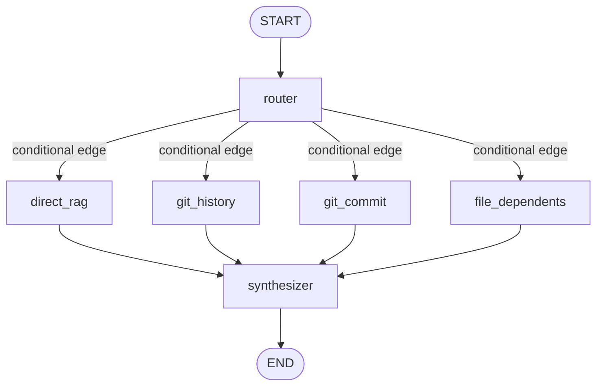

# ADR 0015: V5 Agentic Layer — LangGraph State Machine & Non-RAG Tools

## Status
Accepted

## Date
2026-09-05

## Context

Previous iterations (V1–V4) established a high-performing hybrid RAG engine (85% Recall@5, 95% Recall@10) with production hardening and Langfuse tracing. However, pure vector/lexical retrieval is fundamentally limited when answering questions that require:

1. **Exact Git History Inspection**: e.g., "Which files changed in commit `6e19f61`?" or "Show recent commit history". A vector database stores ingested chunk snapshots, not dynamic commit logs, diffstats, or author metadata.
2. **Reverse Dependency Resolution**: e.g., "Which files depend on `redis` or import `auth.utils`?" Pure semantic embeddings can find files discussing a topic, but cannot guarantee exhaustive enumeration of source code `import` / `require` references.
3. **Multi-Strategy Routing**: Directing queries efficiently so simple code lookups avoid tool overhead, while repository history questions leverage native git operations.

To fulfill PRD FR5.1, FR5.2, and FR5.3, we need an agentic layer structured as an explicit state machine rather than an ad-hoc loop.

## Decision

### 1. Explicit State Machine with LangGraph (FR5.2)

We implement the agentic reasoning layer using **LangGraph** (`langgraph.graph.StateGraph`).

#### State Definition (`AgentState`):
- `question`: User query string.
- `top_k`: Number of chunks if routed to RAG.
- `route`: Active decision branch (`direct_rag`, `git_history`, `git_commit`, `file_dependents`).
- `route_reasoning`: Explanation for why the route was chosen.
- `target`: Extracted entity (e.g. commit hash `6e19f61` or module name `redis`).
- `context_chunks`: Retrieved chunks from vector/BM25 storage.
- `tool_output`: String output from executed repository tool.
- `answer`: Final synthesized answer.
- `sources`: Source citations.
- `steps_taken`: Audit trail of transitions for observability.

#### Graph Topology:

### 2. Dual-Stage Router Node (FR5.1)

The router node employs a two-tier evaluation strategy:
1. **Tier 1 (Deterministic Fast Path)**: Uses regex pattern matching to instantly identify:
   - Specific commit hashes (`[0-9a-fA-F]{6,40}`) with commit keywords (`changed in`, `show`, `diff`).
   - Git log phrases (`git log`, `commit history`, `recent commits`).
   - Dependency inquiries (`what files depend on X`, `which modules import X`).
   Execution time: **< 1ms**, zero API cost.
2. **Tier 2 (LLM Fallback)**: For ambiguous natural language, calls Gemini (`gemini-2.5-flash-lite`) with a strict classification prompt to categorize the query.

### 3. Non-RAG Tools Layer (FR5.3)

We implement safe, read-only tools operating directly on `./corpus/campus-connect`:
- `get_git_commit_history(max_count: int, path: Optional[str])`: Executes `git log` with sanitization to prevent flag injection.
- `get_commit_details(commit_hash: str)`: Validates commit hash format strictly against hexadecimal characters before running `git show --stat --oneline`.
- `find_file_dependents(module_name: str)`: Scans `.ts`, `.tsx`, `.js`, and `.jsx` files in the repository to extract reverse dependencies matching import/require patterns.

### 4. API Endpoints

- **`POST /agent/ask`**: Dedicated endpoint returning full agent inspection metadata (`route`, `route_reasoning`, `tool_output`, `steps_taken`, `sources`, `answer`, `latency_ms`).
- **`POST /ask`**: Preserves 100% backward compatibility for standard RAG, while accepting an optional `use_agent: bool = False` flag to trigger agent routing when requested.

## Files Changed

| File | Change |
|------|--------|
| `pyproject.toml` | Added `langgraph>=1.2.0`, bumped version to `0.3.0` |
| `src/config.py` | Verified default `corpus_path` |
| `src/agent/state.py` | Defined `AgentState` TypedDict |
| `src/agent/tools.py` | Added `get_git_commit_history`, `get_commit_details`, `find_file_dependents` |
| `src/agent/router.py` | Added deterministic regex rules + LLM classification fallback |
| `src/agent/graph.py` | Implemented and compiled LangGraph `StateGraph` |
| `src/agent/__init__.py` | Exported public agent interface |
| `src/api/main.py` | Mounted agent graph in lifespan, added `/agent/ask` and updated `/ask` |
| `tests/test_agent_tools.py` | Unit tests for git and dependency tools |
| `tests/test_agent_router.py` | Unit tests for routing decisions |
| `tests/test_agent_api.py` | Integration tests for `/agent/ask` and `use_agent` flag |

## Consequences

### Positive
- System can answer questions completely inaccessible to pure RAG (historical commits, git diffs, author information, exact reverse dependencies).
- Routing is deterministic and instantaneous for obvious tool queries (<1ms overhead).
- State transitions are recorded in `steps_taken` for end-to-end debugging and auditability.
- Existing pure RAG endpoints and benchmarks remain unaffected.

### Negative / Open Items
- Multi-step loops (e.g. tool execution -> reflection -> secondary tool execution) are deferred to future revisions; the current graph is a directed acyclic graph (DAG) routing between specialized branches.
- Git operations require a local checkout with `.git` intact in the corpus directory.

