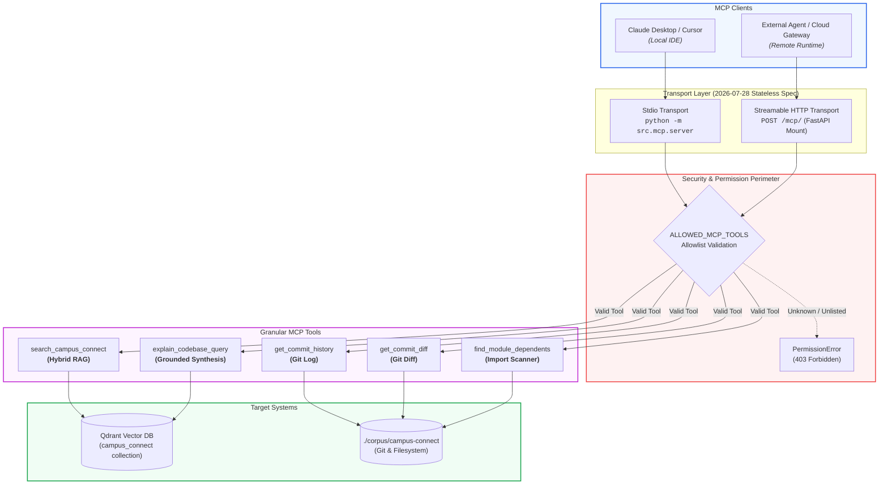

# ADR 0016: V6 Model Context Protocol Server (2026-07-28 Spec)

## Status
Accepted

## Date
2026-09-05

## Context

To fulfill PRD FR6.1 and FR6.2, the AEIA system must expose its codebase intelligence capabilities as a standard **Model Context Protocol (MCP)** server so external agent runtimes, IDEs (Claude Desktop, Cursor, Antigravity), and CI tools can invoke them directly.

In July 2026, the MCP specification introduced major architectural evolutions:
1. **Stateless Protocol Core (2026-07-28 Spec)**: Eliminating mandatory `initialize`/`initialized` handshakes and stateful session headers (`Mcp-Session-Id`). Each request is self-describing via `_meta` envelopes containing client capabilities and protocol versions.
2. **Header-Based Routing**: Streamable HTTP requests must carry `MCP-Protocol-Version: 2026-07-28`, `Mcp-Method: <method>`, and `Mcp-Name: <tool>` (SEP-2243).
3. **Cacheable List Results**: Tool and prompt catalogs include cache hints (`ttlMs` and `cacheScope`) to reduce redundant round trips.
4. **Official Python SDK v2**: The official `mcp` SDK (`modelcontextprotocol/python-sdk` v2) natively implements these 2026-07-28 standards with high-level `MCPServer`.

## Decision

### 1. Official Python SDK v2 Adoption

We adopt the official `mcp>=2.1.0` SDK (`mcp.server.MCPServer`), replacing legacy ad-hoc tool protocols.

### 2. Five Registered MCP Tools (FR6.1)

| Tool Name | Type | Description |
|-----------|------|-------------|
| `search_campus_connect` | Hybrid RAG | Dense vector + BM25 search over corpus returning code chunks with citations |
| `explain_codebase_query` | Grounded Synthesis | End-to-end RAG answering architectural and engineering questions |
| `get_commit_history` | Repository Tool | Recent git commit logs from corpus, optionally filtered by path |
| `get_commit_diff` | Repository Tool | Diffstat and changed files for a specific commit hash |
| `find_module_dependents` | Static Analysis | Reverse dependency search scanning source files that import a given module |

### 3. Explicit Tool Allowlist & Permission Boundary (FR6.2)

To prevent unauthorized or dangerous execution:
- Tools are constrained to the explicit set `ALLOWED_MCP_TOOLS`.
- Any attempt to invoke unlisted tools raises a `PermissionError`.
- All repository tools run strictly within the `./corpus/campus-connect` directory with input validation (e.g. commit hashes validated to alphanumeric characters to eliminate shell injection vulnerabilities).

### 4. Dual Transport Support

1. **Stdio Transport**: Executed locally via `python -m src.mcp.server` for IDE plugins (Claude Desktop, Cursor).
2. **Streamable HTTP Transport (2026-07-28)**: Mounted directly into FastAPI (`POST /mcp/`) via `mcp_server.streamable_http_app()`, enabling horizontal scalability, stateless load balancing, and cloud deployment.



### 5. Client Configuration Guide

#### Claude Desktop (`claude_desktop_config.json`)
```json
{
  "mcpServers": {
    "campus-connect": {
      "command": "uv",
      "args": [
        "--directory",
        "/home/krotrn/coding/aeia",
        "run",
        "python",
        "-m",
        "src.mcp.server"
      ]
    }
  }
}
```

#### Streamable HTTP Client / Gateway
```http
POST /mcp/ HTTP/1.1
Host: localhost:8000
MCP-Protocol-Version: 2026-07-28
Mcp-Method: tools/call
Mcp-Name: search_campus_connect
Content-Type: application/json

{
  "jsonrpc": "2.0",
  "id": 1,
  "method": "tools/call",
  "params": {
    "name": "search_campus_connect",
    "arguments": {"query": "authentication"},
    "_meta": {
      "io.modelcontextprotocol/protocolVersion": "2026-07-28",
      "io.modelcontextprotocol/clientCapabilities": {},
      "io.modelcontextprotocol/clientInfo": {"name": "cursor", "version": "1.0"}
    }
  }
}
```

## Consequences

### Positive
- Full compliance with the latest 2026-07-28 MCP specification.
- Zero-session overhead on HTTP: requests can be routed across round-robin instances without shared session state.
- Single codebase powers both local IDE workflows (stdio) and remote web APIs (HTTP).
- Strict tool allowlisting guarantees safety.

### Negative / Open Items
- Client requests over HTTP must supply the standard `_meta` envelope containing `protocolVersion` and `clientCapabilities` per the 2026-07-28 spec.

