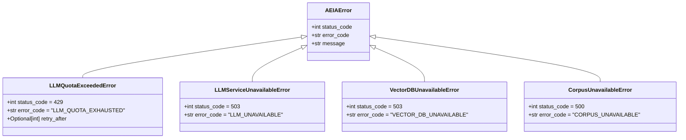

# ADR 0017: Error Handling Hierarchy and Upstream Graceful Degradation

## Status
Accepted

## Date
2026-09-05

## Context

In distributed AI engineering systems, production reliability depends heavily on how external dependencies (cloud LLMs, vector databases, corpus filesystems) and operational failures are handled. 

During testing and free-tier operation, several failure modes were observed:
1. **Upstream LLM Rate Limits and Quota Exhaustion (`429 RESOURCE_EXHAUSTED`)**:
   - Google Gemini free-tier endpoints enforce request limits (e.g. 20 req/day on `gemini-2.5-flash-lite`, or RPM limits on `gemini-3.6-flash`).
   - When quota was reached, previous implementations threw unhandled upstream exceptions resulting in HTTP 500 crashes, dropping retrieved code citations and giving the user zero insight.
2. **Dependent Service Outages (`503 SERVICE_UNAVAILABLE`)**:
   - Outages or connection drops to the vector database (Qdrant on port 6333) or external LLM APIs were not differentiated from internal server logic errors.
3. **Model Decommissioning**:
   - Legacy models (such as `gemini-2.0-flash`) return HTTP 404 deprecation errors and must be systematically migrated to supported endpoints (`gemini-3.6-flash`).

## Decision

### 1. Custom Domain Exception Hierarchy (`src/errors.py`)

We established an explicit domain exception hierarchy rooted in `AEIAError`:

### 2. Dual-Layer LLM Handling: Graceful Degradation & Quota Propagation

In `src/generation/generator.py`:
- **Model Fallback Chain**: Queries first target `gemini-3.6-flash`. If unreachable or rate limited, candidate models are attempted.
- **Graceful Context Degradation**: If all LLM candidates encounter quota exhaustion (`429 RESOURCE_EXHAUSTED`), the generator does **not** fail the request. Instead, it extracts the exact retrieved code context chunks, formats a warning banner (`⚠️ Upstream AI Quota Exceeded (HTTP 429)`), and presents the grounded source citations (`[filepath#Lstart-Lend]`) directly to the engineer.
- **Configurable `raise_on_quota` Option**: When strict API semantics are required, `raise_on_quota=True` raises `LLMQuotaExceededError`.

### 3. FastAPI Exception Handlers (`src/api/main.py`)

We registered centralized exception handlers for FastAPI:
- **`@app.exception_handler(AEIAError)`**: Maps all domain exceptions directly to structured JSON responses containing `error`, `message`, and `detail`. For `LLMQuotaExceededError`, it populates the standard HTTP `Retry-After` response header.
- **`@app.exception_handler(APIError)`**: Catches upstream `google.genai.errors.APIError`:
  - `code == 429` or `"RESOURCE_EXHAUSTED"` maps to `HTTP 429 Too Many Requests` (`LLM_QUOTA_EXHAUSTED`).
  - `code in (502, 503, 504)` maps to `HTTP 503 Service Unavailable` (`LLM_SERVICE_UNAVAILABLE`).
  - Other upstream codes map to `HTTP 502 Bad Gateway` (`LLM_GATEWAY_ERROR`).
- **Endpoint Resilience**: `/ask`, `/agent/ask`, and `/health` now safely re-raise domain and API errors to ensure registered exception handlers format consistent client responses. `/health` returns HTTP 503 when Qdrant is unreachable.

### 4. Vector Database Outage Isolation (`src/retrieval/retriever.py`)

Both dense vector search (`_retrieve_dense`) and BM25 corpus scrolling (`_scroll_all_payloads`) wrap Qdrant client interactions in structured error handling, converting raw network socket or protocol failures into `VectorDBUnavailableError`.

## Consequences

### Positive
- **No Unhandled 500 Crashes**: Upstream rate limits, quota exhaustion, or vector DB disconnects return clean, typed HTTP errors (429, 502, 503) with actionable JSON bodies.
- **High Utility Under Degraded Conditions**: Engineers querying the system during upstream LLM outages still receive relevant, verified code citations and snippets retrieved by the local dense+sparse RAG pipeline.
- **Clear Cloud-Native Health Checking**: Infrastructure load balancers inspecting `/health` accurately detect database outages via HTTP 503.
- **Test Coverage**: Verified with dedicated unit tests in `tests/test_error_handling.py` covering mock quota exhaustion, vector DB failures, and upstream API error translation.

### Trade-Offs
- LLM graceful degradation returns context snippets rather than an AI-synthesized summary; however, grounded code chunks provide immediate engineering value without hallucination.

