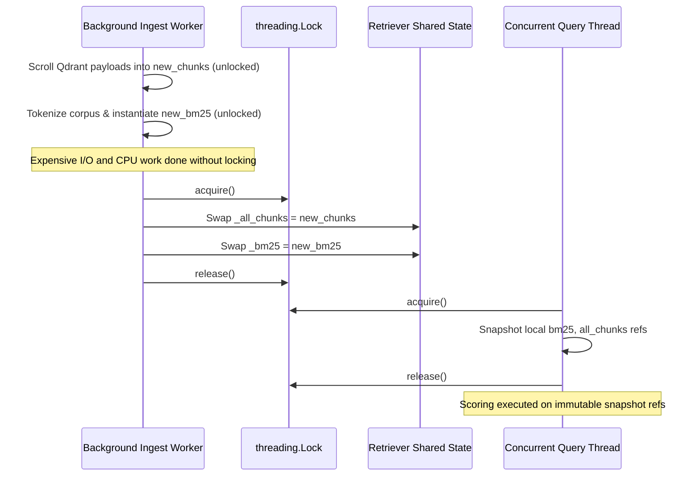

# ADR 0018: Thread-Safe BM25 In-Memory Index Hot-Reload

## Status
Accepted

## Date
2026-09-06

## Context

In AEIA V2, hybrid retrieval was introduced combining Qdrant dense vector search with rank-bm25 sparse keyword search via Reciprocal Rank Fusion (RRF 70/30). The BM25 index is held in-memory (`self._bm25`) alongside cached chunk metadata (`self._all_chunks`).

When background ingestion or corpus updates completed, `Retriever.reload_bm25()` was called to rebuild the index from Qdrant payloads. However, this process mutated `self._all_chunks` and `self._bm25` sequentially in-place without synchronization:

```python
# Unsynchronized reload
self._all_chunks = self._scroll_all_payloads()
tokenized = [self._tokenize(c["content"]) for c in self._all_chunks]
self._bm25 = BM25Okapi(tokenized)
```

In a concurrent multi-threaded environment (e.g. FastAPI worker serving incoming `/ask` or `/agent/ask` requests while background ingestion runs), this created race conditions:
1. **Index-Payload Mismatch**: A concurrent `_retrieve_bm25` invocation could score queries using the newly loaded `_bm25` instance while indexing into stale `_all_chunks` (or vice-versa), causing `IndexError` or associating scores with wrong files.
2. **Read-During-Construction Null Reference**: If a query arrived while `_bm25` was being instantiated, it could access an incomplete object.
3. **Lock Contention**: Holding a coarse lock over the entire scrolling and tokenization sequence (thousands of chunks) would block all incoming retrieval requests for seconds.

## Decision

We implemented an **atomic build-then-swap pattern** guarded by a `threading.Lock` in `src/retrieval/retriever.py`:



### 1. Build-Then-Swap Pattern (`Retriever.reload_bm25`)
Expensive I/O (scrolling Qdrant payloads) and CPU-bound tokenization run purely on local variables without holding any lock. The lock is only held during the instantaneous pointer swap of `self._all_chunks` and `self._bm25`.

```python
def reload_bm25(self):
    new_chunks: List[dict] = self._scroll_all_payloads()
    tokenized = [self._tokenize(c["content"]) for c in new_chunks]
    new_bm25 = BM25Okapi(tokenized)

    with self._bm25_lock:
        self._all_chunks = new_chunks
        self._bm25 = new_bm25
```

### 2. Snapshot Acquisition in Query Threads (`Retriever._retrieve_bm25`)
Concurrent reader threads acquire the lock only long enough to snapshot references to `(bm25, all_chunks)`:

```python
def _retrieve_bm25(self, query: str, top_k: int) -> List[RetrievedChunk]:
    tokens = self._tokenize(query)

    with self._bm25_lock:
        bm25 = self._bm25
        all_chunks = self._all_chunks

    scores = bm25.get_scores(tokens)
    ...
```

Even if a swap occurs immediately after the reader releases the lock, the reader operates on an internally consistent, immutable pair of `(bm25, all_chunks)` until the request finishes.

## Consequences

### Positive
- **Zero Request Blocking**: Incoming search queries are never blocked while thousands of points are scrolled from Qdrant and tokenized.
- **Consistency Guarantee**: `scores = bm25.get_scores()` and `payload = all_chunks[idx]` always refer to the identical corpus snapshot.
- **Thread Safety**: Verified through multi-threaded unit tests (`test_bm25_reload_thread_safety`) executing concurrent reloads and retrievals across threads without race conditions or exceptions.

### Trade-Offs
- Brief memory duplication while `new_chunks` and `new_bm25` are built before the old instances are garbage collected. Given the corpus scale (~4,800 chunks, ~15MB memory), this overhead is negligible.

