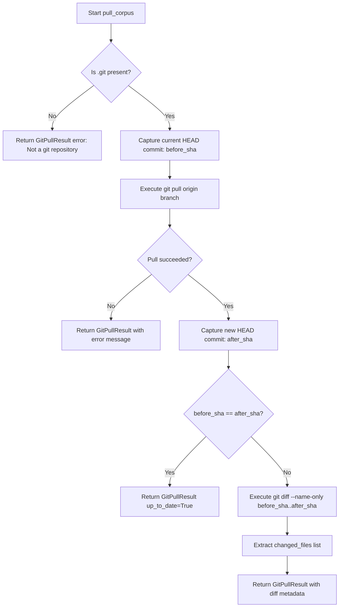

# ADR 0019: Automated Git Synchronization and Diff Tracking

## Status
Accepted

## Date
2026-09-06

## Context

In production environments, the target codebase repository (`corpus/campus-connect`) evolves continuously as developers push new commits, pull requests, and merges to the remote GitHub repository.

Previously:
- AEIA had no mechanism to synchronize new commits from the remote repository.
- Triggering `/ingest` merely scanned whatever static files were currently present on the host disk.
- If upstream developers pushed fixes or new architectural features, an engineer had to manually SSH into the host machine, execute `git pull`, and then trigger `/ingest`.
- Even after doing so, the system could not tell *which* files had changed between the previous and current state, forcing an expensive full re-scan of the entire repository.

## Decision

We designed and implemented a dedicated Git synchronization layer in `src/ingestion/git_sync.py` to automate remote pulls and identify changed file sets.



### 1. `GitPullResult` Data Transfer Object

```python
@dataclass
class GitPullResult:
    before_sha: str
    after_sha: str
    changed_files: List[str] = field(default_factory=list)
    up_to_date: bool = False
    error: str = ""
```

### 2. Isolated `_run_git` Execution
Git commands run via `subprocess.run` with:
- Dedicated working directory (`cwd=corpus_path`)
- Output capture (`capture_output=True, text=True`)
- Standard 120-second timeout preventing hung network calls.

### 3. Commit Delta Resolution
Instead of relying on file modification timestamps (which are unreliable across git checkouts and container mounts), we resolve exact cryptographic commit ranges:
```bash
git diff --name-only <before_sha>..<after_sha>
```
This produces a precise list of relative file paths (created, modified, or deleted) between revisions.

## Consequences

### Positive
- **Automated Upstream Sync**: The assistant can pull upstream updates without host-level manual interventions.
- **Precision Change Set**: Provides the exact list of modified files necessary for downstream delta-only indexing.
- **Idempotency**: If the corpus is already at the latest revision, `up_to_date=True` immediately short-circuits the pipeline, avoiding unnecessary compute and embedding calls.
- **Testability**: Verified with mock subprocess tests in `tests/test_incremental_ingestion.py` covering successful fast-forwards, already up-to-date repositories, and non-git directory error cases.

### Trade-Offs
- Network dependency on the remote git host (e.g. GitHub); failures return explicit error strings rather than crashing the API process.

