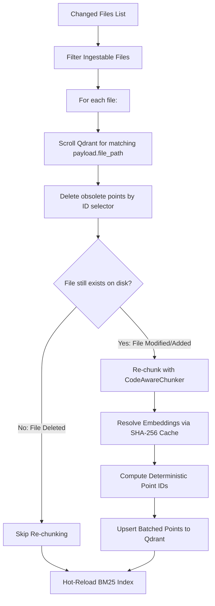

# ADR 0020: Incremental Delta-Only Ingestion with Deterministic Point IDs

## Status
Accepted

## Date
2026-09-06

## Context

In AEIA V1–V3, ingestion was implemented as a monolithic, all-or-nothing pipeline:
`IngestionPipeline.run(recreate=True)`:
1. Dropped the entire Qdrant vector collection (`collection_name="campus_connect"`).
2. Re-scanned all ~4,800 chunks across hundreds of source files.
3. Computed embeddings for all chunks (or resolved them from the on-disk SHA-256 cache).
4. Upserted all ~4,800 points sequentially using sequential integer IDs (`point_id = 0, 1, 2, ...`).

### Key Pain Points of Recreate-All Ingestion
1. **Service Downtime / Retrieval Blackouts**: While `recreate=True` was running, the vector collection was deleted or partially populated. Any concurrent user queries during this multi-minute window failed with missing vector data.
2. **Excessive I/O & Upsert Overhead**: Even when a developer pushed a 1-line change to a single file, all 4,872 points were re-upserted into Qdrant.
3. **Sequential Point ID Collisions**: Because point IDs were simple integers (`0, 1, ...`), updating a single file without dropping the collection would overwrite unrelated points or orphan obsolete chunks at higher indices.

## Decision

We designed and implemented **Incremental (Delta-Only) Ingestion** in `src/ingestion/pipeline.py` based on deterministic point hashing and filtered payload deletions.



### 1. Deterministic Point ID Generation
To ensure idempotent updates, point IDs are computed from a SHA-256 hash of the chunk's logical address: `(file_path, chunk_index)`:

```python
def _point_id(file_path: str, chunk_index: int) -> int:
    """Deterministic Qdrant point ID from (file_path, chunk_index)."""
    raw = hashlib.sha256(f"{file_path}::{chunk_index}".encode()).hexdigest()
    # 60-bit unsigned int for Qdrant compatibility
    return int(raw[:15], 16)
```

This guarantees that re-indexing the same chunk index of the same file produces the exact same Qdrant point ID without collisions across different files.

### 2. File-Scoped Point Deletion (`_delete_points_for_file`)
Before re-indexing a modified file (or when a file is deleted from git), all existing points tagged with `file_path == rel_path` in Qdrant are queried via payload scroll and removed:

```python
records, next_offset = self.client.scroll(
    collection_name=settings.collection_name,
    scroll_filter=Filter(
        must=[FieldCondition(key="file_path", match=MatchValue(value=rel_path))]
    ),
    limit=256,
    offset=next_offset,
    with_payload=False,
    with_vectors=False,
)
```

If a file was deleted upstream, its chunks are cleanly expunged from the vector index without touching any other points.

### 3. Delta-Only Execution (`run_incremental`)
- Preserves the existing collection (`recreate=False`), maintaining 100% search availability during ingestion.
- Only re-chunks and re-embeds the specific files present in `changed_files`.
- Leverages the existing `EmbeddingCache` for unchanged chunks within edited files.
- Triggers `retriever.reload_bm25()` upon completion to refresh sparse search indices.

## Consequences

### Positive
- **Zero Search Downtime**: Ingestion runs incrementally against the active collection without dropping or recreating it.
- **Order-of-Magnitude Speedup**: Updating 1-2 changed files takes <1 second compared to 30-40 seconds for full re-indexing.
- **Clean Point Lifecycle**: Adding, updating, or deleting files in git maintains exact 1:1 parity with Qdrant points.
- **Backward Compatible**: The full `run(recreate=True)` method remains available for complete initial cold-starts.

### Trade-Offs
- Requires scrolling Qdrant point IDs by payload filter prior to deletion. Since Qdrant indexes payload fields efficiently and files have small numbers of chunks (~5-20), scrolling latency is measured in milliseconds.

