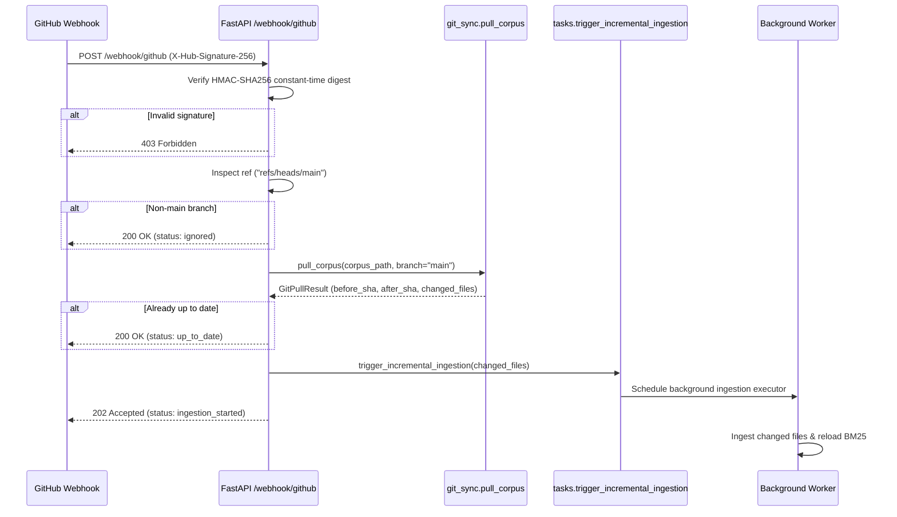

# ADR 0021: GitHub Push Webhook Automation with HMAC-SHA256 Authentication

## Status
Accepted

## Date
2026-09-06

## Context

With automated git pulling (`src/ingestion/git_sync.py`) and incremental delta indexing (`src/ingestion/pipeline.py`), AEIA possessed the components to update its knowledge base efficiently. However, triggering this process still required an explicit API call to the server.

To achieve complete automation, whenever a software engineer pushes code or merges a pull request into the `main` branch of the target GitHub repository (`campus-connect`), AEIA should automatically:
1. Receive and verify the push notification from GitHub.
2. Synchronize the local repository state.
3. Incrementally update the vector and sparse search indices in the background.

Security and resilience considerations:
- Webhook endpoints are public on the internet and must be hardened against spoofed or unauthorized requests.
- Pushes to branches other than `main` (e.g. experimental feature branches) must not trigger ingestion.
- Timeouts must be prevented by immediately acknowledging valid webhook payloads while offloading ingestion to background executors.

## Decision

We designed and implemented a dedicated webhook endpoint `POST /webhook/github` in `src/api/webhook.py` and registered it in `src/api/main.py`.



### 1. Cryptographic Authentication (`verify_github_signature`)
We implemented GitHub's standard HMAC-SHA256 signature verification:
- Secret configured via `settings.github_webhook_secret`.
- Recomputes HMAC over the raw request bytes:
  ```python
  expected = hmac.new(secret.encode("utf-8"), payload_body, hashlib.sha256).hexdigest()
  ```
- Evaluated using constant-time comparison `hmac.compare_digest(expected, received)` to prevent timing side-channel attacks.
- Rejects requests with missing or invalid signatures with `403 Forbidden`.

### 2. Branch Filtering
Inspects the payload's `ref` field. Only pushes matching `refs/heads/main` trigger ingestion. Feature branch pushes return `200 OK` with `{"status": "ignored"}` to prevent index contamination.

### 3. Asynchronous Non-Blocking Execution
- `pull_corpus` runs synchronously to obtain the exact diff.
- `trigger_incremental_ingestion` dispatches `run_incremental(changed_files)` to `asyncio.run_in_executor`.
- Returns `202 Accepted` immediately with commit metadata (`before_sha`, `after_sha`, `changed_files`), preventing GitHub webhook delivery timeouts (which occur at 10 seconds).

## Consequences

### Positive
- **Fully Autonomous Knowledge Pipeline**: When developers push to `campus-connect`, the assistant updates its knowledge base in real-time without developer intervention.
- **Enterprise Security**: Standard GitHub HMAC-SHA256 signature verification ensures that only authentic GitHub servers can trigger indexing.
- **No Webhook Timeouts**: Background task delegation ensures immediate `202 Accepted` HTTP responses well within GitHub's 10-second webhook deadline.
- **Comprehensive Test Coverage**: Tested with valid and invalid HMAC signatures, non-main branch filters, and up-to-date short circuits in `tests/test_incremental_ingestion.py`.

### Trade-Offs
- Requires configuring the `GITHUB_WEBHOOK_SECRET` environment variable in deployment settings.

