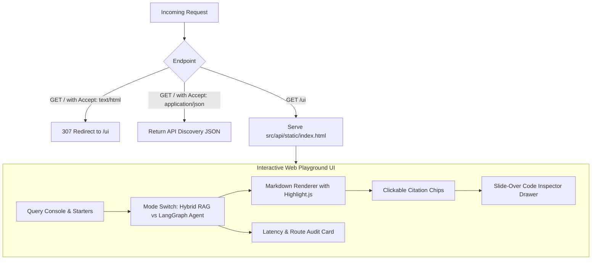

# ADR 0022: Interactive Web UI Playground & Visual Citation Inspector

## Status
Superseded by [ADR 0028](0028-decoupled-nextjs-frontend-console.md) (The single-file HTML playground was retired in favor of a modern, decoupled Next.js console in `frontend/`)

## Date
2026-09-06

## Context

Prior to this decision, AEIA exposed its capabilities strictly through machine-to-machine interfaces:
- FastAPI HTTP JSON endpoints (`POST /ask`, `POST /agent/ask`)
- Model Context Protocol (MCP) server endpoints (`/mcp`)
- Command-line evaluation scripts (`evals/run_eval.py`)

While effective for automated testing and IDE tool integrations, this created several key limitations for user evaluation, recruiter showcases, and developer debugging:
1. **High Friction for Demos**: Prospective users, hiring managers, and recruiters cannot easily interact with a curl command or raw JSON response.
2. **Citation Verification Invisibility**: Grounded citations (`[src/auth.ts#L42-L80]`) were returned as text strings in JSON payloads. Inspecting whether the retrieved code snippet actually justified the LLM's claims required manually opening an IDE and navigating to the specific line numbers.
3. **No Direct Comparison Between Execution Modes**: Testing whether a query should run via "Direct Hybrid RAG" or "LangGraph Agent Router" required switching curl endpoints and manually inspecting JSON fields.

## Decision

We designed and built a zero-dependency, single-page application (SPA) served directly by FastAPI at `GET /ui` and implemented content-negotiated redirection on the root endpoint `GET /`.



### 1. Architecture of the Playground (`src/api/static/index.html`)
- **Zero-Build Dependency Stack**: Uses Tailwind CSS, Marked.js, and Highlight.js loaded via CDN. No Node.js build step or complex frontend bundlers required.
- **Execution Mode Toggle**: Seamlessly switches between `POST /ask` (Direct Hybrid 70/30 RRF) and `POST /agent/ask` (LangGraph state machine router).
- **Interactive Visual Citation Inspector**:
  - Each returned source citation is rendered as an interactive chip showing its index and file coordinates.
  - Clicking any citation chip opens a modal drawer displaying the exact retrieved code chunk with syntax highlighting, line range, and RRF relevance score.
- **Real-Time Telemetry Bar**: Surfaces routing decisions, end-to-end latency breakdown, model name (`gemini-3.6-flash`), and number of retrieved context chunks.
- **Persistent Key Storage**: Stores the `X-API-Key` in browser `localStorage` with password masking.

### 2. Content-Negotiated Root Redirection (`src/api/main.py`)
To preserve 100% backward compatibility for existing API clients and automated tests:
```python
@app.get("/", tags=["General"])
async def root(request: Request):
    accept = request.headers.get("accept", "")
    if "text/html" in accept:
        return RedirectResponse(url="/ui", status_code=status.HTTP_307_TEMPORARY_REDIRECT)
    return {
        "message": "AI Engineering Intelligence Assistant is running",
        "docs_url": "/docs",
        "health_url": "/health",
        "ui_url": "/ui",
    }
```
Browsers visiting `http://localhost:8000/` automatically redirect to the visual playground, while curl, integration tests, and programmatic clients receive the discovery JSON object.

## Consequences

### Positive
- **Instant Visual Demonstrability**: Recruiters and engineers can open `http://localhost:8000/ui` in any browser to query the repository with zero setup.
- **Transparent Grounding**: The code inspector drawer makes hallucination verification immediate by juxtaposing synthesized answers with raw retrieved code blocks.
- **Backward Compatibility**: Automated API consumers, curl scripts, and existing test suites continue to receive JSON responses.
- **Automated Test Coverage**: Verified with dedicated tests in `tests/test_ui.py` covering HTML delivery, browser redirect negotiation, and API client JSON responses.

### Trade-Offs
- Relies on CDN-hosted frontend assets (Tailwind, Marked, Highlight.js); in air-gapped environments without internet access, these assets would need to be vendored into the static assets directory.

