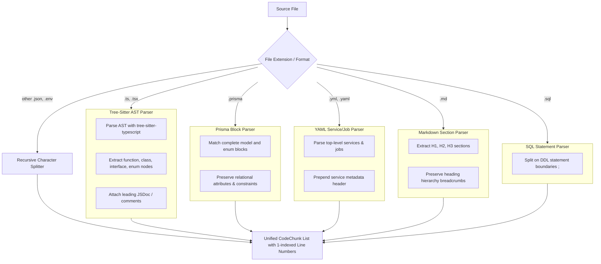

# ADR 0023: Multi-Format Syntax-Aware Chunking (Tree-Sitter AST & Structural Block Parsers)

## Status
Accepted

## Date
2026-09-06

## Context

In AEIA V1–V3, chunking was performed using LangChain's `RecursiveCharacterTextSplitter`. While character splitters with language separators are standard in prototype RAG systems, they suffer from severe failure modes when applied to complex full-stack repositories like `campus-connect` (~94k LOC):

1. **Broken TypeScript/TSX Functions & Classes**: Character count windows cut functions, interfaces, and classes in half mid-statement. For example, a 50-line authentication method could have its parameter signature in Chunk 1 and its authorization check in Chunk 2.
2. **Broken YAML Indentation & Lost Service Identity**: In Docker Compose (`compose.yml`) and CI workflows, character splitting slices through indented blocks. An environment block or port mapping cut from its parent service header leaves the embedding model with no context about *which* service is being configured.
3. **Halved Prisma Models & Lost Relational Context**: Splitting a `model User { ... }` across chunks separated relations (`posts Post[]`, `account Account?`) from the model identifier, degrading schema retrieval.
4. **Severed SQL DDL Migrations**: Splitting multi-line `CREATE TABLE` or `ALTER TABLE` statements created syntactically invalid SQL fragments.
5. **Loss of Markdown Document Breadcrumbs**: Sub-headings (`### How it works`) had no reference to their parent section (`# Architecture > ## Batch & Climb`), impairing contextual search.

## Decision

We designed and implemented a **Multi-Format Syntax-Aware Chunking Architecture** where each file type is processed by its native structural parser rather than a character-count window:

### 1. TypeScript & TSX AST Chunking (`src/ingestion/ast_chunker.py`)
- Uses `tree-sitter==0.26.0` and `tree-sitter-typescript==0.23.2`.
- Traverses AST root nodes identifying top-level declarations: `function_declaration`, `class_declaration`, `interface_declaration`, `type_alias_declaration`, `enum_declaration`, and exported lexical statements.
- **Leading Comment / JSDoc Preservation**: Directly attaches preceding docstrings or comment blocks to the declaration chunk, ensuring lines start at the comment header (line 1) and full documentation context is indexed alongside the signature.
- **Bundling Small Declarations**: Small adjacent statements (e.g. imports or short constants) below `min_chunk_chars` (80 chars) are bundled into a cohesive header chunk to prevent micro-chunk fragmentation.

### 2. Structural Block Parsers (`src/ingestion/block_parsers.py`)
- **`PrismaBlockParser`**: Captures complete `model <Name> { ... }`, `enum <Name> { ... }`, `datasource`, and `generator` blocks. Models and foreign-key relations are guaranteed to remain intact in a single chunk.
- **`YamlBlockParser`**: Chunks YAML files by top-level keys; for Docker Compose, each service (`services.db`, `services.redis`) is chunked as an atomic unit with an injected metadata header (`# Service: <name> in <rel_path>`), preserving indentation and service context.
- **`MarkdownSectionParser`**: Slices Markdown documents along `#`, `##`, and `###` heading boundaries, keeping complete explanatory paragraphs with their defining title.
- **`SqlStatementParser`**: Identifies statement boundaries ending in `;`, preserving entire `CREATE TABLE`, `CREATE INDEX`, or `ALTER TABLE` DDL operations.

### 3. Unified Dispatcher (`src/ingestion/chunker.py`)
`CodeAwareChunker.chunk_file()` delegates to the appropriate structural parser based on extension, maintaining exact 1-indexed `start_line` and `end_line` coordinates, with the legacy recursive splitter retained as a fallback for malformed or unknown files.

## Consequences

### Positive
- **Complete Syntactic Integrity**: No function, class, SQL migration, or Prisma model is severed mid-statement across chunk boundaries.
- **Improved Retrieval Quality**: Dense embeddings capture the full semantics of entire declarations rather than arbitrary 800-character slices.
- **Preserved YAML Indentation**: Docker Compose and CI configs remain syntactically valid and human-readable.
- **Sub-Millisecond Parsing**: Tree-sitter and regex block parsers process typical files in under 2ms.
- **Comprehensive Test Coverage**: Tested in `tests/test_syntax_chunkers.py` across TypeScript, TSX, Prisma, YAML, Markdown, and SQL, with all 64 project tests passing.

### Trade-Offs
- Tree-Sitter requires compiling native C parser libraries (handled automatically via wheels by `uv`).

