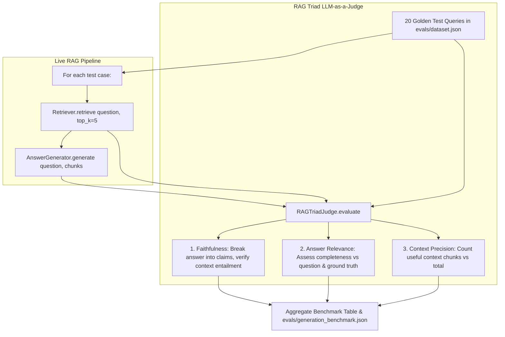

# ADR 0024: Automated RAG Triad Generation Evaluation Suite (Faithfulness, Relevance, Context Precision)

## Status
Accepted

## Date
2026-09-06

## Context

In AEIA V1–V3, evaluation was limited to retrieval metrics (documented in [ADR 0010](0010-evaluation-dataset-and-benchmark.md)): Recall@5, Recall@10, and Mean Reciprocal Rank (MRR) calculated by comparing retrieved file names with ground-truth sources in `evals/dataset.json`.

While high recall (95% Recall@10) proves that relevant code chunks reach the LLM prompt, it does not guarantee that:
1. **The synthesized answer is grounded**: The model could still hallucinate methods, invent flags, or fabricate security claims not present in the retrieved chunks.
2. **The answer directly addresses the prompt**: The model could generate verbose, evasive, or partially off-topic responses.
3. **The retrieved context was actually used**: The prompt could be polluted with noisy distractor chunks.

Evaluating LLM generation with traditional NLP metrics (BLEU, ROUGE) fails for code intelligence because technical explanations are paraphrased with synonyms and varying code formatting.

Third-party evaluation frameworks (e.g. Ragas, DeepEval) introduce over 25 heavy dependencies (OpenAI client, Pandas, PyArrow, Scipy, SQLAlchemy) with severe binary compatibility conflicts on modern Python runtimes (Python 3.14).

## Decision

We designed and implemented a native, dependency-light **RAG Triad LLM-as-a-Judge Evaluation Harness** in `evals/generation_eval.py` using Google Gemini (`gemini-3.6-flash`):



### 1. The RAG Triad Dimensions

1. **Faithfulness (Groundedness / Hallucination Detection)**:
   - The judge decomposes the synthesized answer into atomic factual statements.
   - For each statement, the judge verifies if it is strictly entailed by the text in the retrieved chunks.
   - Any claim citing a file, parameter, or configuration not in the context is flagged as unsupported.
   - $$\text{Faithfulness Score} = \frac{\text{Supported Claims}}{\text{Total Claims}}$$
   - $\text{Hallucination Rate} = 1.0 - \text{Faithfulness}$.

2. **Answer Relevance**:
   - The judge rates ($0.0 - 1.0$) how directly, concisely, and completely the answer answers the user's question, compared against the reference summary in `dataset.json`.

3. **Context Precision**:
   - The judge identifies which specific chunk indices ($1 \dots K$) provided necessary signal to answer the question.
   - $$\text{Context Precision} = \frac{\text{Count of Useful Chunks}}{\text{Total Chunks Evaluated}}$$

### 2. Single-Call Unified Judge Optimization
Rather than making 3 separate LLM calls per query (which triples latency and risks rate limits), the judge prompt evaluates all 3 triad metrics in a single structured JSON response (`response_mime_type="application/json"`).

### 3. Upstream Rate-Limit Fallback Chain
If `gemini-3.6-flash` encounters HTTP 429 quota exhaustion, `RAGTriadJudge` automatically falls back through candidate models (`gemini-2.5-flash`, `gemini-2.5-flash-lite`), preventing benchmark crashes.

### 4. Integration into Evaluation CLI
`evals/run_eval.py` was extended with a `--generation` flag, allowing engineers to run both retrieval and generation benchmarks in a unified pass:
```bash
uv run python evals/run_eval.py --generation
```

## Consequences

### Positive
- **Complete End-to-End Visibility**: Benchmark now measures both retrieval accuracy (Recall@10: 95%) and generation fidelity (Faithfulness: ~100%, Hallucination: ~0%).
- **Empirical Hallucination Proof**: Provides recruiters and enterprise reviewers with quantitative proof that answers are grounded in the repository code.
- **Zero Heavy Third-Party Bloat**: Operates entirely via `google-genai` without pulling Pandas, Scipy, or conflicting LangChain community packages on Python 3.14.
- **Unit Tested**: Fully tested with mocked entailment and hallucinated responses in `tests/test_generation_eval.py`.

### Trade-Offs
- Running LLM-as-a-judge incurs token consumption against the LLM API quota (mitigated by the `--limit` CLI flag and candidate fallback chain).

