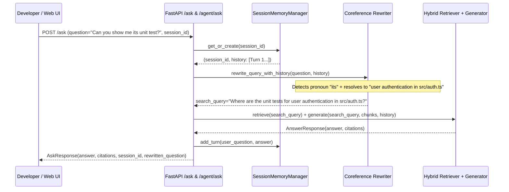

# ADR 0025: Multi-Turn Conversational Memory & Coreference Query Rewriting

## Status
Accepted

## Date
2026-09-06

## Context

In software engineering workflows, developers rarely explore a codebase in isolated, single-turn interactions. Real-world investigations naturally unfold as conversational dialogues:

- **Turn 1**: *"Where is user authentication implemented?"* $\rightarrow$ Assistant identifies `src/auth.ts` and `Better Auth`.
- **Turn 2**: *"Can you show me its unit test?"* (The pronoun *"its"* refers to the authentication component in Turn 1).
- **Turn 3**: *"How does it handle session revocation?"* (The pronoun *"it"* refers to session handling in `src/auth.ts`).

Previously in AEIA:
1. Every call to `POST /ask` or `POST /agent/ask` was stateless.
2. If an engineer submitted Turn 2 (*"Can you show me its unit test?"*), the dense embedding and BM25 models scored that phrase directly against the corpus. Because the query lacked the noun *"authentication"*, the search engine retrieved unrelated test files (`cart-test.ts`, `healthcheck.test.ts`), failing the developer's intent.
3. The LLM synthesis stage had no access to previous answers, leading to fragmented, disjointed explanations.

## Decision

We designed and implemented **Thread-Safe Conversational Session Memory** and **Coreference Query Rewriting** in `src/agent/memory.py`:

### 1. Sliding-Window Session Memory (`SessionMemory` & `SessionMemoryManager`)
- Stores conversation turns (`ChatMessage(role, content)`) in memory under a thread-safe `threading.Lock`.
- Enforces a sliding window of the last $K$ turns (default 5 turns = 10 messages) to prevent memory bloating and context overflow.
- Generates transparent, URL-safe UUIDs (`sess_<12hex>`) when no `session_id` is supplied.

### 2. Coreference Query Rewriter (`rewrite_query_with_history`)
- Inspects incoming questions for follow-up markers, elisions, and pronouns (*"it"*, *"its"*, *"that"*, *"this component"*, *"show me"*).
- If the question is already self-contained (e.g. *"Where is Redis configured?"*), it bypasses the LLM and returns immediately (0ms overhead on initial turns).
- If ambiguous pronouns are detected, an instruction-tuned Gemini model examines the recent conversation turns and reformulates the question into a self-contained search query before vector/BM25 retrieval runs.
- **Graceful Fallback**: If LLM reformulation fails or encounters rate limits, the original query is returned untouched without breaking the user request.

### 3. API & Web UI Integration
- `POST /ask` and `POST /agent/ask` accept an optional `session_id` parameter and return both `session_id` and `rewritten_question` in responses.
- `src/api/static/index.html` tracks session continuity in client state, displays an **"Expanded Context Query"** visual badge when reformulation occurs, and includes a **"New Chat"** button to reset conversational state.

## Consequences

### Positive
- **Natural Multi-Turn Developer Experience**: Engineers can ask pronouns, follow-ups, and clarification questions without repeating full file paths.
- **High Retrieval Accuracy on Follow-Ups**: Follow-up questions retrieve the correct target files because the search engine queries the expanded, contextualized string.
- **Seamless Context Continuity**: Synthesized answers reference prior conversation turns rather than repeating background explanations.
- **Full Test Coverage**: Tested in `tests/test_memory.py` across sliding-window eviction, session management, mock coreference rewriting, and multi-turn API integration.

### Trade-Offs
- Follow-up questions containing pronouns incur a lightweight LLM reformulation call before retrieval (mitigated by greedy zero-temperature decoding and self-contained query short-circuiting).

