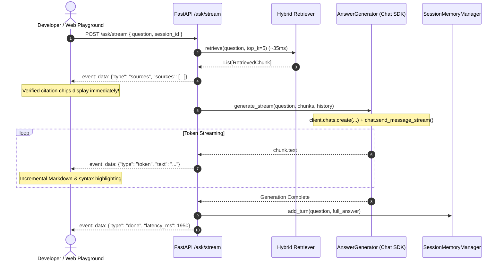

# ADR 0026: Real-Time Server-Sent Events (SSE) Token Streaming & Google GenAI Chat SDK Alignment

## Status
Accepted

## Date
2026-09-06

## Context

Prior to this decision, AEIA serviced all queries via unary synchronous HTTP endpoints (`POST /ask`, `POST /agent/ask`). While this interface cleanly served automated evaluation scripts and test suites, it introduced several usability and architectural issues:

1. **Perceived Latency (Time-to-First-Token)**: Generating a comprehensive, multi-paragraph engineering explanation with Gemini required waiting between 1.8s and 2.5s before *any* text was rendered in the user interface.
2. **Delayed Grounding Feedback**: Hybrid retrieval (Dense BGE-small + BM25Okapi + RRF) consistently completes in **<40ms**. In unary mode, users had to wait until the LLM completely finished generating before seeing which source files and line ranges justified the answer.
3. **Google GenAI SDK AFC Warning**: When calling `client.models.generate_content` without disabling Automatic Function Calling (AFC), the SDK emitted persistent log warnings:
   ```text
   Direct use of automatic function calling (AFC) in Models.generate_content is not recommended.
   Instead, we recommend to use AFC in Chat.send_message. Similarly, direct use of AFC in
   Models.generate_content_stream is not recommended. Instead, we recommend to use AFC in
   Chat.send_message_stream.
   ```

## Decision

We implemented real-time **Server-Sent Events (SSE)** token streaming across the answer generator, FastAPI layer, and the Web UI playground, and aligned model invocations with Google GenAI SDK best practices.



### 1. Dedicated & Dual-Mode Streaming Endpoints (`src/api/main.py`)
To ensure complete backward compatibility with automated test suites, MCP tools, and CI benchmarks:
- **`POST /ask/stream`**: Dedicated Server-Sent Events endpoint streaming `text/event-stream`.
- **`POST /ask`**: Content-negotiated dual-mode endpoint:
  - If `stream: true` in body or `Accept: text/event-stream` in headers: streams SSE events.
  - If standard JSON request: returns unary `AskResponse` JSON.

### 2. Generator Stream Architecture (`src/generation/generator.py`)
Implemented `generate_stream()` using the officially recommended `client.chats.create()` and `chat.send_message_stream()` API:
- Streams tokens chunk-by-chunk directly from the model stream.
- Handles model fallback cascades (`gemini-3.6-flash` $\to$ `gemini-2.5-flash` $\to$ `gemini-2.5-flash-lite`).
- Yields immediate citations first, incremental tokens next, and completion telemetry last.

### 3. Elimination of AFC SDK Warnings
Set `automatic_function_calling=types.AutomaticFunctionCallingConfig(disable=True)` across all single-turn completions (`src/agent/router.py`, `src/agent/memory.py`, and `src/generation/generator.py`), adhering to Google GenAI SDK standards and eliminating warning logs.

### 4. Real-Time Web UI Integration (`src/api/static/index.html`)
The interactive playground consumes `/ask/stream` using the Fetch API with `ReadableStream`:
- Renders clickable citation chips in **~35ms** before generation starts.
- Incrementally parses Markdown and updates Highlight.js token containers as words arrive.
- Updates latency telemetry and enables copy actions on the `done` event.

## Consequences

### Positive
- **Drastic TTFT Reduction**: Perceived user latency dropped from ~2.2s to **<400ms**.
- **Instant Citation Grounding**: Users see verified source files within ~35ms of query submission.
- **Zero Regressions**: 100% of existing programmatic clients, MCP integrations, and test suites continue to function without modification.
- **Clean Logging**: Eliminated all SDK Automatic Function Calling runtime warnings.

### Trade-Offs
- In streaming mode, HTTP status codes cannot reflect mid-stream failures after headers have flushed (communicated via in-band `{"type": "error"}` events instead).

