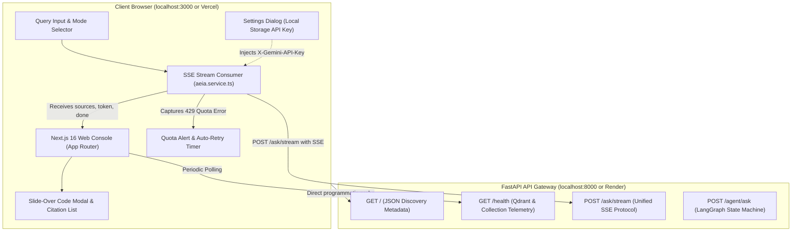

# ADR 0028: Decoupled Next.js Frontend Console & Retirement of Static Single-File UI

## Status

Accepted (Supersedes [ADR 0022](0022-interactive-web-playground-ui.md))

## Date

2026-09-07

## Context

In [ADR 0022](0022-interactive-web-playground-ui.md), we introduced a zero-dependency, single-file HTML playground (`src/api/static/index.html`) served directly by FastAPI at `GET /ui`. While effective as a quick proof-of-concept for recruiter demonstrations, this monolithic, inline approach encountered several critical architectural limitations as the system expanded:

1. **Tight Coupling & Monolithic Deployment**: Serving the frontend through FastAPI tightly coupled UI rendering with backend CPU/memory cycles. Any frontend cosmetic update or styling adjustment required restarting or redeploying the FastAPI container.
2. **Missing Modern Component Lifecycle**: An inline HTML file using CDN scripts (Tailwind CDN, Marked.js, Highlight.js) lacked component encapsulation, TypeScript type safety, automated UI unit tests, and production asset bundling.
3. **Complex State Management Under Streaming**: As Server-Sent Events (SSE) streaming expanded to support both Direct RAG and multi-step LangGraph agent orchestration ([ADR 0026](0026-real-time-sse-token-streaming-and-chat-sdk.md), [ADR 0030](0030-unified-sse-streaming-protocol-for-rag-and-agent.md)), managing token buffers, markdown parsing, syntax highlighting, and citation drawer state in vanilla JavaScript became brittle and error-prone.
4. **No Client Configuration or Error Interception**: Users hitting Gemini free-tier quota exhaustion (`429 RESOURCE_EXHAUSTED`) had no interactive way to supply their own Gemini API key, test connection health, or manage retry backoff without editing server `.env` files.

## Decision

We retired the static single-file playground (`src/api/static/index.html`) and deleted the `GET /ui` route. We replaced it with a dedicated, enterprise-grade Next.js console located in [`frontend/`](../../frontend/), establishing a cleanly decoupled frontend/backend architecture.

### 1. Technology Stack (`frontend/`)
* **Framework**: Next.js 16 (App Router, Turbopack) with React 19.
* **Language**: Strict TypeScript with path aliases (`@/*`).
* **Design System**: Tailwind CSS v4, `shadcn/ui` primitives (Dialog, Tabs, Badge, Card, Avatar, Skeleton, Dropdown Menu), and Lucide icons.
* **Data Fetching & State**: TanStack React Query v5 for server state caching and health polling, combined with a custom SSE fetcher.
* **Testing**: Vitest + React Testing Library for component/unit tests; Playwright for end-to-end browser automation.

### 2. Decoupled Component Architecture (`frontend/src/components/aeia/`)
The interface is structured into focused, reusable components:
- **`QueryInput`**: Keyboard-accessible textarea supporting `Enter` to submit, `Shift+Enter` for multiline input, and stop/clear actions.
- **`ModeSelector`**: Toggle between **Direct Hybrid RAG** (fast BGE-small + BM25Okapi 70/30 RRF) and **Autonomous Agent** (LangGraph router with Git history, commit diff, and dependency tracking).
- **`AnswerCard`**: Markdown renderer supporting streaming syntax highlighting, citation badge anchors, copy-to-clipboard, and token-by-token text updates.
- **`CitationList`**: Interactive grid of verified source citations displaying line numbers (`#L10-L45`), file paths, and relevance scores.
- **`CodeModal`**: Slide-over drawer rendering the exact retrieved chunk content with syntax highlighting and file metadata for hallucination verification.
- **`SettingsDialog`**: Modal for configuring backend URL (`NEXT_PUBLIC_API_URL`), API key (`X-API-Key`), and client-provided Gemini API key (`X-Gemini-API-Key`) stored securely in browser `localStorage`.
- **`QuotaAlert`**: Interactive alert banner that activates upon HTTP 429 quota exhaustion, featuring an animated countdown timer and 1-click retry.
- **`TelemetryBar`**: Real-time audit metrics displaying route selected (`direct_rag`, `git_commit`, etc.), latency in milliseconds, and token streaming metrics.

### 3. Pure Headless API Gateway (`src/api/main.py`)
With the UI decoupled:
* The root endpoint `GET /` no longer performs content-negotiated HTML redirects. It unconditionally returns standard API discovery JSON (`message`, `docs_url`, `health_url`).
* The legacy `GET /ui` route returns `404 Not Found` (verified via `tests/test_ui.py`).
* CORS middleware (`CORSMiddleware`) explicitly enables cross-origin requests between the Next.js frontend (e.g. `http://localhost:3000` or production Vercel domains) and the FastAPI backend.

## Consequences

### Positive
- **Independent Deployability**: The Next.js frontend can be deployed at zero cost on Vercel with global CDN edge caching, while the FastAPI backend runs in a containerized environment (Render, Railway, or Fly.io).
- **Production Developer Experience**: Full TypeScript coverage across API request/response payloads, automated ESLint/Prettier formatting, Vitest component testing, and Playwright E2E verification.
- **Improved UX and Error Resilience**: The client-side settings dialog and quota alert ensure that users can provide their own Gemini API keys and recover from quota exhaustion without backend intervention.
- **Headless API Cleanliness**: FastAPI serves strictly as a high-performance REST and SSE API server with zero static asset overhead.

### Trade-Offs
- Running the full stack locally now requires two terminal processes: `uv run uvicorn src.api.main:app` (backend) and `pnpm dev` (frontend).

## Validation

- `pytest tests/test_ui.py` (verifies `GET /ui` is retired with 404 and `GET /` returns JSON discovery metadata).
- `cd frontend && pnpm test` (verifies Vitest unit and component tests).
- `cd frontend && pnpm build` (verifies Next.js Turbopack production compilation).

