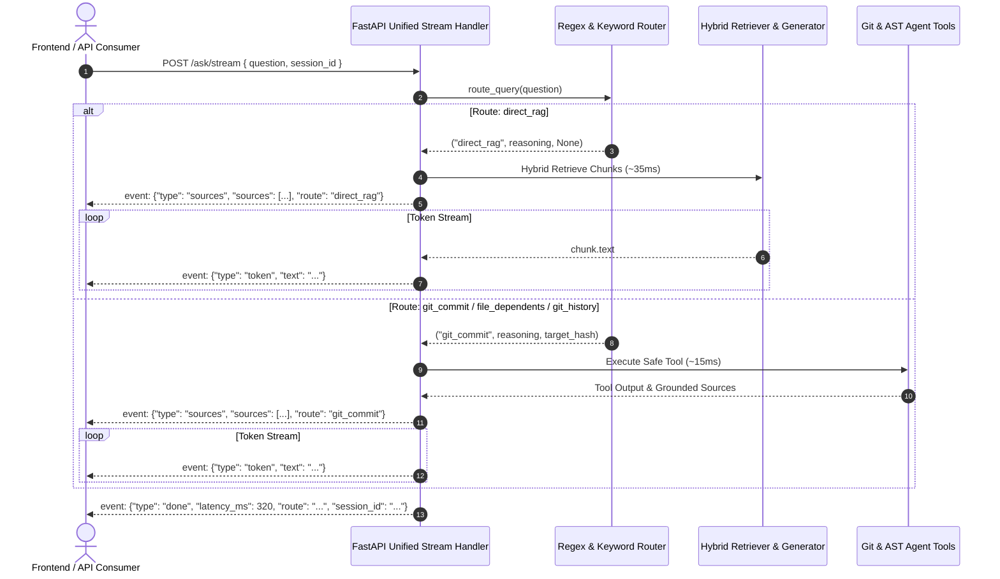

# ADR 0030: Unified Server-Sent Events (SSE) Streaming Protocol for RAG & Agentic Routing

## Status

Accepted

## Date

2026-09-07

## Context

In [ADR 0026](0026-real-time-sse-token-streaming-and-chat-sdk.md), we introduced real-time Server-Sent Events (SSE) streaming for answer generation. However, that implementation was scoped strictly to the Direct Hybrid RAG pipeline. If a query pertained to non-RAG operations—such as Git commit diffs, commit history logs, or module dependency tracking ([ADR 0015](0015-v5-agentic-router-langgraph.md))—the user had to invoke a separate unary endpoint (`POST /agent/ask`).

This introduced significant architectural fragmentation:
1. **Client Guesswork**: The user or frontend client had to know in advance whether a question required vector retrieval or an agent tool, defeating the purpose of an autonomous intelligent router.
2. **Asymmetric User Experience**: RAG queries enjoyed immediate citation display (<40ms) and token-by-token streaming (TTFT <400ms), while agent queries stalled in a blocking HTTP request until all tools completed.
3. **Dual Telemetry Schemas**: Frontend consoles had to parse two distinct payload contracts (`AskResponse` vs. `AgentAskResponse`) depending on the endpoint selected.

## Decision

We unified streaming across the entire system under `POST /ask/stream` (and content-negotiated `POST /ask` with `Accept: text/event-stream` or `stream: true`). The router state machine now executes natively within the streaming pipeline, servicing both RAG and deterministic agent tools under a single, cohesive SSE event schema.

### 1. Unified Event Schema
All queries emit standard SSE events with the following standardized payloads:

| Event Type | Payload Attributes | Description |
| :--- | :--- | :--- |
| `sources` | `sources: list[dict]`, `route: str`, `route_reasoning: str` | Emitted immediately after retrieval or tool execution (<50ms). Contains verified line numbers or tool citations. |
| `token` | `text: str` | Streamed incrementally as text is generated or formatted. |
| `done` | `latency_ms: float`, `session_id: str`, `route: str`, `route_reasoning: str` | Signals completion of generation and reports performance telemetry. |
| `error` | `error: str`, `status_code?: int` | Emitted if an unhandled domain exception occurs during processing. |

### 2. Implementation in Stream Pipeline (`src/api/main.py`)
Within `_stream_ask_response`:
1. The incoming query is evaluated by `route_query(question)`.
2. If routed to an agent tool (`git_history`, `git_commit`, or `file_dependents`):
   - The tool is executed securely within `src/agent/tools.py`.
   - Tool citations are packaged as `SourceCitation` objects (`file_path: "git-repository-history"`, `citation: "repo-tool-call"`).
   - The `sources` event is pushed immediately, followed by chunked tokens of the synthesized analysis.
3. If routed to `direct_rag`:
   - Hybrid retrieval retrieves top-$k$ chunks.
   - The `sources` event is pushed immediately, followed by real-time LLM token streaming via `generator.generate_stream()`.
4. The final text is appended to multi-turn session memory ([ADR 0025](0025-conversational-memory-and-coreference-rewriter.md)).

## Consequences

### Positive
- **Single Universal Endpoint**: Client applications, IDE extensions, and the Next.js Web Console need to implement only one streaming consumer for any engineering query.
- **Instant Interactive Feedback**: Whether examining a commit diff or querying architecture patterns, citation chips and route audits display in under 50ms.
- **Transparent Router Observability**: Clients receive explicit `route` and `route_reasoning` in the `sources` and `done` events, allowing UI telemetry bars to visualize how the system decided to handle the request.

### Trade-Offs
- For deterministic tool routes (e.g. Git log), output is streamed in artificial small chunks to preserve the identical SSE consumption interface expected by frontend markdown parsers.

## Validation

- `pytest tests/test_unified_stream.py` (verifies SSE event format and execution across `direct_rag`, `git_commit`, and `file_dependents` routes).
- `pytest tests/test_stream.py` (verifies backward-compatible RAG streaming).

