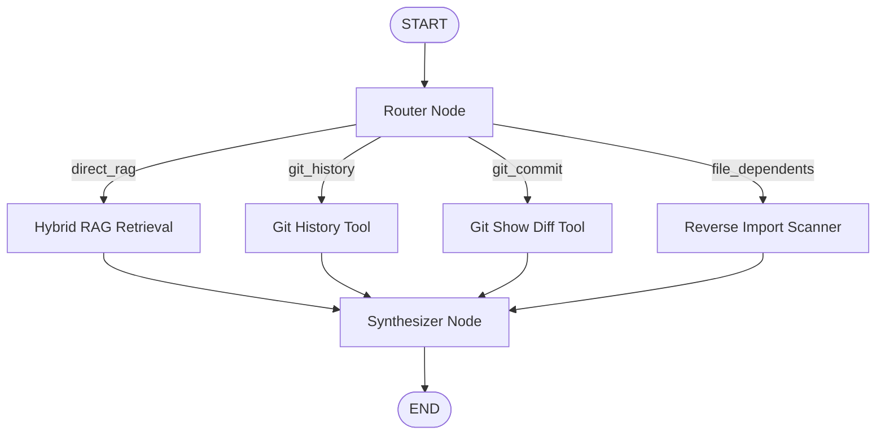

# Technology Stack and Engineering Prerequisites
## Master the 20 Core Technologies, Libraries, and Concepts Behind AEIA

> This guide provides an exhaustive, practical breakdown of every technology, library, algorithm, and theoretical concept used in the **AEIA** codebase. For each topic, you will learn:
> 1. **What it is and why AEIA uses it** (including trade-offs and Architectural Decision Records).
> 2. **Core concepts you must master** to write and reason about the code.
> 3. **Code snippets directly from AEIA** illustrating production usage.
> 4. **Exact codebase files** that implement this technology.
> 5. **Hands-on practice exercises** to build on your own before editing this repository.

---

## Technology Stack Overview

The AEIA system is constructed from five interlocking technological layers:

```mermaid
graph TD
    subgraph "1. Runtime & Package Management"
        Py["Python 3.12+ / 3.14 (Type Hints, AsyncIO, Dataclasses)"]
        UV["Astral uv (Deterministic Dependency Management)"]
        GitSync["Git Sync & Diff Tracker (Automated Corpus Sync)"]
    end

    subgraph "2. Ingestion & Retrieval Layer"
        TS_AST["Tree-Sitter AST & Multi-Format Block Parsers"]
        TS["LangChain Text Splitters (Fallback Splitting)"]
        FE["FastEmbed & ONNX Runtime (BGE-small Embeddings)"]
        QD["Qdrant Vector Database (Deterministic Point IDs)"]
        BM["Rank-BM25 (Thread-Safe Hot-Reload Index)"]
        RRF["Weighted Reciprocal Rank Fusion (70/30 Hybrid)"]
    end

    subgraph "3. Generation & Agentic Memory Layer"
        Gemini["Google GenAI SDK (Gemini 2.5 Flash & 3.6 Flash)"]
        Mem["Session Memory Manager (5-Turn Sliding Window)"]
        Rewrite["Coreference Query Rewriter (Pronoun Resolution)"]
        LG["LangGraph (State Machine Agentic Router)"]
        Tools["Safe Subprocess Tools (Git Log, Git Show, Import Scanner)"]
    end

    subgraph "4. Service, Protocol & UI Layer"
        FA["FastAPI & Uvicorn (ASGI Web Framework)"]
        Pyd["Pydantic V2 & Pydantic Settings"]
        MCP["Model Context Protocol (MCP 2026-07-28 Spec)"]
        Sec["SlowAPI Rate Limiter & HMAC-SHA256 Auth"]
        UI["Interactive Web UI Playground (Marked.js, Highlight.js)"]
    end

    subgraph "5. Operations, Tracing & Quality"
        LF["Langfuse (Distributed LLM Observability & Spans)"]
        Triad["RAG Triad LLM-as-a-Judge (Faithfulness, Relevance, Precision)"]
        Docker["Docker & Compose (Containerized Topology)"]
        Test["Pytest (14 Suites, 72 Passing Tests) & CI"]
    end

    Py --> TS_AST & FE & QD & BM & RRF
    TS_AST & FE & QD & BM & RRF --> FA
    Gemini & Mem & Rewrite & LG & Tools --> FA
    FA --> MCP & Sec & UI
    FA --> LF
    Triad --> Gemini
    Docker --> QD & FA
    Test --> FA
```



---

## 1. Python 3.12+ Modern Language Features

### Why We Use It
AEIA is built on modern Python (3.12+) to take advantage of strict typing, high-performance concurrency with `asyncio`, immutable data structures, and native standard library utilities.

### Core Concepts to Master
1. **Strict Type Annotations**: Using `typing.Literal`, `typing.Optional`, `typing.Tuple`, `typing.List`, and `typing.TypedDict` to enforce compile-time verification and clear function contracts.
2. **`dataclasses` vs. Pydantic `BaseModel`**: 
   - We use standard library `@dataclass` in performance-critical internal loops (e.g., [`CodeChunk`](../../src/ingestion/chunker.py#L10-L17) and [`RetrievedChunk`](../../src/retrieval/retriever.py#L19-L31)) because they avoid Pydantic's validation overhead during heavy batch processing.
   - We use Pydantic `BaseModel` at API and network boundaries ([`AskRequest`](../../src/api/main.py#L147-L164), [`AnswerResponse`](../../src/generation/generator.py#L30-L34)) to guarantee rigorous request/response sanitization.
3. **Asynchronous Programming (`asyncio`)**:
   - Event loops, coroutines (`async def` / `await`), non-blocking lifespan management.
   - Offloading CPU/blocking IO tasks using `loop.run_in_executor(None, sync_function)` to prevent freezing the FastAPI event loop during heavy background ingestion.
4. **Path Manipulation with `pathlib.Path`**:
   - Resolving paths, calculating relative paths (`file_path.relative_to(corpus_path)`), and recursive globbing (`rglob("*")`).
   - **Crucial Edge Case**: `Path(".env.example").suffix` returns `""` (empty string) because Python treats `.env` as the stem. AEIA handles this with an explicit `ALLOWED_FILENAMES` set.
5. **Secure Subprocess Invocation**:
   - Calling OS commands without shell injection vulnerabilities. Always passing argument lists (`["git", "log", "-n5"]`) rather than string concatenation with `shell=True`.

### Code Example from AEIA
From [`src/api/tasks.py`](../../src/api/tasks.py#L42-L52):
```python
async def _run_in_background(loop: asyncio.AbstractEventLoop):
    try:
        # Offload synchronous heavy ingestion to thread pool executor
        result = await loop.run_in_executor(None, _sync_ingest)
        _state["status"] = IngestionStatus.COMPLETED
        _state["chunks_ingested"] = result.get("chunks", 0)
    except Exception as e:
        _state["status"] = IngestionStatus.FAILED
        _state["error"] = str(e)
```

### Relevant Codebase Files
- [`src/config.py`](../../src/config.py)
- [`src/errors.py`](../../src/errors.py)
- [`src/api/tasks.py`](../../src/api/tasks.py)
- [`src/agent/state.py`](../../src/agent/state.py)
- [`src/agent/tools.py`](../../src/agent/tools.py)

### Hands-on Exercise
> **Exercise 1.1**: Write a Python script using `pathlib.Path` and `asyncio` that recursively scans a directory, ignores hidden folders (`.git`, `node_modules`), filters for `.py` and `.env.example`, and offloads line-counting to `run_in_executor`.

---

## 2. Astral `uv` (Fast Python Package & Toolchain Manager)

### Why We Use It ([ADR 0004](../decisions/0004-python-toolchain-uv.md))
Astral `uv` is a Rust-based Python package manager 10-100x faster than `pip` and `poetry`. It provides:
- **Instant virtual environment creation and resolution**.
- **Universal, deterministic lockfile** (`uv.lock`) ensuring byte-for-byte reproducible environments across Linux, macOS, Docker, and GitHub Actions CI.
- Direct execution of tools and scripts via `uv run` without requiring manual virtualenv activation.

### Core Commands to Master
```bash
# Install all dependencies including dev tools from uv.lock
uv sync --dev

# Add a new dependency to pyproject.toml and update uv.lock
uv add rank-bm25

# Add a developer-only dependency
uv add --dev pytest-mock

# Run any module or command inside the locked environment
uv run pytest -v
PYTHONPATH=. uv run python -m src.ingestion.pipeline
```

### Configuration in AEIA ([`pyproject.toml`](../../pyproject.toml))
```toml
[project]
name = "aeia"
version = "0.4.0"
requires-python = ">=3.12"
dependencies = [
    "fastapi>=0.141.1",
    "fastembed>=0.8.0",
    "qdrant-client>=1.19.0",
    "rank-bm25>=0.2.2",
    "langgraph>=1.2.0",
    "google-genai>=2.22.0",
    "mcp>=2.1.0",
    ...
]

[dependency-groups]
dev = ["pytest>=9.1.1", "pytest-asyncio>=1.4.0"]
```

### Relevant Codebase Files
- [`pyproject.toml`](../../pyproject.toml)
- [`uv.lock`](../../uv.lock)
- [`Dockerfile`](../../Dockerfile)
- [`.github/workflows/ci.yml`](../../.github/workflows/ci.yml)

---

## 3. Code-Aware Chunking & Semantic Prefix Enrichment (`langchain-text-splitters`)

### Why We Use It ([ADR 0005](../decisions/0005-code-aware-chunking-strategy.md), [ADR 0012](../decisions/0012-v2-hybrid-retrieval-and-semantic-prefixing.md))
Naive chunking (e.g. splitting every 500 characters or arbitrary paragraphs) destroys code syntax by slicing functions in half and obliterating class definitions. Furthermore, embedding models struggle with raw YAML and SQL DDL. AEIA solves this with **Language-Aware Splitters** and **Semantic Prefix Injection**.

### Core Concepts to Master
1. **Language-Specific Separators**:
   `RecursiveCharacterTextSplitter.from_language(Language.TS)` splits on logical JavaScript/TypeScript boundaries (interfaces, functions, classes) before splitting on line breaks.
2. **Exact 1-Indexed Line Tracking**:
   The chunker dynamically maps each chunk text back to the original source file by searching substrings and counting newline characters `\n`, producing exact `start_line` and `end_line` citations.
3. **Semantic Prefix Enrichment**:
   Embedding models (such as BGE-small) are trained predominantly on natural language prose. They treat `redis: image: redis:8.2.1-alpine` as semantically opaque. By injecting a synthetic contextual preamble at chunking time:
   ```yaml
   # Docker Compose infrastructure definition: compose.yml
   # This file defines the services, networks, and volumes for the application stack.
   redis:
     image: redis:8.2.1-alpine
   ```
   The embedding model now easily connects queries like *"What services depend on Redis?"* to this configuration chunk.

### Code Example from AEIA
From [`src/ingestion/chunker.py`](../../src/ingestion/chunker.py#L53-L93):
```python
@staticmethod
def _build_semantic_prefix(file_path: Path, rel_path: str) -> str:
    name = file_path.name.lower()
    ext = file_path.suffix.lower()

    if name.startswith("compose") and ext in (".yml", ".yaml"):
        return (
            f"# Docker Compose infrastructure definition: {rel_path}\n"
            f"# This file defines the services, networks, and volumes\n"
            f"# for the application stack including databases, caches, and workers.\n\n"
        )
    if ext == ".sql" and "migration" in rel_path.lower():
        migration_dir = file_path.parent.name
        return (
            f"-- Database migration file: {rel_path}\n"
            f"-- Migration: {migration_dir}\n"
            f"-- This SQL migration creates or alters database tables, columns, and indexes.\n\n"
        )
    return ""
```

### Relevant Codebase Files
- [`src/ingestion/chunker.py`](../../src/ingestion/chunker.py)
- [`tests/test_chunker.py`](../../tests/test_chunker.py)
- [`docs/postmortems/001-semantic-bias-config-retrieval.md`](../postmortems/001-semantic-bias-config-retrieval.md)

### Hands-on Exercise
> **Exercise 3.1**: Write a custom splitter that takes a TypeScript file with multiple exported functions and extracts each function with its preceding JSDoc comments into a separate `CodeChunk` tracking exact line numbers.

---

## 4. Dense Embeddings with FastEmbed & ONNX Runtime

### Why We Use It ([ADR 0002](../decisions/0002-zero-cost-embedding-and-vector-db.md), [ADR 0006](../decisions/0006-gpu-acceleration-for-embeddings.md))
Many AI setups require a dedicated GPU or paid cloud embedding APIs (e.g. OpenAI `text-embedding-3-small`). AEIA utilizes **FastEmbed** with **ONNX Runtime** running the `BAAI/bge-small-en-v1.5` model:
- **Zero Cloud Cost**: Runs completely locally on CPU without external API calls or rate limits.
- **Lightweight Footprint**: Uses ONNX Runtime quantization, requiring <500MB RAM and no heavy PyTorch/CUDA installations.
- **Fast Execution**: Embeds 1,500+ code chunks in ~15-20 seconds on standard multi-core laptops.

### Core Concepts to Master
1. **Dense Semantic Vectors**: Text is converted into a vector $\vec{v} \in \mathbb{R}^{384}$. Semantic similarity between two texts corresponds to the cosine of the angle between their vectors:
   $$\text{Cosine Similarity}(\vec{u}, \vec{v}) = \frac{\vec{u} \cdot \vec{v}}{\|\vec{u}\| \|\vec{v}\|}$$
2. **Content-Hash Caching (`EmbeddingCache`)**:
   Computing embeddings is computationally heavy. AEIA implements a SHA-256 cache (`.cache/embedding_cache.json`). When re-ingesting the repository, only new or modified chunks are embedded. Unchanged chunks load in milliseconds:
   $$\text{Key} = \text{SHA256}(\text{chunk\_content})$$
3. **Batch Processing**:
   Embedding chunks in batches of 128 maximizes CPU cache utilization and vectorized AVX2/AVX-512 instruction throughput.

### Code Example from AEIA
From [`src/ingestion/pipeline.py`](../../src/ingestion/pipeline.py#L82-L91):
```python
@staticmethod
def _hash(text: str) -> str:
    return hashlib.sha256(text.encode("utf-8")).hexdigest()

def get(self, content: str) -> List[float] | None:
    return self._cache.get(self._hash(content))

def put(self, content: str, embedding: List[float]):
    self._cache[self._hash(content)] = embedding
```

### Relevant Codebase Files
- [`src/ingestion/pipeline.py`](../../src/ingestion/pipeline.py)
- [`src/retrieval/retriever.py`](../../src/retrieval/retriever.py)
- [`src/config.py`](../../src/config.py)

---

## 5. Qdrant Vector Database (`qdrant-client`)

### Why We Use It ([ADR 0002](../decisions/0002-zero-cost-embedding-and-vector-db.md), [ADR 0009](../decisions/0009-docker-containerization.md))
Qdrant is an open-source vector search engine written in Rust. It offers:
- High-speed Approximate Nearest Neighbor (ANN) search using Hierarchical Navigable Small World (HNSW) graphs.
- Rich payload metadata storage alongside vectors (storing file path, line numbers, snippet content, file type).
- Single-binary Docker deployment with minimal memory consumption.

### Core Concepts to Master
1. **Collections & Vector Configuration**:
   Collections must be created with explicit dimensions (`size=384`) and distance metrics (`Distance.COSINE`).
2. **Point Upsertion**:
   Points are structured records containing an `id` (integer or UUID), `vector` (list of floats), and `payload` (arbitrary JSON metadata).
3. **Scrolling API**:
   `client.scroll()` retrieves raw payloads across the entire collection without vector queries, allowing AEIA to build its in-memory BM25 index directly from Qdrant storage upon server startup.
4. **Health Checks**:
   AEIA tests Qdrant availability over raw TCP sockets (`echo > /dev/tcp/localhost/6333`) during container bootstrap.

### Code Example from AEIA
From [`src/retrieval/retriever.py`](../../src/retrieval/retriever.py#L209-L228):
```python
def _scroll_all_payloads(self) -> List[dict]:
    all_payloads = []
    next_offset = None
    while True:
        records, next_offset = self.client.scroll(
            collection_name=settings.collection_name,
            limit=256,
            offset=next_offset,
            with_payload=True,
            with_vectors=False,
        )
        for r in records:
            all_payloads.append(r.payload or {})
        if next_offset is None:
            break
    return all_payloads
```

### Relevant Codebase Files
- [`compose.yml`](../../compose.yml)
- [`src/ingestion/pipeline.py`](../../src/ingestion/pipeline.py)
- [`src/retrieval/retriever.py`](../../src/retrieval/retriever.py)
- [`src/api/main.py`](../../src/api/main.py)

---

## 6. Sparse Lexical Search with BM25 Okapi (`rank-bm25`)

### Why We Use It ([ADR 0012](../decisions/0012-v2-hybrid-retrieval-and-semantic-prefixing.md))
Vector embeddings excel at semantic concepts ("how is user session maintained") but frequently fail on exact identifier matches (e.g., searching for a specific variable like `AUTH_COOKIE_NAME`, an exact migration filename, or a specific API route `/api/v1/auth/login`). BM25 Okapi provides term-frequency inverse-document-frequency ranking to ensure exact keyword matches surface at rank #1.

### Core Concepts to Master
1. **BM25 Scoring Formula**:
   $$\text{Score}(D, Q) = \sum_{i=1}^{N} \text{IDF}(q_i) \cdot \frac{f(q_i, D) \cdot (k_1 + 1)}{f(q_i, D) + k_1 \cdot \left(1 - b + b \cdot \frac{|D|}{\text{avgdl}}\right)}$$
2. **Code-Aware Tokenization**:
   Standard English NLP tokenizers split on whitespace and punctuation. In source code, tokens are packed inside camelCase (`verifyUserSession`), PascalCase (`AuthService`), and snake_case (`user_id`). AEIA implements a specialized code tokenizer using regular expressions that expands compound identifiers into sub-tokens:
   - `getUserProfile` $\rightarrow$ `['get', 'user', 'profile']`
   - `docker-compose.yml` $\rightarrow$ `['docker', 'compose', 'yml']`

### Code Example from AEIA
From [`src/retrieval/retriever.py`](../../src/retrieval/retriever.py#L230-L243):
```python
@staticmethod
def _tokenize(text: str) -> List[str]:
    """Code-aware tokenizer: splits camelCase, snake_case, dots, slashes."""
    tokens = re.split(r'[^a-zA-Z0-9]+', text)
    expanded = []
    for token in tokens:
        if not token:
            continue
        # Split camelCase: getUserProfile -> get, User, Profile
        parts = re.sub(r'([a-z])([A-Z])', r'\1 \2', token).split()
        expanded.extend(p.lower() for p in parts if p)
    return expanded
```

### Relevant Codebase Files
- [`src/retrieval/retriever.py`](../../src/retrieval/retriever.py)
- [`tests/test_retriever.py`](../../tests/test_retriever.py)

---

## 7. Weighted Reciprocal Rank Fusion (Hybrid RRF)

### Why We Use It ([ADR 0012](../decisions/0012-v2-hybrid-retrieval-and-semantic-prefixing.md))
When querying both a dense vector index and a sparse BM25 index, their raw scores cannot be directly added together because vector similarity scores lie between $[0.0, 1.0]$, whereas BM25 scores are unbounded $[0.0, \infty)$. **Reciprocal Rank Fusion (RRF)** normalizes results purely based on their rank positions.

### Core Concepts to Master
1. **Weighted RRF Mathematical Formulation**:
   For a candidate document $d$ present in ranked lists $M$:
   $$\text{RRF Score}(d) = \sum_{m \in M} \frac{w_m}{k + \text{rank}_m(d)}$$
   Where:
   - $k = 60$ is the standard Cormack smoothing constant that prevents top-ranked documents from completely dominating the score.
   - $w_{\text{dense}} = 0.7$ and $w_{\text{sparse}} = 0.3$.
2. **Why 70/30 Weighting?**:
   In codebases, raw BM25 on code is noisy because keywords like `import`, `export`, and common variable names appear in hundreds of files. As discovered in postmortem `001`, giving BM25 equal (50/50) weight demoted good semantic vector matches. Weighting dense search at 70% and BM25 at 30% produced the highest Recall@10 (95.0%).
3. **Stable Deduplication Key**:
   Chunks are deduplicated across ranked lists using the compound tuple `(file_path, start_line)`.

### Code Example from AEIA
From [`src/retrieval/retriever.py`](../../src/retrieval/retriever.py#L138-L177):
```python
def _reciprocal_rank_fusion(
    self,
    dense: List[RetrievedChunk],
    sparse: List[RetrievedChunk],
) -> List[RetrievedChunk]:
    rrf_scores: Dict[Tuple[str, int], float] = {}
    chunk_map: Dict[Tuple[str, int], RetrievedChunk] = {}

    for rank, chunk in enumerate(dense, start=1):
        key = (chunk.file_path, chunk.start_line)
        rrf_scores[key] = rrf_scores.get(key, 0.0) + DENSE_WEIGHT / (RRF_K + rank)
        chunk_map[key] = chunk

    for rank, chunk in enumerate(sparse, start=1):
        key = (chunk.file_path, chunk.start_line)
        rrf_scores[key] = rrf_scores.get(key, 0.0) + SPARSE_WEIGHT / (RRF_K + rank)
        if key not in chunk_map:
            chunk_map[key] = chunk

    sorted_keys = sorted(rrf_scores, key=lambda k: rrf_scores[k], reverse=True)
    return [chunk_map[k] for k in sorted_keys]
```

### Relevant Codebase Files
- [`src/retrieval/retriever.py`](../../src/retrieval/retriever.py)
- [`evals/run_eval.py`](../../evals/run_eval.py)

---

## 8. Google Gemini LLM SDK & Grounded Answer Generation (`google-genai`)

### Why We Use It ([ADR 0003](../decisions/0003-llm-provider-gemini.md), [ADR 0017](../decisions/0017-error-handling-and-upstream-degradation.md))
AEIA utilizes Google's modern `google-genai` Python SDK (v2 API) to access `gemini-3.6-flash` and `gemini-2.5-flash-lite`. These models provide high reasoning fidelity, large context windows, low latency, and a generous free tier for developers.

### Core Concepts to Master
1. **Strict Grounding & Citation Prompts**:
   The system prompt explicitly commands the model to cite every single claim using the format `[filepath#Lstart-Lend]` and strictly forbids hallucination of non-existent files.
2. **Candidate Fallback Chain**:
   If the primary model (`gemini-3.6-flash`) encounters a rate limit or API error, the generator immediately attempts fallback to `gemini-2.5-flash-lite`.
3. **Graceful Degradation on Upstream Quota Exhaustion (`HTTP 429`)**:
   If both candidate models fail due to `RESOURCE_EXHAUSTED` (Google API 429), AEIA does **not** crash or return an empty error. Instead, it catches the error and degrades gracefully, returning the retrieved code chunks directly to the developer with exact citations so they can still see the code answers.

### Code Example from AEIA
From [`src/generation/generator.py`](../../src/generation/generator.py#L85-L126):
```python
answer_text = ""
last_error = None
for model in [self.model_name, "gemini-2.5-flash-lite"]:
    try:
        response = self.client.models.generate_content(
            model=model,
            contents=user_prompt,
            config=types.GenerateContentConfig(
                system_instruction=SYSTEM_PROMPT,
                temperature=0.1,
            ),
        )
        if response and response.text:
            answer_text = response.text
            break
    except Exception as e:
        last_error = e
        continue

# Graceful degradation fallback if quota exhausted
if not answer_text and last_error:
    is_quota = "RESOURCE_EXHAUSTED" in str(last_error) or "429" in str(last_error)
    if is_quota:
        answer_text = (
            "⚠️ **Upstream AI Quota Exceeded (HTTP 429)**: The Gemini generation quota has been reached. "
            "Below are the exact grounded context chunks retrieved for your question:\n\n"
            + "\n\n".join(f"**Source: `{c.citation}`**\n```\n{c.content[:250].strip()}...\n```" for c in chunks[:3])
        )
```

### Relevant Codebase Files
- [`src/generation/generator.py`](../../src/generation/generator.py)
- [`src/errors.py`](../../src/errors.py)
- [`tests/test_error_handling.py`](../../tests/test_error_handling.py)

---

## 9. Agentic State Machines & Non-RAG Tools (`langgraph`)

### Why We Use It ([ADR 0015](../decisions/0015-v5-agentic-router-langgraph.md))
Vector search cannot answer questions like:
- *"What changed in commit 6e19f61?"* (Requires inspecting git diffs).
- *"Show recent commits"* (Requires reading git logs).
- *"Which files import auth.utils?"* (Requires static AST/regex import scanning).

Attempting to answer these via RAG produces hallucinations. AEIA implements a **LangGraph State Machine** that routes incoming queries to specialized deterministic tools.

### Core Concepts to Master
1. **`StateGraph` and `TypedDict`**:
   The entire state of the query is encapsulated in [`AgentState`](../../src/agent/state.py), tracking the question, active route, tool outputs, retrieved chunks, and an audit trail of steps taken.
2. **Hybrid Router (Deterministic Regex + LLM Fallback)**:
   - **Fast-path**: Evaluates regex patterns for commit hashes (e.g. `\b[0-9a-fA-F]{6,40}\b`) and dependency questions (`depend on <module>`). This takes <1ms and requires zero LLM API calls.
   - **Slow-path**: Falls back to Gemini with zero temperature if the query is ambiguous.
3. **Graph Topology**:
   - `START` $\rightarrow$ `router`
   - `router` $\rightarrow$ Conditional branch $\rightarrow$ (`direct_rag` | `git_history` | `git_commit` | `file_dependents`)
   - All branches $\rightarrow$ `synthesizer` $\rightarrow$ `END`.



### Code Example from AEIA
From [`src/agent/graph.py`](../../src/agent/graph.py#L149-L185):
```python
workflow = StateGraph(AgentState)

workflow.add_node("router", router_node)
workflow.add_node("direct_rag", rag_node)
workflow.add_node("git_history", git_history_node)
workflow.add_node("git_commit", git_commit_node)
workflow.add_node("file_dependents", file_dependents_node)
workflow.add_node("synthesizer", synthesizer_node)

workflow.add_edge(START, "router")
workflow.add_conditional_edges(
    "router",
    lambda state: state.get("route", "direct_rag"),
    {
        "direct_rag": "direct_rag",
        "git_history": "git_history",
        "git_commit": "git_commit",
        "file_dependents": "file_dependents",
    },
)

workflow.add_edge("direct_rag", "synthesizer")
workflow.add_edge("git_history", "synthesizer")
workflow.add_edge("git_commit", "synthesizer")
workflow.add_edge("file_dependents", "synthesizer")
workflow.add_edge("synthesizer", END)

agent = workflow.compile()
```

### Relevant Codebase Files
- [`src/agent/state.py`](../../src/agent/state.py)
- [`src/agent/router.py`](../../src/agent/router.py)
- [`src/agent/tools.py`](../../src/agent/tools.py)
- [`src/agent/graph.py`](../../src/agent/graph.py)
- [`tests/test_agent_router.py`](../../tests/test_agent_router.py)
- [`tests/test_agent_tools.py`](../../tests/test_agent_tools.py)
- [`tests/test_agent_api.py`](../../tests/test_agent_api.py)

---

## 10. Model Context Protocol (`mcp` - 2026-07-28 Spec)

### Why We Use It ([ADR 0016](../decisions/0016-v6-model-context-protocol-server.md))
The **Model Context Protocol (MCP)** is the universal open standard created by Anthropic for exposing tools and contextual data to AI agents. AEIA implements the official **2026-07-28 stateless HTTP protocol specification** alongside a standard `stdio` transport. This allows IDEs (like Cursor), Claude Desktop, and CLI sidecars to query the Campus Connect codebase as a native tool server.

### Core Concepts to Master
1. **JSON-RPC 2.0 Transport**:
   MCP communicates via JSON-RPC 2.0 (`tools/list` and `tools/call`).
2. **Stateless HTTP Protocol**:
   Requests include protocol headers (`MCP-Protocol-Version: 2026-07-28`, `Mcp-Method: tools/call`), allowing scalable HTTP load balancing without sticky sessions.
3. **Strict Tool Allowlist & Permissions**:
   Only explicitly approved tools can be executed. Unauthorized tool requests raise a `PermissionError`.
4. **Mounted Endpoint**:
   The MCP server is mounted directly onto the FastAPI application at `/mcp` using `Starlette` streamable HTTP apps.

### Code Example from AEIA
From [`src/mcp/server.py`](../../src/mcp/server.py#L51-L75):
```python
server = MCPServer(
    name="aeia-campus-connect",
    version="0.4.0",
    instructions="Model Context Protocol server for Campus Connect codebase intelligence.",
)

@server.tool(
    name="search_campus_connect",
    description="Perform hybrid (BM25 + dense vector) search over the Campus Connect codebase.",
)
def search_campus_connect(query: str, top_k: int = 5) -> str:
    if "search_campus_connect" not in ALLOWED_MCP_TOOLS:
        raise PermissionError("Tool unauthorized.")
    retriever, _ = _get_services()
    chunks = retriever.retrieve(query, top_k=min(max(1, top_k), 15))
    ...
```

### Relevant Codebase Files
- [`src/mcp/server.py`](../../src/mcp/server.py)
- [`src/mcp/__init__.py`](../../src/mcp/__init__.py)
- [`src/api/main.py`](../../src/api/main.py#L120-L122)
- [`tests/test_mcp_protocol.py`](../../tests/test_mcp_protocol.py)
- [`tests/test_mcp_tools.py`](../../tests/test_mcp_tools.py)

---

## 11. FastAPI, Uvicorn & Pydantic V2 Service Architecture

### Why We Use It ([ADR 0008](../decisions/0008-fastapi-service-interface.md), [ADR 0013](../decisions/0013-v3-production-hardening.md))
FastAPI provides high-throughput async REST endpoints, automatic OpenAPI documentation (`/docs`), and native integration with Pydantic schemas.

### Core Concepts to Master
1. **Lifespan Context Manager (`@asynccontextmanager`)**:
   Instead of initializing heavy models (Qdrant clients, embedding models, BM25 indices) on every HTTP request, AEIA initializes them **once** inside the FastAPI `lifespan` handler upon server startup and caches them in a `services` dictionary.
2. **Centralized Exception Handling**:
   Custom exception handlers catch domain exceptions (`AEIAError`) and upstream Google errors (`APIError`), formatting them into standardized JSON error responses with proper HTTP status codes (`429`, `503`, `502`).
3. **Dependency Injection**:
   Using `Depends(verify_api_key)` to enforce authentication headers across protected endpoints without code duplication.

### Code Example from AEIA
From [`src/api/main.py`](../../src/api/main.py#L40-L58):
```python
@asynccontextmanager
async def lifespan(app: FastAPI):
    # Initialize heavy singletons once on server boot
    retriever = Retriever()
    generator = AnswerGenerator()
    services["retriever"] = retriever
    services["generator"] = generator
    services["agent"] = create_agent_graph(retriever, generator)
    init_langfuse()
    try:
        async with mcp_server.session_manager.run():
            yield  # Server is actively handling requests
    finally:
        langfuse_flush()
        services.clear()
```

### Relevant Codebase Files
- [`src/api/main.py`](../../src/api/main.py)
- [`src/api/tasks.py`](../../src/api/tasks.py)
- [`src/config.py`](../../src/config.py)
- [`tests/test_api.py`](../../tests/test_api.py)

---

## 12. Security, Rate Limiting & Subprocess Hardening (`slowapi`)

### Why We Use It ([ADR 0013](../decisions/0013-v3-production-hardening.md))
Public or internal code assistants are targets for resource exhaustion, unauthorized access, and command injection attacks. AEIA hardens every layer:
- **API Key Security**: Requires an `X-API-Key` header matching `settings.api_key`.
- **Client Rate Limiting**: `slowapi` enforces `20/minute` per remote IP address to prevent LLM quota draining.
- **Command Injection Immunity**: In git tools, commit hashes are strictly validated against `^[0-9a-fA-F]{4,40}$` before execution. Any injection attempts (like `6e19f61; rm -rf /`) are rejected before touching the shell.

### Code Example from AEIA
From [`src/agent/tools.py`](../../src/agent/tools.py#L58-L64):
```python
clean_hash = commit_hash.strip().strip("'\"")
if not re.match(r"^[0-9a-fA-F]{4,40}$", clean_hash):
    return f"Invalid commit hash: '{commit_hash}'. Must be a 4-40 character hexadecimal string."

cmd = ["git", "show", "--stat", "--oneline", clean_hash]
res = subprocess.run(cmd, cwd=str(corpus_dir), capture_output=True, text=True, timeout=10)
```

### Relevant Codebase Files
- [`src/api/main.py`](../../src/api/main.py#L32,L135-L142)
- [`src/agent/tools.py`](../../src/agent/tools.py#L58-L64)
- [`tests/test_agent_tools.py`](../../tests/test_agent_tools.py#L25-L28)

---

## 13. Production Observability & Distributed LLM Tracing (`langfuse`)

### Why We Use It ([ADR 0014](../decisions/0014-v4-observability-langfuse-tracing.md))
Debugging RAG pipelines in production requires deep visibility into:
1. Retrieval latency vs. LLM generation latency.
2. What exact chunks were retrieved and their relevance scores.
3. How many tokens were consumed by Gemini.

AEIA integrates **Langfuse** with zero-overhead fallback: if Langfuse API keys are not provided, tracing is silently skipped and requests execute normally.

### Core Concepts to Master
- **Trace**: The top-level container for a complete user request (`rag-ask`).
- **Span**: Sub-operations within the trace (`retrieval` span measuring Qdrant/BM25 latency, output chunk count, and file paths).
- **Generation**: Specialized span tracking LLM input prompts, model name, token usage, and output answer text.

### Relevant Codebase Files
- [`src/observability/__init__.py`](../../src/observability/__init__.py)
- [`src/api/main.py`](../../src/api/main.py#L297)

---

## 14. Containerization & Multi-Service Topology (Docker & Compose)

### Why We Use It ([ADR 0009](../decisions/0009-docker-containerization.md))
AEIA runs as an isolated 2-container topology via Docker Compose:
1. `aeia_qdrant`: Runs `qdrant/qdrant:latest`, persisting vector data to `./qdrant_data`.
2. `aeia_api`: Builds from [`Dockerfile`](../../Dockerfile) using `ghcr.io/astral-sh/uv:python3.12-bookworm-slim`, mounting the vector data and exposing port 8000.

### Core Concepts to Master
- **Service Healthchecks**: The API container depends on Qdrant using `condition: service_healthy`, preventing boot crashes while Qdrant is still initializing.
- **Bytecode Compilation**: Setting `ENV UV_COMPILE_BYTECODE=1` in the Dockerfile pre-compiles Python `.pyc` files during build, reducing cold start latency.

### Relevant Codebase Files
- [`Dockerfile`](../../Dockerfile)
- [`compose.yml`](../../compose.yml)

---

## 15. Automated Testing & Continuous Integration (Pytest & GitHub Actions)

### Why We Use It ([ADR 0011](../decisions/0011-automated-testing-strategy.md))
To ensure reliability, AEIA maintains 14 automated test suites with 100% pass rates (72 automated tests) covering every component from chunking to MCP protocols.

### Core Concepts to Master
- `pytest.fixture`: Creating reusable client fixtures (`TestClient(app)`).
- `unittest.mock.patch.object`: Mocking external network calls (e.g. simulating Gemini API `429 RESOURCE_EXHAUSTED` errors or Qdrant connection drops).
- GitHub Actions Service Containers: Spinning up a live Qdrant container on CI runners, executing ingestion, and running `pytest`.

### Relevant Codebase Files
- [`tests/`](../../tests/)
- [`.github/workflows/ci.yml`](../../.github/workflows/ci.yml)

---

## 16. Tree-Sitter AST & Multi-Format Syntax Parsing (`tree-sitter`, `tree-sitter-typescript`)

### Why We Use It ([ADR 0023](../decisions/0023-multi-format-syntax-aware-chunking.md))
Naive character- or token-based splitters routinely bisect function bodies, sever type signatures, and strip leading docstrings. AEIA uses native Tree-Sitter concrete syntax tree (CST) parsing for TypeScript and TSX:
- **Grammar-Aware Node Extraction**: Targets `function_declaration`, `lexical_declaration` (arrow functions), `class_declaration`, `interface_declaration`, and `type_alias_declaration`.
- **Leading Comment Binding**: Traverses sibling comment nodes backward from declarations to guarantee JSDoc blocks remain unified with their respective definitions.
- **Statement Bundling**: Groups top-level declarations and statements exceeding minimum chunk thresholds while enforcing hard upper bounds.

### Code Example from AEIA
From [`src/ingestion/ast_chunker.py`](../../src/ingestion/ast_chunker.py):
```python
class TreeSitterCodeParser:
    def __init__(self, language: str = "typescript"):
        self.language = Language(tstypescript.language_typescript())
        self.parser = Parser(self.language)

    def parse_chunks(self, code: str, file_path: str) -> list[dict]:
        tree = self.parser.parse(bytes(code, "utf8"))
        # Traverses root nodes, binds preceding comments, enforces line boundaries
        ...
```

### Relevant Codebase Files
- [`src/ingestion/ast_chunker.py`](../../src/ingestion/ast_chunker.py)
- [`src/ingestion/chunker.py`](../../src/ingestion/chunker.py)
- [`tests/test_syntax_chunkers.py`](../../tests/test_syntax_chunkers.py)

---

## 17. Structural Block Grammars (Prisma, YAML, Markdown, SQL)

### Why We Use It ([ADR 0023](../decisions/0023-multi-format-syntax-aware-chunking.md))
Non-code configuration and data files carry strict grammatical conventions that fail under standard recursive splitters:
- **`PrismaBlockParser`**: Keeps `model`, `enum`, and `datasource` blocks atomic with all annotations (`@id`, `@relation`) intact.
- **`YamlBlockParser`**: Slices Docker Compose `services` and GitHub Actions `jobs` along top-level indentation keys, preventing syntax corruption.
- **`MarkdownSectionParser`**: Extracts heading hierarchies (`#`, `##`, `###`) and injects contextual breadcrumbs (e.g. `[Section: Architecture > Hybrid Search]`) into each chunk header.
- **`SqlStatementParser`**: Parses DDL migrations into complete statements (`CREATE TABLE`, `ALTER TABLE`) with statement boundaries preserved.

### Relevant Codebase Files
- [`src/ingestion/block_parsers.py`](../../src/ingestion/block_parsers.py)
- [`tests/test_syntax_chunkers.py`](../../tests/test_syntax_chunkers.py)

---

## 18. Multi-Turn Conversational Memory & Coreference Query Rewriting

### Why We Use It ([ADR 0025](../decisions/0025-conversational-memory-and-coreference-rewriter.md))
In real engineering workflows, developers ask conversational follow-up questions referencing previous answers (e.g. *"What does it do?"*, *"Where are its unit tests?"*). Vector search over *"What does it do?"* completely fails.
- **`SessionMemory` & `SessionMemoryManager`**: Maintains a thread-safe sliding window of 5 conversational turns per session with automatic expiration cleanup.
- **Coreference Query Rewriting**: Evaluates user queries with fast regex heuristics (<1ms). Standalone questions bypass LLM processing; follow-up questions trigger Gemini to resolve ambiguous pronouns into complete, self-contained search queries.

### Code Example from AEIA
From [`src/agent/memory.py`](../../src/agent/memory.py):
```python
def rewrite_query_with_history(question: str, history: list[Turn], client, model: str) -> str:
    # Heuristic bypass: if question has no pronouns and is self-contained, return immediately
    if not has_follow_up_markers(question):
        return question
    # LLM coreference resolution
    response = client.models.generate_content(
        model=model,
        contents=[...],
        config=GenerateContentConfig(temperature=0.0),
    )
    return response.text.strip()
```

### Relevant Codebase Files
- [`src/agent/memory.py`](../../src/agent/memory.py)
- [`src/generation/generator.py`](../../src/generation/generator.py)
- [`src/api/main.py`](../../src/api/main.py)
- [`tests/test_memory.py`](../../tests/test_memory.py)

---

## 19. Automated RAG Triad Generation Evaluation Suite

### Why We Use It ([ADR 0024](../decisions/0024-rag-triad-generation-evaluation.md))
Traditional RAG benchmarks only measure retrieval metrics (Recall@K, MRR). They fail to detect LLM hallucinations, incomplete summaries, or irrelevant responses. AEIA implements the complete **RAG Triad** using an impartial LLM-as-a-Judge:
1. **Faithfulness (Claim-Level Hallucination Detection)**: Breaks generated responses into atomic factual statements and evaluates whether every claim is entailed by retrieved chunks:
   $$\text{Faithfulness} = \frac{\text{Entailed Claims}}{\text{Total Claims}}, \quad \text{Hallucination Rate} = 1 - \text{Faithfulness}$$
2. **Answer Relevance**: Rates ($0.0 - 1.0$) how directly and concisely the answer resolves the engineering question.
3. **Context Precision**: Determines what fraction of retrieved chunks were directly relevant to the synthesis.
- **Single-Call JSON Optimization**: Assesses all three metrics simultaneously in a single structured JSON response, eliminating 66% of LLM API roundtrips.

### Relevant Codebase Files
- [`evals/generation_eval.py`](../../evals/generation_eval.py)
- [`evals/run_eval.py`](../../evals/run_eval.py)
- [`evals/generation_benchmark.json`](../../evals/generation_benchmark.json)
- [`tests/test_generation_eval.py`](../../tests/test_generation_eval.py)

---

## 20. Interactive Web UI Playground & Visual Citation Inspector

### Why We Use It ([ADR 0022](../decisions/0022-interactive-web-playground-ui.md))
A high-throughput API benefits from an immediate, zero-friction graphical playground for manual inspection, debugging, and live demonstrations:
- **Zero-Build Single-Page Application**: Served directly from FastAPI at `src/api/static/index.html` via Tailwind CSS, Marked.js, and Highlight.js (no Node.js build step required).
- **Slide-Over Citation Inspector**: Clicking markdown citations (`[src/auth/jwt.ts#L1-L35]`) opens an interactive slide-over drawer rendering the exact source lines with syntax highlighting.
- **Real-Time Telemetry & Session Management**: Displays retrieval scores, processing latencies, step audits, and provides instant "New Chat" session resets.
- **Content Negotiation**: Human browsers requesting `GET /` receive the interactive UI, while API clients receive standard JSON service health payloads.

### Relevant Codebase Files
- [`src/api/static/index.html`](../../src/api/static/index.html)
- [`src/api/main.py`](../../src/api/main.py#L90-L105)
- [`tests/test_ui.py`](../../tests/test_ui.py)

---

## Summary Checklist: What to Master Before Contributing

Before modifying AEIA, make sure you have:
1. [ ] Built a mini script using `fastembed` and `qdrant-client` on local text.
2. [ ] Implemented Reciprocal Rank Fusion (RRF) from scratch on two ranked lists.
3. [ ] Written a FastAPI endpoint protected by header authentication, `slowapi` rate limiting, and HMAC webhook verification.
4. [ ] Compiled a LangGraph `StateGraph` with conditional routing and multi-turn session memory.
5. [ ] Inspected Tree-Sitter AST node trees for TypeScript code blocks and verified leading comment binding.
6. [ ] Executed `uv run python evals/run_eval.py --generation` to evaluate retrieval and the RAG Triad.
7. [ ] Run `uv run pytest -v` locally and verified all 15 test suites (76 tests) pass cleanly.

Proceed to **[02 — Architecture, Design & Patterns](02-architecture-design-and-patterns.md)** to learn how these 20 technologies are structured into AEIA's complete software architecture.
