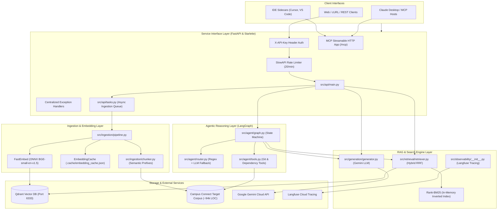
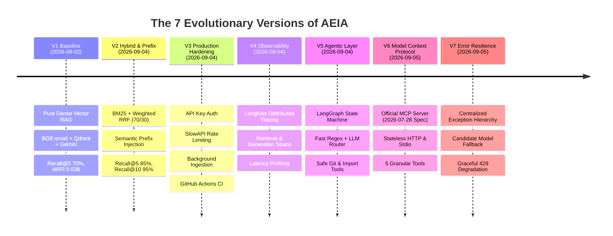
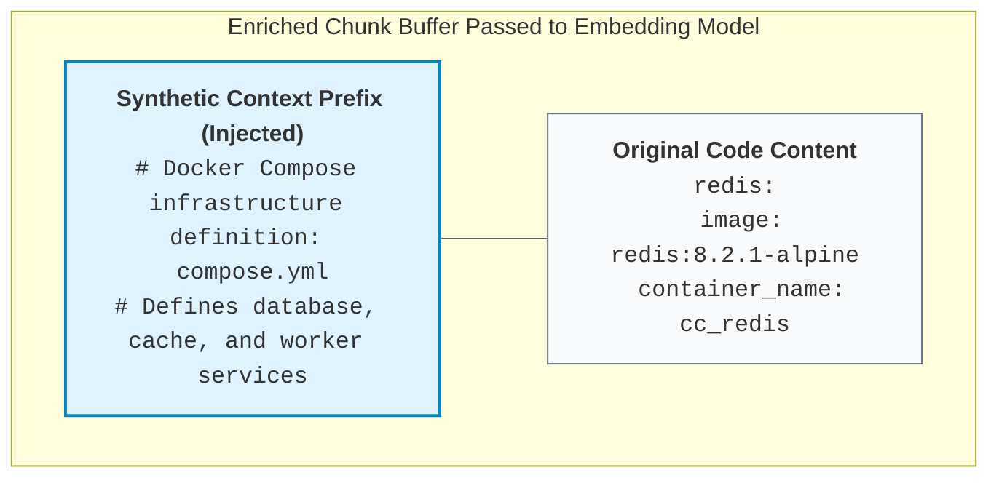
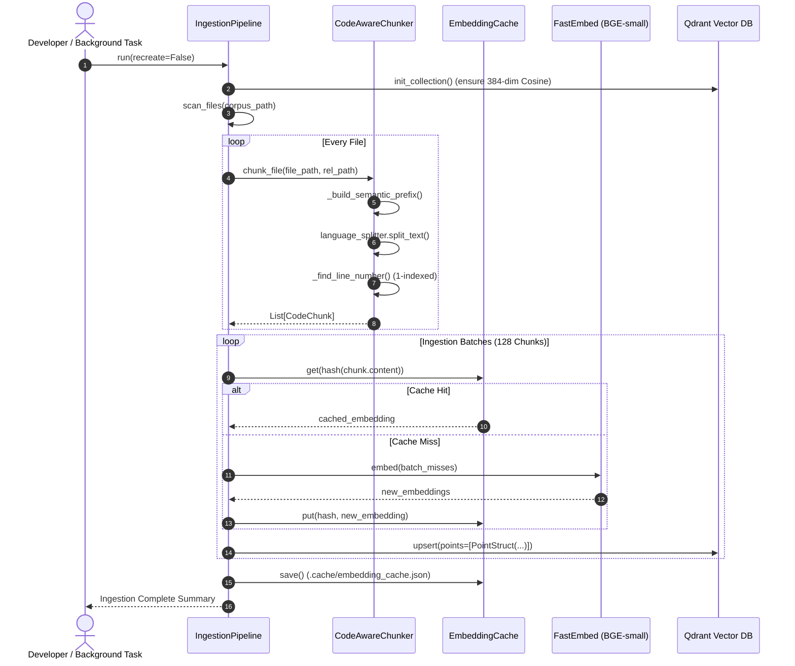
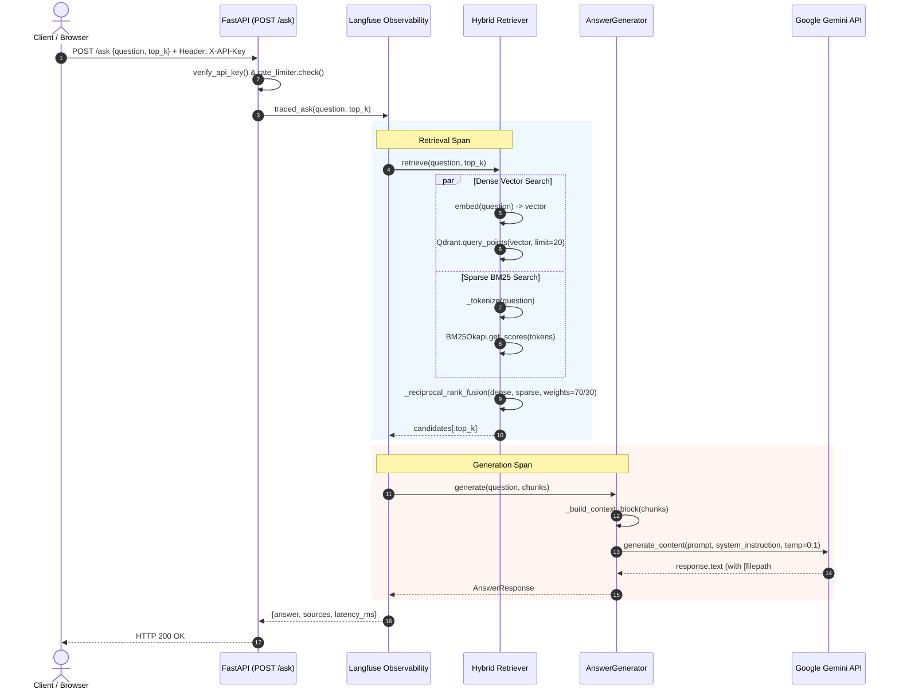
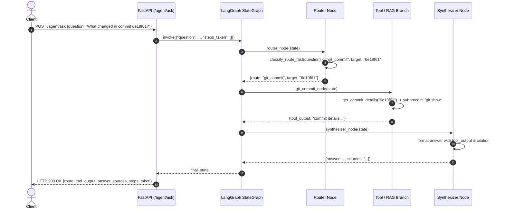

# Architecture, System Design & Engineering Patterns
## Deep Architectural Blueprint and Software Patterns of AEIA

> This document provides an exhaustive architectural breakdown of the **AI Engineering Intelligence Assistant (AEIA)**. It covers the end-to-end system topology, the chronological evolution across 7 production versions (V1–V7), the core software design patterns implemented in code, detailed data flow walkthroughs, and engineering standards.

---

## 1. High-Level System Topology

AEIA is architected as a modular, decoupled intelligence platform that indexes, retrieves, and reasons over the Campus Connect target codebase (~94k LOC). It exposes multiple client access interfaces (Standard HTTP REST, LangGraph Agentic API, and the Model Context Protocol):



---

## 2. The 7 Evolutionary Versions (V1 – V7)

AEIA did not begin as a monolithic system. It evolved incrementally through 7 distinct versions, where each version addressed specific empirical bottlenecks, evaluation failures, or operational requirements.



### V1 — Baseline Dense Vector RAG ([ADR 0001](../decisions/0001-target-corpus.md)–[ADR 0011](../decisions/0011-automated-testing-strategy.md))
- **Objective**: Establish a functional, grounded code question-answering pipeline.
- **Components**:
  - `CodeAwareChunker`: Language-specific splitting for TypeScript/TSX and Markdown using `langchain-text-splitters`.
  - `FastEmbed`: Local CPU embedding generation using `BAAI/bge-small-en-v1.5` (384 dimensions).
  - `Qdrant`: Single vector collection with Cosine distance.
  - `AnswerGenerator`: Gemini API prompts requiring strict `[filepath#Lstart-Lend]` citations.
  - `evals/run_eval.py`: Golden benchmark on 20 test cases.
- **Benchmark Baseline**:
  - **Recall@5**: 70.0%
  - **Recall@10**: 85.0%
  - **MRR (Mean Reciprocal Rank)**: 0.638
  - **Search Latency**: ~43ms
- **Identified Failure Modes**:
  1. Dense embeddings failed to retrieve exact variable names or database table definitions when wording differed slightly.
  2. Configuration files (`compose.yml`, SQL migrations, `.env.example`) were treated as semantically opaque by the embedding model.

### V2 — Hybrid Retrieval & Semantic Prefixing ([ADR 0012](../decisions/0012-v2-hybrid-retrieval-and-semantic-prefixing.md))
- **Objective**: Overcome dense vector blind spots and elevate retrieval recall above 90%.
- **Empirical Experiments & Findings**:
  1. **Cross-Encoder Reranking Test**: We tested integrating `FlashRank` with `ms-marco-MiniLM-L-12-v2`. Reranking degraded performance across the board (Recall@10 dropped from 85% to 80%, MRR dropped from 0.638 to 0.455, and latency exploded from 43ms to 1453ms). *Lesson: Web-trained cross-encoders actively downrank source code.*
  2. **Equal-Weight Hybrid RRF**: Dense + BM25 with equal 50/50 RRF weight improved Recall@5 to 75%, but dropped MRR to 0.464 because noisy BM25 keyword hits demoted high-confidence dense hits.
  3. **Weighted RRF (70/30)**: Allocating 0.7 weight to dense search and 0.3 to BM25 balanced keyword precision with semantic depth.
  4. **Semantic Prefix Enrichment**: Prepending natural-language preambles to `compose.yml`, SQL migrations, and `.env` files resolved the semantic opacity gap.
- **V2 Final Benchmark Results**:
  - **Recall@5**: **85.0%** (+15% improvement over V1)
  - **Recall@10**: **95.0%** (+10% improvement over V1)
  - **MRR**: **0.588**
  - **Search Latency**: **45ms** (retaining sub-50ms speed without expensive rerankers)

### V3 — Production Hardening ([ADR 0013](../decisions/0013-v3-production-hardening.md))
- **Objective**: Transition from a local research prototype to a hardened, authenticated service.
- **Additions**:
  - **Authentication**: `verify_api_key` FastAPI dependency enforcing `X-API-Key` headers.
  - **Rate Limiting**: `slowapi` limiter restricting clients to `20/minute` based on remote IP address.
  - **Async Ingestion Queue**: Re-ingestion triggered via `POST /ingest` runs asynchronously in a thread pool (`loop.run_in_executor`) while exposing `GET /ingest/status`.
  - **Automated CI**: GitHub Actions workflow [`.github/workflows/ci.yml`](../../.github/workflows/ci.yml) provisioning a live Qdrant service container, running ingestion, and executing test suites.

### V4 — Distributed Observability with Langfuse ([ADR 0014](../decisions/0014-v4-observability-langfuse-tracing.md))
- **Objective**: Instrument full-lifecycle request tracing to monitor retrieval latency, generation latency, chunk scores, and token consumption.
- **Implementation**:
  - Non-invasive wrapper [`src/observability/__init__.py`](../../src/observability/__init__.py).
  - Traces create sub-spans: `retrieval` (recording top files, scores, chunk count) and `generation` (recording prompt, model, tokens, response snippet).
  - **Zero-Overhead Degradation**: If `LANGFUSE_PUBLIC_KEY` is not provided in `.env`, the system bypasses tracing with zero performance penalty.

### V5 — Agentic Reasoning Layer with LangGraph ([ADR 0015](../decisions/0015-v5-agentic-router-langgraph.md))
- **Objective**: Handle queries that cannot be solved by static vector search (git history, commit diffs, reverse module imports).
- **Implementation**:
  - A deterministic state machine using `langgraph`.
  - **Dual-Speed Router**:
    - *Fast Path*: Regex matching for commit hashes and dependency phrases (<1ms latency, 0 token cost).
    - *Slow Path*: Gemini classifier with temperature `0.0` for ambiguous queries.
  - **Deterministic Tools**:
    - `get_git_commit_history`: Safe `git log` execution.
    - `get_commit_details`: Safe `git show` execution with strict hex regex validation (`^[0-9a-fA-F]{4,40}$`).
    - `find_file_dependents`: Regex-based static scanner identifying TypeScript/JavaScript files that import a given module.

### V6 — Model Context Protocol Server ([ADR 0016](../decisions/0016-v6-model-context-protocol-server.md))
- **Objective**: Expose AEIA capabilities as a standardized tool server under Anthropic's Model Context Protocol (MCP).
- **Implementation**:
  - Implements the official **2026-07-28 stateless HTTP protocol specification** mounted at `/mcp` on the FastAPI app.
  - Exposes 5 granular tools: `search_campus_connect`, `explain_codebase_query`, `get_commit_history`, `get_commit_diff`, and `find_module_dependents`.
  - Enforces an explicit `ALLOWED_MCP_TOOLS` permission allowlist.
  - Supports dual transport: Stateless HTTP for web/remote agents and `stdio` for local tools (Claude Desktop, Cursor).

### V7 — Centralized Error Resilience & Upstream Quota Degradation ([ADR 0017](../decisions/0017-error-handling-and-upstream-degradation.md))
- **Objective**: Prevent unhandled exceptions, standardize error schemas, and maintain system availability when upstream LLM APIs hit rate limits.
- **Implementation**:
  - Typed domain exception hierarchy: `AEIAError`, `LLMQuotaExceededError`, `LLMServiceUnavailableError`, `VectorDBUnavailableError`, `CorpusUnavailableError`.
  - Upstream Google API handlers mapping `RESOURCE_EXHAUSTED` to HTTP 429 and network failures to HTTP 503.
  - **Graceful Context Fallback**: When Gemini quota is exhausted, `AnswerGenerator` falls back to returning the retrieved, grounded code chunks directly to the user rather than failing.

---

## 3. Core Software Design Patterns in AEIA

AEIA employs several classical and modern software design patterns to maintain high throughput, low latency, and testability.

### Pattern 1: The Lifespan Singleton Pattern
*File: [`src/api/main.py`](../../src/api/main.py#L40-L58)*

**Problem**: Initializing machine learning models (`TextEmbedding`), vector database connections (`QdrantClient`), BM25 indices, and compiled LangGraph workflows on every HTTP request introduces hundreds of milliseconds of latency per request.

**Solution**: Use FastAPI's modern `@asynccontextmanager` lifespan handler to instantiate singletons exactly once during process boot, store them in a shared module dictionary `services`, and cleanly tear them down on shutdown.

```python
services = {}

@asynccontextmanager
async def lifespan(app: FastAPI):
    # One-time initialization on server startup
    retriever = Retriever()
    generator = AnswerGenerator()
    services["retriever"] = retriever
    services["generator"] = generator
    services["agent"] = create_agent_graph(retriever, generator)
    init_langfuse()
    
    try:
        async with mcp_server.session_manager.run():
            yield  # Server runs here
    finally:
        # One-time teardown on server shutdown
        langfuse_flush()
        services.clear()
```

### Pattern 2: Typed Domain Exception Hierarchy
*File: [`src/errors.py`](../../src/errors.py)*

**Problem**: Letting generic `Exception` or external library errors (e.g. `qdrant_client.http.exceptions.UnexpectedResponse`, `google.genai.errors.APIError`) leak into route handlers results in inconsistent error responses and vague HTTP 500 errors.

**Solution**: Encapsulate all failure modes inside a typed hierarchy inheriting from a common base class `AEIAError` with explicit HTTP status codes and machine-readable error codes.

```python
class AEIAError(Exception):
    def __init__(self, message: str, status_code: int = 500, error_code: str = "INTERNAL_ERROR"):
        super().__init__(message)
        self.message = message
        self.status_code = status_code
        self.error_code = error_code

class LLMQuotaExceededError(AEIAError):
    def __init__(self, message: str = "LLM API quota exceeded.", retry_after: Optional[int] = None):
        super().__init__(message, status_code=429, error_code="LLM_QUOTA_EXHAUSTED")
        self.retry_after = retry_after

class VectorDBUnavailableError(AEIAError):
    def __init__(self, message: str = "Vector DB connection failed."):
        super().__init__(message, status_code=503, error_code="VECTOR_DB_UNAVAILABLE")
```

### Pattern 3: Graceful Quota Degradation Pattern
*File: [`src/generation/generator.py`](../../src/generation/generator.py#L106-L126)*

**Problem**: In high-load environments or when using free-tier LLM API keys, upstream rate limits (`HTTP 429`) can disrupt service.

**Solution**: Implement multi-tier degradation:
1. **Tier 1**: Attempt primary model (`gemini-3.6-flash`).
2. **Tier 2**: On error, attempt fallback model (`gemini-2.5-flash-lite`).
3. **Tier 3 (Degraded Grounded Context)**: If all LLM candidates fail due to quota exhaustion, extract the top 3 grounded context chunks retrieved by Qdrant/BM25 and present them directly to the developer with exact citations. The developer still gets the code they need to do their job.

### Pattern 4: Fast-Path Regex Classifier with LLM Fallback
*File: [`src/agent/router.py`](../../src/agent/router.py)*

**Problem**: Routing every user query through an LLM introduces 300–800ms of latency and consumes billable tokens even for trivial queries like *"What changed in commit 6e19f61?"*.

**Solution**: A tiered routing pattern:
- **Fast Path (`classify_route_fast`)**: Uses compiled regular expressions to detect hex commit hashes (`\b[0-9a-fA-F]{6,40}\b`), git log phrases (`recent commits`), or dependency patterns (`what files depend on <x>`). Latency: `< 0.1ms`. Token cost: `$0.00`.
- **Slow Path (`classify_route_llm`)**: Invokes Gemini with strict temperature `0.0` only when the query is ambiguous.

### Pattern 5: Synthetic Context Injection (Semantic Prefixes)
*File: [`src/ingestion/chunker.py`](../../src/ingestion/chunker.py#L53-L93)*

**Problem**: Embedding models map terms based on co-occurrence in natural language. Raw configuration syntax (YAML service blocks, SQL DDL migrations) lacks natural language semantic anchors.

**Solution**: Synthetically inject human-readable header descriptions to the raw text buffer before passing it to the text splitter. The original line numbers of the code remain completely preserved because line tracking calculates offsets from the original un-prefixed source file.



---

## 4. End-to-End Data Flow Walkthroughs

### Flow A: Ingestion Pipeline Data Flow
Executed via `PYTHONPATH=. uv run python -m src.ingestion.pipeline` or `POST /ingest`:



---

### Flow B: Pure Grounded RAG Query Flow (`POST /ask`)



---

### Flow C: Agentic Workflow Query Flow (`POST /agent/ask`)



---

## 5. Engineering Standards and Invariants

When developing or modifying AEIA, adhere strictly to the following invariants:

1. **Deterministic Dependency Locking**: Never modify dependencies directly in `uv.lock`. Always update `pyproject.toml` or run `uv add <package>` and commit the updated lockfile.
2. **Strict Line Citation Preservation**: When modifying [`src/ingestion/chunker.py`](../../src/ingestion/chunker.py), never alter line number calculations in a way that shifts the 1-indexed citation offsets. Every citation format must strictly match:
   `[filepath#Lstart-Lend]`
3. **Subprocess Sanitization**: Never call `subprocess.run` with `shell=True`. Always pass argument lists and validate all user-supplied inputs (e.g. commit hashes, file paths) with strict regular expressions.
4. **Sub-50ms Retrieval Budget**: The hybrid retrieval pipeline (`_retrieve_dense` + `_retrieve_bm25` + `_reciprocal_rank_fusion`) must complete in **< 50 milliseconds** on local development machines. Do not re-enable heavy neural cross-encoders on the main search path.
5. **Graceful Degradation Requirement**: Every network call to an external service (Qdrant, Gemini, Langfuse) must be wrapped in error handling that gracefully falls back or raises a typed `AEIAError`.

---

Proceed to **[03 — File-by-File Mastery Catalog](03-file-by-file-mastery-catalog.md)** for a line-by-line inspection of every single file in the codebase.

