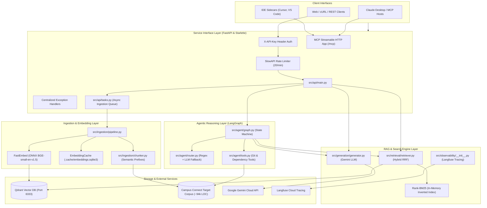
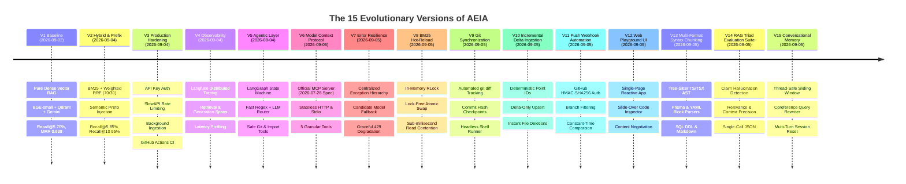
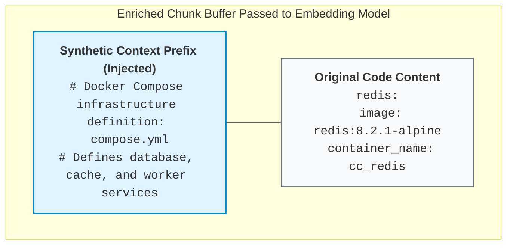
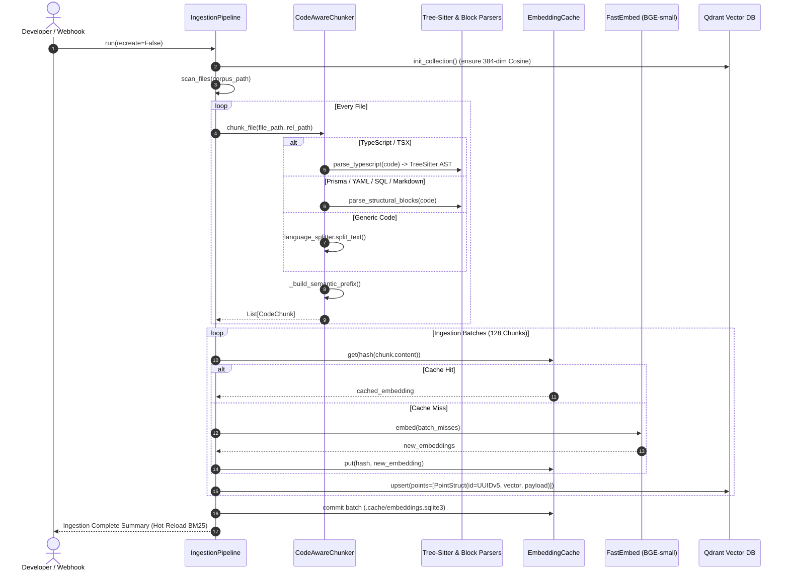
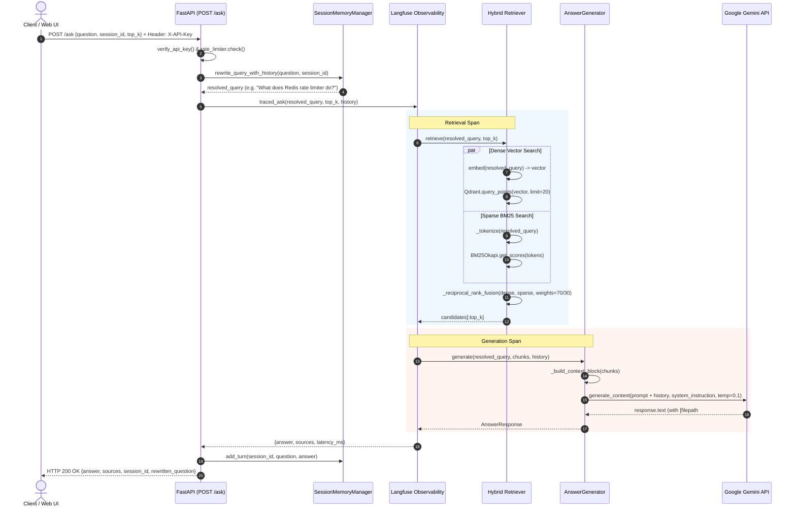
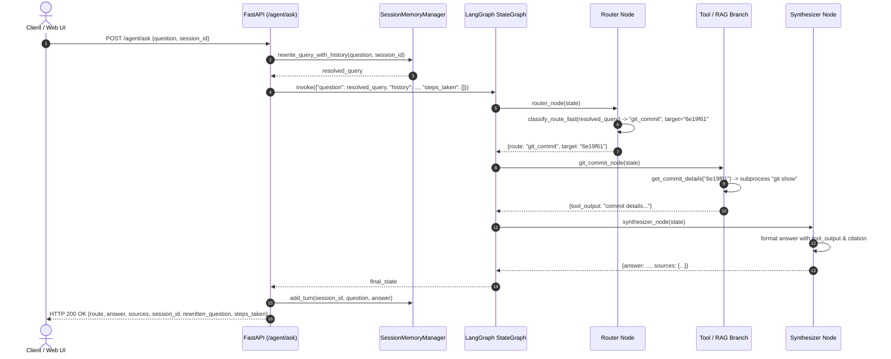

# Architecture, System Design & Engineering Patterns
## Deep Architectural Blueprint and Software Patterns of AEIA

> This document provides an exhaustive architectural breakdown of the **AI Engineering Intelligence Assistant (AEIA)**. It covers the end-to-end system topology, the chronological evolution across 7 production versions (V1–V7), the core software design patterns implemented in code, detailed data flow walkthroughs, and engineering standards.

---

## 1. High-Level System Topology

AEIA is architected as a modular, decoupled intelligence platform that indexes, retrieves, and reasons over the Campus Connect target codebase (~94k LOC). It exposes multiple client access interfaces (Standard HTTP REST, LangGraph Agentic API, and the Model Context Protocol):



---

## 2. The 15 Evolutionary Versions (V1 – V15)

AEIA did not begin as a monolithic system. It evolved incrementally through 15 distinct versions, where each version addressed specific empirical bottlenecks, evaluation failures, or operational requirements.



### V1 — Baseline Dense Vector RAG ([ADR 0001](../decisions/0001-target-corpus.md)–[ADR 0011](../decisions/0011-automated-testing-strategy.md))
- **Objective**: Establish a functional, grounded code question-answering pipeline.
- **Components**:
  - `CodeAwareChunker`: Language-specific splitting for TypeScript/TSX and Markdown using `langchain-text-splitters`.
  - `FastEmbed`: Local CPU embedding generation using `BAAI/bge-small-en-v1.5` (384 dimensions).
  - `Qdrant`: Single vector collection with Cosine distance.
  - `AnswerGenerator`: Gemini API prompts requiring strict `[filepath#Lstart-Lend]` citations.
  - `evals/run_eval.py`: Golden benchmark on 20 test cases.
- **Benchmark Baseline**:
  - **Recall@5**: 70.0%
  - **Recall@10**: 85.0%
  - **MRR (Mean Reciprocal Rank)**: 0.638
  - **Search Latency**: ~43ms
- **Identified Failure Modes**:
  1. Dense embeddings failed to retrieve exact variable names or database table definitions when wording differed slightly.
  2. Configuration files (`compose.yml`, SQL migrations, `.env.example`) were treated as semantically opaque by the embedding model.

### V2 — Hybrid Retrieval & Semantic Prefixing ([ADR 0012](../decisions/0012-v2-hybrid-retrieval-and-semantic-prefixing.md), updated by [ADR 0027](../decisions/0027-file-aware-hybrid-retrieval-ranking.md))
- **Objective**: Overcome dense vector blind spots and elevate retrieval recall above 90%.
- **Empirical Experiments & Findings**:
  1. **Cross-Encoder Reranking Test**: We tested integrating `FlashRank` with `ms-marco-MiniLM-L-12-v2`. Reranking degraded performance across the board (Recall@10 dropped from 85% to 80%, MRR dropped from 0.638 to 0.455, and latency exploded from 43ms to 1453ms). *Lesson: Web-trained cross-encoders actively downrank source code.*
  2. **Equal-Weight Hybrid RRF**: Dense + BM25 with equal 50/50 RRF weight improved Recall@5 to 75%, but dropped MRR to 0.464 because noisy BM25 keyword hits demoted high-confidence dense hits.
  3. **Weighted RRF (70/30)**: Allocating 0.7 weight to dense search and 0.3 to BM25 balanced keyword precision with semantic depth.
  4. **Semantic Prefix Enrichment**: Prepending natural-language preambles to `compose.yml`, SQL migrations, and `.env` files resolved the semantic opacity gap.
- **Current benchmark results after file-aware ranking**:
  - **Recall@5**: **100.0%** (20/20)
  - **Recall@10**: **100.0%** (20/20)
  - **MRR**: **0.7917**
  - **Search Latency**: **46.34ms**

### V3 — Production Hardening ([ADR 0013](../decisions/0013-v3-production-hardening.md))
- **Objective**: Transition from a local research prototype to a hardened, authenticated service.
- **Additions**:
  - **Authentication**: `verify_api_key` FastAPI dependency enforcing `X-API-Key` headers.
  - **Rate Limiting**: `slowapi` limiter restricting clients to `20/minute` based on remote IP address.
  - **Async Ingestion Queue**: Re-ingestion triggered via `POST /ingest` runs asynchronously in a thread pool (`loop.run_in_executor`) while exposing `GET /ingest/status`.
  - **Automated CI**: GitHub Actions workflow [`.github/workflows/ci.yml`](../../.github/workflows/ci.yml) provisioning a live Qdrant service container, running ingestion, and executing test suites.

### V4 — Distributed Observability with Langfuse ([ADR 0014](../decisions/0014-v4-observability-langfuse-tracing.md))
- **Objective**: Instrument full-lifecycle request tracing to monitor retrieval latency, generation latency, chunk scores, and token consumption.
- **Implementation**:
  - Non-invasive wrapper [`src/observability/__init__.py`](../../src/observability/__init__.py).
  - Traces create sub-spans: `retrieval` (recording top files, scores, chunk count) and `generation` (recording prompt, model, tokens, response snippet).
  - **Zero-Overhead Degradation**: If `LANGFUSE_PUBLIC_KEY` is not provided in `.env`, the system bypasses tracing with zero performance penalty.

### V5 — Agentic Reasoning Layer with LangGraph ([ADR 0015](../decisions/0015-v5-agentic-router-langgraph.md))
- **Objective**: Handle queries that cannot be solved by static vector search (git history, commit diffs, reverse module imports).
- **Implementation**:
  - A deterministic state machine using `langgraph`.
  - **Dual-Speed Router**:
    - *Fast Path*: Regex matching for commit hashes and dependency phrases (<1ms latency, 0 token cost).
    - *Slow Path*: Gemini classifier with temperature `0.0` for ambiguous queries.
  - **Deterministic Tools**:
    - `get_git_commit_history`: Safe `git log` execution.
    - `get_commit_details`: Safe `git show` execution with strict hex regex validation (`^[0-9a-fA-F]{4,40}$`).
    - `find_file_dependents`: Regex-based static scanner identifying TypeScript/JavaScript files that import a given module.

### V6 — Model Context Protocol Server ([ADR 0016](../decisions/0016-v6-model-context-protocol-server.md))
- **Objective**: Expose AEIA capabilities as a standardized tool server under Anthropic's Model Context Protocol (MCP).
- **Implementation**:
  - Implements the official **2026-07-28 stateless HTTP protocol specification** mounted at `/mcp` on the FastAPI app.
  - Exposes 5 granular tools: `search_campus_connect`, `explain_codebase_query`, `get_commit_history`, `get_commit_diff`, and `find_module_dependents`.
  - Enforces an explicit `ALLOWED_MCP_TOOLS` permission allowlist.
  - Supports dual transport: Stateless HTTP for web/remote agents and `stdio` for local tools (Claude Desktop, Cursor).

### V7 — Centralized Error Resilience & Upstream Quota Degradation ([ADR 0017](../decisions/0017-error-handling-and-upstream-degradation.md))
- **Objective**: Prevent unhandled exceptions, standardize error schemas, and maintain system availability when upstream LLM APIs hit rate limits.
- **Implementation**:
  - Typed domain exception hierarchy: `AEIAError`, `LLMQuotaExceededError`, `LLMServiceUnavailableError`, `VectorDBUnavailableError`, `CorpusUnavailableError`.
  - Upstream Google API handlers mapping `RESOURCE_EXHAUSTED` to HTTP 429 and network failures to HTTP 503.
  - **Graceful Context Fallback**: When Gemini quota is exhausted, `AnswerGenerator` falls back to returning the retrieved, grounded code chunks directly to the user rather than failing.

### V8 — Thread-Safe BM25 In-Memory Index Hot-Reload ([ADR 0018](../decisions/0018-bm25-thread-safe-hot-reload.md))
- **Objective**: Allow real-time index reloads after background re-ingestion without blocking concurrent search queries or throwing race condition errors.
- **Implementation**:
  - Implemented `threading.RLock` guard in `Retriever`.
  - Employs an atomic pointer swap: builds the new BM25 corpus and index in a detached local variable before acquiring the write lock for a sub-microsecond reference swap.

### V9 — Automated Git Corpus Sync & Diff Tracking ([ADR 0019](../decisions/0019-git-corpus-sync-and-diff-tracking.md))
- **Objective**: Keep the indexed knowledge base perfectly synchronized with remote git repositories without manual intervention.
- **Implementation**:
  - `src/ingestion/git_sync.py` performs safe fetch/pull operations and calculates modified, added, and deleted files using `git diff --name-status`.
  - Checkpoints commit SHA states in `.cache/last_synced_commit.txt`.

### V10 — Incremental Delta-Only Ingestion with Deterministic Point IDs ([ADR 0020](../decisions/0020-incremental-delta-only-ingestion.md))
- **Objective**: Eliminate expensive full-corpus re-embedding on every change by processing only modified or deleted files.
- **Implementation**:
  - Deterministic Qdrant Point IDs generated via UUIDv5 derived from `(rel_path, chunk_index)`.
  - When files are deleted or modified, points belonging to obsolete chunk indices are purged via Qdrant payload filters before new chunks are upserted.

### V11 — GitHub Push Webhook Automation ([ADR 0021](../decisions/0021-github-push-webhook-automation.md))
- **Objective**: Automatically trigger incremental ingestion whenever code is pushed to GitHub.
- **Implementation**:
  - Endpoint `POST /webhook/github` verifies `X-Hub-Signature-256` using constant-time `hmac.compare_digest`.
  - Filters events by target branch (e.g., `main`), rejecting out-of-scope branch pushes immediately with HTTP 200/202.

### V12 — Interactive Web UI Playground & Visual Citation Inspector ([ADR 0022](../decisions/0022-interactive-web-playground-ui.md))
- **Objective**: Deliver a zero-setup, graphical user interface for developers and evaluators to interact with AEIA without relying on curl or Swagger.
- **Implementation**:
  - Reactive single-page application at `src/api/static/index.html` (Tailwind CSS, Marked.js, Highlight.js). *Superseded by [ADR 0028](../decisions/0028-decoupled-nextjs-frontend-console.md): this file no longer exists — the console now lives in [`frontend/`](../../frontend/).*
  - Mode toggle between Direct RAG and Agent workflows.
  - Slide-over drawer rendering the exact cited source code lines when citations are clicked.
  - Content negotiation on `GET /` delivering HTML to browsers and JSON to API clients.

### V13 — Multi-Format Syntax-Aware Chunking ([ADR 0023](../decisions/0023-multi-format-syntax-aware-chunking.md))
- **Objective**: Replace coarse text splitters with parser-guided syntax boundaries across all file formats in modern full-stack repositories.
- **Implementation**:
  - `TreeSitterCodeParser`: Concrete syntax tree extraction for TypeScript and TSX, keeping functions, classes, interfaces, and leading JSDocs intact.
  - `PrismaBlockParser`: Atomic schema `model` and `enum` block extraction.
  - `YamlBlockParser`: Top-level indentation-preserving block extraction for Docker Compose services and GitHub Actions jobs.
  - `MarkdownSectionParser`: Breadcrumb hierarchy injection (`# Level 1 > ## Level 2`).
  - `SqlStatementParser`: Complete DDL statement isolation.

### V14 — Automated RAG Triad Generation Evaluation Suite ([ADR 0024](../decisions/0024-rag-triad-generation-evaluation.md))
- **Objective**: Quantify generation fidelity, hallucination rates, and answer relevancy using an impartial LLM judge.
- **Implementation**:
  - `evals/generation_eval.py` assesses Faithfulness (claim entailment), Answer Relevance, and Context Precision.
  - Employs a single structured JSON judge call to reduce LLM API roundtrips by 66%.
  - Integrates directly with `evals/run_eval.py --generation`.

### V15 — Multi-Turn Conversational Memory & Coreference Rewriter ([ADR 0025](../decisions/0025-conversational-memory-and-coreference-rewriter.md))
- **Objective**: Allow developers to have flowing multi-turn conversations where follow-up queries implicitly reference previous answers.
- **Implementation**:
  - `src/agent/memory.py`: Thread-safe sliding window session registry (`SessionMemoryManager`).
  - `rewrite_query_with_history`: Fast regex heuristic bypass for standalone queries (<1ms) and Gemini-powered pronoun resolution for follow-ups (e.g. "what does it do?").
  - Full-stack threading through `/ask`, `/agent/ask`, and the Web UI Playground.

---

## 3. Core Software Design Patterns in AEIA

AEIA employs several classical and modern software design patterns to maintain high throughput, low latency, and testability.

### Pattern 1: The Lifespan Singleton Pattern
*File: [`src/api/main.py`](../../src/api/main.py#L40-L58)*

**Problem**: Initializing machine learning models (`TextEmbedding`), vector database connections (`QdrantClient`), BM25 indices, and compiled LangGraph workflows on every HTTP request introduces hundreds of milliseconds of latency per request.

**Solution**: Use FastAPI's modern `@asynccontextmanager` lifespan handler to instantiate singletons exactly once during process boot, store them in a shared module dictionary `services`, and cleanly tear them down on shutdown.

```python
services = {}

@asynccontextmanager
async def lifespan(app: FastAPI):
    # One-time initialization on server startup
    retriever = Retriever()
    generator = AnswerGenerator()
    services["retriever"] = retriever
    services["generator"] = generator
    services["agent"] = create_agent_graph(retriever, generator)
    init_langfuse()
    
    try:
        async with mcp_server.session_manager.run():
            yield  # Server runs here
    finally:
        # One-time teardown on server shutdown
        langfuse_flush()
        services.clear()
```

### Pattern 2: Typed Domain Exception Hierarchy
*File: [`src/errors.py`](../../src/errors.py)*

**Problem**: Letting generic `Exception` or external library errors (e.g. `qdrant_client.http.exceptions.UnexpectedResponse`, `google.genai.errors.APIError`) leak into route handlers results in inconsistent error responses and vague HTTP 500 errors.

**Solution**: Encapsulate all failure modes inside a typed hierarchy inheriting from a common base class `AEIAError` with explicit HTTP status codes and machine-readable error codes.

```python
class AEIAError(Exception):
    def __init__(self, message: str, status_code: int = 500, error_code: str = "INTERNAL_ERROR"):
        super().__init__(message)
        self.message = message
        self.status_code = status_code
        self.error_code = error_code

class LLMQuotaExceededError(AEIAError):
    def __init__(self, message: str = "LLM API quota exceeded.", retry_after: Optional[int] = None):
        super().__init__(message, status_code=429, error_code="LLM_QUOTA_EXHAUSTED")
        self.retry_after = retry_after

class VectorDBUnavailableError(AEIAError):
    def __init__(self, message: str = "Vector DB connection failed."):
        super().__init__(message, status_code=503, error_code="VECTOR_DB_UNAVAILABLE")
```

### Pattern 3: Graceful Quota Degradation Pattern
*File: [`src/generation/generator.py`](../../src/generation/generator.py#L106-L126)*

**Problem**: In high-load environments or when using free-tier LLM API keys, upstream rate limits (`HTTP 429`) can disrupt service.

**Solution**: Implement multi-tier degradation:
1. **Tier 1**: Attempt primary model (`gemini-3.6-flash`).
2. **Tier 2**: On error, attempt fallback model (`gemini-2.5-flash-lite`).
3. **Tier 3 (Degraded Grounded Context)**: If all LLM candidates fail due to quota exhaustion, extract the top 3 grounded context chunks retrieved by Qdrant/BM25 and present them directly to the developer with exact citations. The developer still gets the code they need to do their job.

### Pattern 4: Fast-Path Regex Classifier with LLM Fallback
*File: [`src/agent/router.py`](../../src/agent/router.py)*

**Problem**: Routing every user query through an LLM introduces 300–800ms of latency and consumes billable tokens even for trivial queries like *"What changed in commit 6e19f61?"*.

**Solution**: A tiered routing pattern:
- **Fast Path (`classify_route_fast`)**: Uses compiled regular expressions to detect hex commit hashes (`\b[0-9a-fA-F]{6,40}\b`), git log phrases (`recent commits`), or dependency patterns (`what files depend on <x>`). Latency: `< 0.1ms`. Token cost: `$0.00`.
- **Slow Path (`classify_route_llm`)**: Invokes Gemini with strict temperature `0.0` only when the query is ambiguous.

### Pattern 5: Synthetic Context Injection (Semantic Prefixes)
*File: [`src/ingestion/chunker.py`](../../src/ingestion/chunker.py#L53-L93)*

**Problem**: Embedding models map terms based on co-occurrence in natural language. Raw configuration syntax (YAML service blocks, SQL DDL migrations) lacks natural language semantic anchors.

**Solution**: Synthetically inject human-readable header descriptions to the raw text buffer before passing it to the text splitter. The original line numbers of the code remain completely preserved because line tracking calculates offsets from the original un-prefixed source file.



### Pattern 6: AST Node Bundling & Leading Comment Preservation
*File: [`src/ingestion/ast_chunker.py`](../../src/ingestion/ast_chunker.py)*

**Problem**: Naive text or token splitters slice through function declarations, drop preceding JSDoc comments, and isolate export statements from their definitions.

**Solution**: Native Tree-Sitter concrete syntax tree (CST) parsing extracts semantic declarations (`function_declaration`, `class_declaration`, `interface_declaration`). When capturing an AST node, the parser scans previous sibling nodes backward for `comment` tokens, binding documentation directly with the declaration. Statements are bundled until reaching a target chunk size without splitting code blocks.

### Pattern 7: Single-Call RAG Triad Judge Pattern
*File: [`evals/generation_eval.py`](../../evals/generation_eval.py)*

**Problem**: Evaluating generation quality across Faithfulness, Relevance, and Context Precision traditionally requires 3 separate LLM calls per query, exhausting API quotas (e.g. 60 LLM calls for a 20-query benchmark).

**Solution**: Combine the entire RAG Triad evaluation into a single structured JSON schema prompt. The judge returns atomic claims, entailment judgements, relevance score, and precision score in one roundtrip—reducing latency and token consumption by 66%.

### Pattern 8: Sliding-Window Session Memory with Fast Coreference Rewriter
*File: [`src/agent/memory.py`](../../src/agent/memory.py)*

**Problem**: Follow-up questions like *"What does it do?"* or *"Show me its unit tests"* lack sufficient nouns for vector retrieval. However, sending every query to an LLM rewriter adds unacceptable latency (400ms+) on standalone queries.

**Solution**: A two-stage pipeline:
1. **Heuristic Evaluation**: Fast regex scans for pronouns (`it`, `this`, `that`, `they`) and follow-up markers (`what about`, `how does that`). If absent, the query is immediately passed to retrieval with zero latency overhead.
2. **LLM Coreference Resolution**: If follow-up markers are present, Gemini rewrites the question using the last 5 turns of conversation history into a fully self-contained retrieval query.

### Pattern 9: Decoupled Web Console & Pure Headless API Gateway
*Files: [`frontend/`](../../frontend/), [`src/api/main.py`](../../src/api/main.py)*

**Problem**: Serving a single-file HTML frontend through FastAPI tightly couples UI rendering with backend CPU/memory cycles and lacks modern component state management, TypeScript type safety, and automated test frameworks.

**Solution**: Retire `GET /ui` (returning 404) and standardize `GET /` as a pure headless API discovery endpoint returning JSON metadata. The user interface is cleanly decoupled into an independent Next.js 16 / React 19 web console in `frontend/`, deployed at zero cost on Vercel Edge. The browser no longer talks to FastAPI directly: it calls the console's own route handlers, which forward to the gateway server-side (see **Pattern 12**) ([ADR 0028](../decisions/0028-decoupled-nextjs-frontend-console.md), [ADR 0032](../decisions/0032-production-hardening-credential-boundary-and-async-correctness.md)).

### Pattern 10: Dynamic Client-Side API Key Injection & Quota Resilience
*Files: [`src/generation/generator.py`](../../src/generation/generator.py), [`src/api/main.py`](../../src/api/main.py), [`frontend/src/components/aeia/settings-dialog.tsx`](../../frontend/src/components/aeia/settings-dialog.tsx)*

**Problem**: Shared server-side Gemini API keys on Google AI Studio free tier frequently trigger `429 RESOURCE_EXHAUSTED` under concurrent usage or evaluation benchmarks, locking out all subsequent evaluators.

**Solution**: `AnswerGenerator` supports dynamic per-request client instantiation via `_resolve_client(api_key)`. Clients can supply a personal Gemini API key via the `X-Gemini-API-Key` header or request body. The key is securely held in browser `localStorage`, bypassing shared server quota limits without being stored on the server. If a 429 occurs, the UI's `QuotaAlert` component presents an animated countdown timer and a 1-click retry modal ([ADR 0029](../decisions/0029-client-side-api-key-injection-and-quota-resilience.md)).

### Pattern 11: Unified Streaming Protocol for RAG & Agentic Routing
*Files: [`src/api/main.py`](../../src/api/main.py), [`frontend/src/services/aeia.service.ts`](../../frontend/src/services/aeia.service.ts)*

**Problem**: Clients previously had to guess whether a query required vector search (`/ask/stream`) or non-RAG tools (`/agent/ask`), resulting in fragmented endpoints and blocking delays for tool operations.

**Solution**: All streaming is unified under `POST /ask/stream`. The router state machine executes within the streaming pipeline, immediately emitting verified source citations (<50ms) and streaming text tokens whether the answer was synthesized via dense/sparse RAG or deterministic Git/AST agent tools ([ADR 0030](../decisions/0030-unified-sse-streaming-protocol-for-rag-and-agent.md)).

### Pattern 12: Server-Side Credential Boundary (Backend-for-Frontend Proxy)
*Files: [`frontend/src/app/api/aeia/proxy.ts`](../../frontend/src/app/api/aeia/proxy.ts), [`frontend/src/app/api/aeia/`](../../frontend/src/app/api/aeia/), [`frontend/src/config/env.ts`](../../frontend/src/config/env.ts)*

**Problem**: The console originally read the backend credential from `NEXT_PUBLIC_API_KEY`. Next.js inlines every `NEXT_PUBLIC_`-prefixed value into the client bundle at build time, so the API key protecting the gateway was shipped to every visitor and readable in `.next/static/`. A shared secret that reaches the browser is not a secret.

**Solution**: The key moved server-side. Route handlers under `frontend/src/app/api/aeia/*` (`ask/stream`, `agent`, `health`) receive the browser's request, attach `X-API-Key` from the server-only `AEIA_API_KEY`, and forward to FastAPI — a Backend-for-Frontend. The browser never sees the credential, and `CORS_ALLOW_ORIGINS` narrows to origins that genuinely call the API from client-side JavaScript while `allow_credentials` stays `False`.

> **Breaking change**: `NEXT_PUBLIC_API_KEY` → `AEIA_API_KEY`, and `NEXT_PUBLIC_API_URL` → `AEIA_API_URL`. Any deployment carrying the old names still publishes its key.

Note the deliberate asymmetry with **Pattern 10**: a user's *own* Gemini key stays in their browser and travels per-request, because it is their credential to spend. The *shared* backend key never leaves the server.

### Pattern 13: Sync Handlers for Blocking Work (Threadpool Offload)
*Files: [`src/api/main.py`](../../src/api/main.py)*

**Problem**: `/ask`, `/ask/stream`, `/agent/ask`, and `/health` were declared `async def` but their bodies performed *synchronous* blocking work — embedding a query, Qdrant round-trips, Gemini calls. An `async def` handler runs directly on the event loop, so every blocking call froze the entire server: concurrent requests serialized behind each other and even `/health` would hang while one query was generating.

**Solution**: Those handlers are declared plain `def`. FastAPI then runs them in its threadpool, so blocking work parallelizes correctly and the event loop stays free. Handlers that genuinely await (`/ingest`, the webhook, exception handlers) remain `async def`.

A second defect lived in the same place: `/ask` and `/ask/stream` each carried their own `@limiter.limit`, and the streaming route re-entered the non-streaming one, spending two rate-limit tokens per streaming request. Both now delegate to an undecorated `_ask_impl`, so a request costs exactly one token.

---

## 4. End-to-End Data Flow Walkthroughs

### Flow A: Ingestion Pipeline Data Flow
Executed via `PYTHONPATH=. uv run python -m src.ingestion.pipeline`, `POST /ingest`, or `POST /webhook/github`:



---

### Flow B: Pure Grounded RAG Query Flow (`POST /ask`)



---

### Flow C: Agentic Workflow Query Flow (`POST /agent/ask`)



---

## 5. Engineering Standards and Invariants

When developing or modifying AEIA, adhere strictly to the following invariants:

1. **Deterministic Dependency Locking**: Never modify dependencies directly in `uv.lock`. Always update `pyproject.toml` or run `uv add <package>` and commit the updated lockfile.
2. **Strict Line Citation Preservation**: When modifying [`src/ingestion/chunker.py`](../../src/ingestion/chunker.py), never alter line number calculations in a way that shifts the 1-indexed citation offsets. Every citation format must strictly match:
   `[filepath#Lstart-Lend]`
3. **Subprocess Sanitization**: Never call `subprocess.run` with `shell=True`. Always pass argument lists and validate all user-supplied inputs (e.g. commit hashes, file paths) with strict regular expressions.
4. **Sub-50ms Retrieval Budget**: The hybrid retrieval pipeline (`_retrieve_dense` + `_retrieve_bm25` + `_reciprocal_rank_fusion`) must complete in **< 50 milliseconds** on local development machines. Do not re-enable heavy neural cross-encoders on the main search path.
5. **Graceful Degradation Requirement**: Every network call to an external service (Qdrant, Gemini, Langfuse) must be wrapped in error handling that gracefully falls back or raises a typed `AEIAError`.

---

Proceed to **[03 — File-by-File Mastery Catalog](03-file-by-file-mastery-catalog.md)** for a line-by-line inspection of every single file in the codebase.

