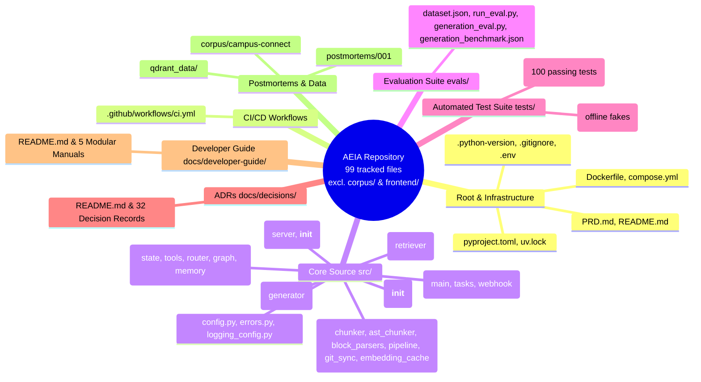

# File-by-File Codebase Mastery Catalog
## The Complete Reference to Every Single File in the AEIA Repository

> **Purpose**: This catalog leaves no file behind. Every configuration file, source module, evaluation script, automated test, architectural decision record, and deployment descriptor is documented here with:
> 1. **Relative File Path & Primary Responsibility**.
> 2. **Required Technologies & Prerequisite Concepts**.
> 3. **Line-by-Line / Section-by-Section Anatomy**: Critical code patterns, functions, classes, and logic.
> 4. **Verification & Testing**: Commands to test this specific file.
> 5. **Contribution & Improvement Opportunities**: Concrete ways you can extend or optimize this file.

---

## Master File Inventory

---

## 1. Root & Infrastructure Configuration

### 1.1 `pyproject.toml`
- **Relative Path**: [`../../pyproject.toml`](../../pyproject.toml)
- **Role**: The single source of truth for project metadata, dependencies, build settings, and pytest configuration.
- **Technologies Needed**: PEP 517/518/621 packaging standards, Astral `uv`, `pytest.ini_options`.
- **Anatomy & Critical Lines**:
  - `requires-python = ">=3.12"`: Enforces modern Python runtime.
  - `dependencies`: Declares locked runtime libraries including `fastapi`, `fastembed`, `qdrant-client`, `rank-bm25`, `langgraph`, `google-genai`, `mcp`, `slowapi`, and `langfuse`.
  - `[dependency-groups] dev`: Separates test runners (`pytest`, `pytest-asyncio`) from production image requirements.
  - `[tool.pytest.ini_options] pythonpath = ["."]`: Automatically adds repository root to Python module search path, preventing `ModuleNotFoundError` during tests.
- **Verification**: `uv sync` validates dependency graph resolution.
- **How to Improve**: Add linter/formatter configurations (e.g. `[tool.ruff]`) to enforce automated code styling.

### 1.2 `uv.lock`
- **Relative Path**: [`../../uv.lock`](../../uv.lock)
- **Role**: Universal, deterministic cross-platform lockfile containing exact cryptographically verified wheel hashes for every transitive dependency.
- **Technologies Needed**: Package resolution algorithms, lockfile mechanics.
- **Anatomy**: Automatically generated by `uv`. Never edit this file by hand.
- **Verification**: `uv sync --frozen` verifies that the local environment strictly matches the lockfile.
- **How to Improve**: Run `uv lock --upgrade` periodically to audit and bump security patches.

### 1.3 `.python-version`
- **Relative Path**: [`../../.python-version`](../../.python-version)
- **Role**: Declares the active Python version (`3.14` / `3.12`) for toolchains like `uv`, `pyenv`, and `asdf`.
- **Technologies Needed**: Python version managers.
- **How to Improve**: Keep synchronized with production Docker base image version.

### 1.4 `.gitignore`
- **Relative Path**: [`../../.gitignore`](../../.gitignore)
- **Role**: Prevents committing compiled bytecode, virtual environments, vector caches, and secret keys to Git.
- **Anatomy**: Ignores `.venv/`, `__pycache__/`, `.cache/` (embedding cache), `qdrant_data/` (on-disk vector storage), and `.env`.
- **How to Improve**: Ensure IDE-specific directories (`.idea/`, `.vscode/`) and OS temporary files (`.DS_Store`) remain blocked.

### 1.5 `.env`
- **Relative Path**: [`../../.env`](../../.env)
- **Role**: Local developer environment configuration holding API keys and service URLs.
- **Technologies Needed**: Dotenv specification, 12-factor application principles.
- **Anatomy**:
  - `GEMINI_API_KEY`: API key for Google Gemini answer generation.
  - `QDRANT_URL`: URL of vector database (defaults to `http://localhost:6333`).
  - `API_KEY`: Secret string required by the `X-API-Key` HTTP authentication header.
  - `RATE_LIMIT`: SlowAPI rate limit expression (e.g. `20/minute`).
  - `LANGFUSE_*`: Optional observability credentials.
- **How to Improve**: Maintain `.env.example` in sync with any new settings added to `src/config.py`.

### 1.6 `Dockerfile`
- **Relative Path**: [`../../Dockerfile`](../../Dockerfile)
- **Role**: Defines the lightweight, multi-stage production container image for the AEIA API service.
- **Technologies Needed**: Docker, container optimization, Astral `uv` Docker integration.
- **Anatomy & Critical Lines**:
  - `FROM ghcr.io/astral-sh/uv:python3.12-bookworm-slim`: Official high-performance slim base image with pre-installed `uv`.
  - `ENV UV_COMPILE_BYTECODE=1`: Pre-compiles `.pyc` files during build, speeding up container cold start.
  - `RUN uv sync --frozen --no-dev`: Installs only production dependencies without dev tools.
  - `CMD ["uv", "run", "uvicorn", "src.api.main:app", "--host", "0.0.0.0", "--port", "8000"]`: Production server entrypoint.
- **Verification**: `docker build -t aeia:test .`
- **How to Improve**: Add a non-root system user (`USER appuser`) for hardened container security.

### 1.7 `compose.yml`
- **Relative Path**: [`../../compose.yml`](../../compose.yml)
- **Role**: Orchestrates the multi-container development and staging topology: Qdrant vector database + AEIA FastAPI service.
- **Technologies Needed**: Docker Compose V2, healthchecks, container networking, volume mounts.
- **Anatomy & Critical Lines**:
  - `qdrant`: Binds ports `6333` and `6334`. Mounts `./qdrant_data:/qdrant/storage` for vector persistence.
  - `healthcheck`: Tests TCP socket connectivity `bash -c 'echo > /dev/tcp/localhost/6333'`.
  - `api.depends_on`: Uses `condition: service_healthy` so the API service waits until Qdrant is fully initialized before booting.
- **Verification**: `docker compose up -d`
- **How to Improve**: Add an optional Grafana/Prometheus or Langfuse local container service for full on-prem observability.

### 1.8 `main.py` — *removed*
- **Status**: Deleted. This was the `uv init` placeholder that printed `Hello from aeia!`; it had no role once the service acquired a real entrypoint.
- **Where to start the app instead**: `PYTHONPATH=. uv run uvicorn src.api.main:app --reload --port 8000`, or `docker compose up`.
- **How to Improve**: If a terminal client is wanted, add a `typer` CLI under `src/` and expose it via `[project.scripts]` in [`pyproject.toml`](../../pyproject.toml) rather than reviving a root-level script.

### 1.9 `PRD.md`
- **Relative Path**: [`../../PRD.md`](../../PRD.md)
- **Role**: Product Requirements Document specifying functional requirements (FR1–FR7: Hybrid RAG, Agentic Routing, MCP Server, Observability) and non-functional requirements (NFR1–NFR5: Latency budgets, Cost zero-overhead, Security).
- **Technologies Needed**: Product management, software engineering requirements.
- **How to Improve**: Update whenever new version milestones or architectural features are approved.

### 1.10 `README.md`
- **Relative Path**: [`../../README.md`](../../README.md)
- **Role**: Primary user-facing README.
- **Anatomy**: Features list, quick-start curl commands, retrieval benchmark table, LangGraph ASCII diagram, ADR directory links.
- **How to Improve**: Include badges for CI status and coverage.

---

## 2. CI/CD Workflows

### 2.1 `.github/workflows/ci.yml`
- **Relative Path**: [`../../.github/workflows/ci.yml`](../../.github/workflows/ci.yml)
- **Role**: Continuous Integration pipeline executed on every GitHub pull request and push to `main`.
- **Technologies Needed**: GitHub Actions, service containers, astral-sh/setup-uv.
- **Anatomy & Critical Lines**:
  - `services.qdrant`: Automatically boots a live Qdrant container with healthchecks on port 6333 in the CI runner.
  - `uses: astral-sh/setup-uv@v6`: Sets up `uv` cache for lightning-fast CI builds.
  - `run: uv sync --dev`: Syncs exact locked dependencies.
  - `run: PYTHONPATH=. uv run python -m src.ingestion.pipeline`: Seeds the live Qdrant container with corpus vectors.
  - `run: uv run pytest -v`: Runs all unit and integration test suites against the seeded database.
- **Verification**: Run locally using `act` or push to a GitHub branch.
- **How to Improve**: Add code coverage reporting (`pytest --cov`) and linting (`ruff check`).

---

## 3. Core Source Code (`src/`)

### 3.1 `src/config.py`
- **Relative Path**: [`../../src/config.py`](../../src/config.py)
- **Role**: Centralized configuration management using Pydantic Settings.
- **Technologies Needed**: `pydantic-settings`, `BaseSettings`, environment variables.
- **Anatomy & Critical Lines**:
  - `Settings(BaseSettings)`: Reads `.env` with `extra="ignore"`.
  - Defines defaults for `qdrant_url`, `collection_name`, `embedding_model` (`BAAI/bge-small-en-v1.5`), `embedding_dim` (384), `api_key`, `rate_limit`, and Langfuse keys.
  - `settings = Settings()`: Singleton instance imported across the codebase.
- **How to Improve**: Add validation validators (e.g. ensure `embedding_dim` matches the selected `embedding_model`).

### 3.2 `src/errors.py`
- **Relative Path**: [`../../src/errors.py`](../../src/errors.py)
- **Role**: Typed domain exception hierarchy providing structured error codes and HTTP statuses.
- **Technologies Needed**: Python exception handling, object-oriented design.
- **Anatomy & Critical Lines**:
  - `AEIAError`: Base exception with `message`, `status_code`, and `error_code`.
  - `LLMQuotaExceededError`: Raised on HTTP 429 quota exhaustion; includes optional `retry_after` parameter.
  - `VectorDBUnavailableError`: Raised when Qdrant is unreachable (HTTP 503).
  - `LLMServiceUnavailableError` and `CorpusUnavailableError`.
- **Verification**: Tested in `tests/test_error_handling.py`.
- **How to Improve**: Add client-facing error remediation tips in the exception payload.

### 3.3 `src/ingestion/chunker.py`
- **Relative Path**: [`../../src/ingestion/chunker.py`](../../src/ingestion/chunker.py)
- **Role**: Multi-format syntax-aware code and config chunker dispatching to AST and structural block parsers.
- **Technologies Needed**: `tree-sitter`, `tree-sitter-typescript`, regular expressions, structural parsing.
- **Anatomy & Critical Lines**:
  - `CodeChunk` dataclass: Holds `content`, `file_path`, `start_line`, `end_line`, `file_type`, and `chunk_index`.
  - `CodeAwareChunker.chunk_file()`: Delegates to `TreeSitterCodeParser` for `.ts`/`.tsx`, `PrismaBlockParser` for `.prisma`, `YamlBlockParser` for `.yml`, `MarkdownSectionParser` for `.md`, and `SqlStatementParser` for `.sql`.
  - `_build_semantic_prefix()`: Prepends descriptive natural language headers to Docker Compose YAML, SQL migrations, and `.env` files.
- **Verification**: Tested in `tests/test_chunker.py` and `tests/test_syntax_chunkers.py`.

### 3.3.1 `src/ingestion/ast_chunker.py`
- **Relative Path**: [`../../src/ingestion/ast_chunker.py`](../../src/ingestion/ast_chunker.py)
- **Role**: Tree-Sitter AST parser for TypeScript and TSX code chunking.
- **Technologies Needed**: `tree_sitter.Parser`, `tree_sitter_typescript`.
- **Anatomy**: Parses AST nodes for functions, classes, interfaces, and types; preserves leading comments and JSDocs; bundles short statements below threshold into coherent chunks.

### 3.3.2 `src/ingestion/block_parsers.py`
- **Relative Path**: [`../../src/ingestion/block_parsers.py`](../../src/ingestion/block_parsers.py)
- **Role**: Syntax-aware structural block parsers for Prisma, YAML, Markdown, and SQL.
- **Technologies Needed**: Regex multiline grammars, line-number tracking.
- **Anatomy**: `PrismaBlockParser` (atomic models/enums), `YamlBlockParser` (atomic Compose services and CI jobs), `MarkdownSectionParser` (header hierarchy), and `SqlStatementParser` (atomic DDL statements).

### 3.4 `src/ingestion/pipeline.py`
- **Relative Path**: [`../../src/ingestion/pipeline.py`](../../src/ingestion/pipeline.py)
- **Role**: Complete codebase ingestion runner: scans files, manages SHA-256 embedding cache, computes embeddings with FastEmbed, and batch upserts points into Qdrant. Supports both full recreate and incremental delta-only indexing.
- **Technologies Needed**: `fastembed.TextEmbedding`, `qdrant_client`, SHA-256 hashing, batch processing.
- **Anatomy & Critical Lines**:
  - `EmbeddingCache`: Imported from [`embedding_cache.py`](../../src/ingestion/embedding_cache.py) (§3.4.2). SQLite-backed, mapping `sha256(content)` to a 384-dim `float32` vector.
  - **Atomic run claim**: The ingestion state transition is made under a single lock, so two concurrent triggers cannot both start a run (a check-then-set race fixed in [ADR 0032](../decisions/0032-production-hardening-credential-boundary-and-async-correctness.md)).
  - **Non-destructive by default**: `run()` upserts then prunes stale points rather than dropping the collection, so the index stays queryable throughout a re-ingest.
  - `_point_id()`: Computes deterministic 60-bit integers from `sha256(f"{file_path}::{chunk_index}")`, ensuring stable idempotent point IDs.
  - `_delete_points_for_file()`: Scrolls and deletes points matching a specific `file_path` filter before re-indexing.
  - `run(recreate=True)`: Recreates collection and indexes entire corpus.
  - `run_incremental(changed_files)`: Purges stale points for changed/deleted files, re-chunks and upserts modified files without dropping collection.
- **Verification**: `PYTHONPATH=. uv run python -m src.ingestion.pipeline`

### 3.4.1 `src/ingestion/git_sync.py`
- **Relative Path**: [`../../src/ingestion/git_sync.py`](../../src/ingestion/git_sync.py)
- **Role**: Automated git synchronization utility for remote corpus repositories.
- **Technologies Needed**: `subprocess`, git porcelain commands (`rev-parse`, `pull`, `diff`).
- **Anatomy & Critical Lines**:
  - `GitPullResult`: Dataclass capturing `before_sha`, `after_sha`, `changed_files`, and `up_to_date`.
  - `pull_corpus()`: Captures HEAD commit, pulls `origin main`, resolves changed files via `git diff --name-only <before>..<after>`, and detects up-to-date state.

### 3.4.2 `src/ingestion/embedding_cache.py`
- **Relative Path**: [`../../src/ingestion/embedding_cache.py`](../../src/ingestion/embedding_cache.py)
- **Role**: Content-addressed embedding cache backed by SQLite (`.cache/embeddings.sqlite3`). Re-ingesting an unchanged file costs a cheap lookup instead of a forward pass through the embedding model.
- **Technologies Needed**: `sqlite3`, SHA-256 hashing, `numpy` `float32` buffers, WAL journaling.
- **Anatomy & Critical Lines**:
  - `content_hash(text)`: `sha256` of the UTF-8 chunk content — the cache key.
  - `_SCHEMA`: One table, `embeddings(hash TEXT PRIMARY KEY, dim INTEGER, vec BLOB)`.
  - `PRAGMA journal_mode=WAL` / `synchronous=NORMAL`: Concurrent reads during writes, with a crash-safe commit per batch rather than one rewrite of the entire corpus.
  - `_migrate_legacy_json()`: One-time import of the pre-[ADR 0032](../decisions/0032-production-hardening-credential-boundary-and-async-correctness.md) `.cache/embedding_cache.json`, so an existing cache is not thrown away on upgrade.
- **Why it replaced the JSON file**: The old format decoded every vector into Python floats on construction (tens of seconds, hundreds of MB of RAM) and rewrote the whole file on each save, so an interrupted write lost the lot.
- **Verification**: `uv run pytest tests/test_incremental_ingestion.py -v`

### 3.4.3 `src/logging_config.py`
- **Relative Path**: [`../../src/logging_config.py`](../../src/logging_config.py)
- **Role**: Single entry point for logging setup, so modules call `logging.getLogger(__name__)` and inherit consistent formatting and level instead of each configuring handlers (or printing).
- **Technologies Needed**: `logging`, `logging.config`.
- **Anatomy & Critical Lines**: Reads `LOG_LEVEL` from settings; installs one root handler; idempotent so repeated calls (tests, workers, the reloader) do not stack duplicate handlers.
- **Verification**: `LOG_LEVEL=DEBUG PYTHONPATH=. uv run python -m src.ingestion.pipeline`

### 3.5 `src/retrieval/retriever.py`
- **Relative Path**: [`../../src/retrieval/retriever.py`](../../src/retrieval/retriever.py)
- **Role**: Production hybrid retriever fusing dense vector search and sparse BM25Okapi search via 70/30 Weighted Reciprocal Rank Fusion (RRF), equipped with thread-safe hot-reload.
- **Technologies Needed**: `qdrant-client`, `rank-bm25`, Reciprocal Rank Fusion, `threading.Lock`.
- **Anatomy & Critical Lines**:
  - `Retriever.__init__`: Connects to Qdrant, loads local `TextEmbedding`, initializes `_bm25_lock`, and calls `reload_bm25()`.
  - `reload_bm25()`: Build-then-swap pattern; expensive scrolling and tokenization run without holding lock, followed by an atomic pointer swap under `_bm25_lock`.
  - `_retrieve_bm25()`: Snapshots `(self._bm25, self._all_chunks)` under lock, ensuring consistent query scoring without blocking concurrent reloads.
  - `_reciprocal_rank_fusion()`: Merges dense and sparse candidates using:
    $$\text{RRF Score} = \frac{0.7}{60 + \text{rank}_{\text{dense}}} + \frac{0.3}{60 + \text{rank}_{\text{sparse}}}$$
  - Deduplicates on `(chunk.file_path, chunk.start_line)`.
- **Verification**: Tested in `tests/test_retriever.py` and `tests/test_incremental_ingestion.py`.

### 3.6 `src/generation/generator.py`
- **Relative Path**: [`../../src/generation/generator.py`](../../src/generation/generator.py)
- **Role**: Synthesizes engineering answers grounded strictly in retrieved context chunks using Google Gemini.
- **Technologies Needed**: `google-genai` SDK, Pydantic, prompt engineering, error degradation.
- **Anatomy & Critical Lines**:
  - `SYSTEM_PROMPT`: Strictly enforces answering only from provided chunks and citing sources as `[filepath#Lstart-Lend]`.
  - `generate()`: Builds context blocks from retrieved chunks. Tries primary model `gemini-3.6-flash`, then falls back to `gemini-2.5-flash-lite`.
  - **Graceful Degradation**: If Google API returns 429 quota exhaustion and `raise_on_quota=False`, returns retrieved chunks formatted directly as answers so developers can still inspect the code.
- **Verification**: Tested in `tests/test_error_handling.py`.
- **How to Improve**: Add streaming response support (`generate_content_stream`).

### 3.7 `src/observability/__init__.py`
- **Relative Path**: [`../../src/observability/__init__.py`](../../src/observability/__init__.py)
- **Role**: Langfuse distributed tracing client. Instruments retrieval and generation spans.
- **Technologies Needed**: Distributed tracing, APM, latency instrumentation.
- **Anatomy & Critical Lines**:
  - `init_langfuse()`: Initializes client only if credentials exist in `.env`. Otherwise returns `None`.
  - `traced_ask()`: Top-level entrypoint. If Langfuse is active, wraps execution in a `rag-ask` trace, records a `retrieval` span (chunk counts, scores, files) and a `gemini-generate` span (model, prompt, tokens).
  - `flush()`: Flushes pending traces on server shutdown.
- **How to Improve**: Add trace user ID tagging and token cost tracking calculations.

### 3.8 `src/agent/state.py`
- **Relative Path**: [`../../src/agent/state.py`](../../src/agent/state.py)
- **Role**: Defines the `AgentState` `TypedDict` that flows through the LangGraph state machine.
- **Technologies Needed**: `typing.TypedDict`, state management.
- **Anatomy**: Contains `question`, `top_k`, `route`, `route_reasoning`, `target`, `context_chunks`, `tool_output`, `answer`, `sources`, and `steps_taken`.

### 3.9 `src/agent/tools.py`
- **Relative Path**: [`../../src/agent/tools.py`](../../src/agent/tools.py)
- **Role**: Deterministic non-RAG tools for repository inspection.
- **Technologies Needed**: `subprocess`, safe shell execution, regex file scanning.
- **Anatomy & Critical Lines**:
  - `get_git_commit_history(max_count, path)`: Executes safe `git log -n<count> --pretty=format:...` inside corpus.
  - `get_commit_details(commit_hash)`: Validates commit hash against `^[0-9a-fA-F]{4,40}$` before running `git show --stat`. Rejects any malicious injection strings.
  - `find_file_dependents(module_name)`: Regex-scans all `.ts`, `.tsx`, `.js` files in corpus for `import ... from '<target>'` or `require('<target>')`.
- **Verification**: Tested in `tests/test_agent_tools.py`.
- **How to Improve**: Add support for parsing `tsconfig.json` path aliases (`@/components/...`).

### 3.10 `src/agent/router.py`
- **Relative Path**: [`../../src/agent/router.py`](../../src/agent/router.py)
- **Role**: Dual-speed classifier routing user queries between `direct_rag`, `git_commit`, `git_history`, and `file_dependents`.
- **Technologies Needed**: Regular expressions, Gemini LLM classification.
- **Anatomy & Critical Lines**:
  - `classify_route_fast(question)`: Evaluates regex rules for commit hashes, git log keywords, and dependency questions. Returns route immediately (<1ms) if confident.
  - `classify_route_llm(question)`: Falls back to Gemini with zero temperature if regex doesn't match.
- **Verification**: Tested in `tests/test_agent_router.py`.

### 3.11 `src/agent/graph.py`
- **Relative Path**: [`../../src/agent/graph.py`](../../src/agent/graph.py)
- **Role**: Constructs and compiles the LangGraph state machine.
- **Technologies Needed**: `langgraph.graph.StateGraph`, conditional edges, DAG topology.
- **Anatomy & Critical Lines**:
  - Adds nodes: `router`, `direct_rag`, `git_history`, `git_commit`, `file_dependents`, and `synthesizer`.
  - Sets entrypoint to `router`, wires conditional edges to the selected branch, and converges all branches to `synthesizer`.
- **Verification**: Tested in `tests/test_agent_api.py`.

### 3.11.1 `src/agent/memory.py`
- **Relative Path**: [`../../src/agent/memory.py`](../../src/agent/memory.py)
- **Role**: Multi-turn conversational session memory and coreference query rewriter.
- **Technologies Needed**: Thread-safe locks, sliding window data structures, Gemini structured query rewriting.
- **Anatomy & Critical Lines**:
  - `Turn` & `SessionMemory`: Dataclasses maintaining a sliding window of recent conversation turns (default `max_turns=5`) with timestamps.
  - `SessionMemoryManager`: Thread-safe registry storing and retrieving active sessions with automatic TTL expiration cleanup.
  - `rewrite_query_with_history(question, history, client, model)`: Analyzes follow-up questions for pronouns or implicit references (e.g., "what does it do?", "show me its tests"). Fast heuristic bypasses rewriting if the query is standalone; otherwise prompts Gemini to expand references into a fully self-contained retrieval query.
- **Verification**: Tested in `tests/test_memory.py`.

### 3.12 `src/mcp/server.py`
- **Relative Path**: [`../../src/mcp/server.py`](../../src/mcp/server.py)
- **Role**: Official Model Context Protocol (MCP) server adhering to the 2026-07-28 specification.
- **Technologies Needed**: `mcp.server.MCPServer`, JSON-RPC 2.0, Starlette streamable HTTP apps.
- **Anatomy & Critical Lines**:
  - `ALLOWED_MCP_TOOLS`: Enforces strict allowlist of 5 tools: `search_campus_connect`, `explain_codebase_query`, `get_commit_history`, `get_commit_diff`, `find_module_dependents`.
  - `get_streamable_http_app()`: Configures `TransportSecuritySettings` and creates a stateless Starlette app mounted at `/mcp`.
  - `if __name__ == "__main__": asyncio.run(mcp_server.run_stdio_async())`: Supports local stdio transport.
- **Verification**: Tested in `tests/test_mcp_protocol.py` and `tests/test_mcp_tools.py`.

### 3.13 `src/api/main.py`
- **Relative Path**: [`../../src/api/main.py`](../../src/api/main.py)
- **Role**: The core FastAPI application entrypoint.
- **Technologies Needed**: `fastapi`, `slowapi`, lifespan events, CORS, exception handlers.
- **Anatomy & Critical Lines**:
  - `lifespan(app)`: Initializes singletons (`Retriever`, `AnswerGenerator`, LangGraph agent, MCP server).
  - Centralized handlers for `AEIAError`, `RateLimitExceeded`, and `APIError`.
  - Mounts `/mcp` streamable HTTP app.
  - Endpoints: `GET /` (root), `GET /health`, `POST /ask`, `POST /agent/ask`, `POST /ingest`, `GET /ingest/status`, `POST /webhook/github`.
- **Verification**: Tested in `tests/test_api.py` and `tests/test_incremental_ingestion.py`.

### 3.14 `src/api/tasks.py`
- **Relative Path**: [`../../src/api/tasks.py`](../../src/api/tasks.py)
- **Role**: Background task worker managing asynchronous full and incremental corpus ingestion with automatic BM25 index refreshing.
- **Technologies Needed**: `asyncio`, thread pool execution.
- **Anatomy**: `trigger_ingestion()` launches full recreate in background; `trigger_incremental_ingestion(changed_files)` executes delta-only indexing. Both invoke `_hot_reload_retriever()` upon completion.

### 3.15 `src/api/webhook.py`
- **Relative Path**: [`../../src/api/webhook.py`](../../src/api/webhook.py)
- **Role**: GitHub push event webhook listener with cryptographic HMAC-SHA256 signature verification.
- **Technologies Needed**: `hmac`, `hashlib`, FastAPI `Request`, constant-time digest verification.
- **Anatomy**: Validates `X-Hub-Signature-256`, filters for `refs/heads/main`, executes `pull_corpus()`, schedules incremental ingestion in background, and responds with `202 Accepted`.

### 3.16 `src/api/static/index.html` — *removed*
- **Status**: Deleted. The single-file Tailwind/Marked.js console was retired by [ADR 0028](../decisions/0028-decoupled-nextjs-frontend-console.md) in favour of the Next.js console in [`frontend/`](../../frontend/) (see §7). `GET /ui` now returns 404 and `GET /` returns JSON service discovery — [`tests/test_ui.py`](../../tests/test_ui.py) pins both.
- **Why it is still listed**: So that older ADRs, screenshots, and commit messages referring to it remain traceable to its replacement.

---

## 4. Evaluation Suite (`evals/`)

### 4.1 `evals/dataset.json`
- **Relative Path**: [`../../evals/dataset.json`](../../evals/dataset.json)
- **Role**: 20 golden test cases with human-verified ground-truth expected source files.
- **Anatomy**: Categorized across 7 engineering domains (`architecture_navigation`, `code_location`, `change_analysis`, `config_schema_lookup`, `debugging_assistance`, `dependency_reasoning`, `onboarding`).

### 4.2 `evals/run_eval.py`
- **Relative Path**: [`../../evals/run_eval.py`](../../evals/run_eval.py)
- **Role**: Benchmark runner executing queries against the live retriever. Supports `--generation` flag.
- **Anatomy**: Computes Recall@5, Recall@10, Mean Reciprocal Rank (MRR), average search latency, and prints a formatted per-category breakdown table.
- **Verification**: `uv run python evals/run_eval.py` (or `uv run python evals/run_eval.py --generation`)

### 4.3 `evals/generation_eval.py`
- **Relative Path**: [`../../evals/generation_eval.py`](../../evals/generation_eval.py)
- **Role**: Automated RAG Triad generation evaluation suite using Google Gemini as an LLM-as-a-Judge.
- **Technologies Needed**: `google-genai`, RAG Triad framework, JSON response schemas.
- **Anatomy**: Evaluates Faithfulness (groundedness / hallucination rate), Answer Relevance, and Context Precision across the 20 golden queries in `dataset.json`. Generates structured benchmark report at `evals/generation_benchmark.json`.
- **Verification**: `uv run python evals/generation_eval.py --limit 2`

---

## 5. Automated Test Suites (`tests/`)

All test suites use `pytest` and can be run simultaneously via `uv run pytest -v`. The full run is **offline by default** — no Qdrant, no API key, ~26 seconds — because [`conftest.py`](../../tests/conftest.py) substitutes in-memory fakes. Set `AEIA_TEST_MODE=integration` to run the same tests against a live stack.

| Test File | Target Under Test | Key Assertions & Scenarios |
| :--- | :--- | :--- |
| [`../../tests/test_chunker.py`](../../tests/test_chunker.py) | `CodeAwareChunker` | TypeScript interface preservation, line numbers, Markdown headings, empty file handling. |
| [`../../tests/test_retriever.py`](../../tests/test_retriever.py) | `Retriever` | Verifies top_k chunk counts, non-empty citations, `#L` line patterns, positive scores. |
| [`../../tests/conftest.py`](../../tests/conftest.py) | Shared fixtures | Supplies in-memory fakes for Qdrant, the embedding model, and Gemini; defines the `real_router` marker that opts a test out of the offline routing fake. |
| [`../../tests/test_api.py`](../../tests/test_api.py) | `src/api/main.py` | Validates root, health, missing/invalid `X-API-Key` rejection (**401** — missing auth is an authentication failure, not a validation error), valid `/ask` responses. |
| [`../../tests/test_agent_router.py`](../../tests/test_agent_router.py) | `src/agent/router.py` | Tests regex routing for commit hashes, git log queries, and dependency questions. |
| [`../../tests/test_agent_tools.py`](../../tests/test_agent_tools.py) | `src/agent/tools.py` | Tests safe `git log`, valid commit diff, command injection rejection (`rm -rf`), and Redis dependent scan. |
| [`../../tests/test_agent_api.py`](../../tests/test_agent_api.py) | `POST /agent/ask` | Tests agent auth, routing execution, `use_agent` flag on `/ask`, and step audit logging. |
| [`../../tests/test_mcp_protocol.py`](../../tests/test_mcp_protocol.py) | MCP Protocol | Verifies 2026-07-28 stateless HTTP headers, `tools/list` JSON-RPC, and `tools/call`. |
| [`../../tests/test_mcp_tools.py`](../../tests/test_mcp_tools.py) | MCP Tools | Tests calling all 5 tools via MCP server interface and verifies output formats. |
| [`../../tests/test_error_handling.py`](../../tests/test_error_handling.py) | Error Resilience | Tests HTTP 429 quota exception handling, Retry-After header, 503 Vector DB failure, and graceful chunk fallback. |
| [`../../tests/test_incremental_ingestion.py`](../../tests/test_incremental_ingestion.py) | Live Sync & Webhook | Tests git sync, deterministic point IDs, HMAC-SHA256 signature verification, branch filtering, and BM25 thread safety. |
| [`../../tests/test_ui.py`](../../tests/test_ui.py) | Web Playground & API Root | Tests `GET /ui` 404 retirement (in favor of Next.js frontend) and standard JSON service discovery on `GET /`. |
| [`../../tests/test_syntax_chunkers.py`](../../tests/test_syntax_chunkers.py) | Syntax Chunkers | Tests Tree-Sitter AST parser (TS/TSX), Prisma blocks, YAML compose services, Markdown sections, and SQL DDL. |
| [`../../tests/test_generation_eval.py`](../../tests/test_generation_eval.py) | RAG Triad Evals | Tests LLM judge scoring, faithful vs hallucinated claim detection, and benchmark summary aggregation. |
| [`../../tests/test_memory.py`](../../tests/test_memory.py) | Multi-Turn Memory | Tests sliding-window session management, standalone query bypass, LLM pronoun rewriting, and API integration. |
| [`../../tests/test_stream.py`](../../tests/test_stream.py) | SSE Streaming | Tests `POST /ask/stream` and `stream=True` flag, `text/event-stream` headers, and event sequence (`sources`, `token`, `done`). |
| [`../../tests/test_unified_stream.py`](../../tests/test_unified_stream.py) | Unified Stream Routing | Tests unified streaming across `direct_rag`, `git_commit`, and `file_dependents` routes under a single SSE contract. |
| [`../../tests/test_regressions.py`](../../tests/test_regressions.py) | Previously-fixed defects | One test per bug fixed in [ADR 0032](../decisions/0032-production-hardening-credential-boundary-and-async-correctness.md) — double-counted streaming rate limit, ingestion check-then-set race, missing-auth status code, credential leakage, and others. A fixed bug cannot return silently. |

---

## 6. Architectural Decision Records (`docs/decisions/`)

Every major technical choice is documented as an ADR:

- [`0001-target-corpus.md`](../decisions/0001-target-corpus.md): Selection of Campus Connect (~94k LOC full-stack target repo).
- [`0002-zero-cost-embedding-and-vector-db.md`](../decisions/0002-zero-cost-embedding-and-vector-db.md): Qdrant + FastEmbed BGE-small for zero-cost CPU execution.
- [`0003-llm-provider-gemini.md`](../decisions/0003-llm-provider-gemini.md): Gemini LLM selection for reasoning fidelity and generous developer tier.
- [`0004-python-toolchain-uv.md`](../decisions/0004-python-toolchain-uv.md): Migration to Astral `uv` for 10-100x faster package management.
- [`0005-code-aware-chunking-strategy.md`](../decisions/0005-code-aware-chunking-strategy.md): Exact line preservation and language-aware chunking.
- [`0006-gpu-acceleration-for-embeddings.md`](../decisions/0006-gpu-acceleration-for-embeddings.md): CPU vs GPU trade-off analysis.
- [`0007-grounded-retrieval-and-citations.md`](../decisions/0007-grounded-retrieval-and-citations.md): Strict citation formatting requirement `[filepath#Lstart-Lend]`.
- [`0008-fastapi-service-interface.md`](../decisions/0008-fastapi-service-interface.md): FastAPI ASGI service design and latency instrumentation.
- [`0009-docker-containerization.md`](../decisions/0009-docker-containerization.md): Multi-container Docker Compose architecture and healthchecks.
- [`0010-evaluation-dataset-and-benchmark.md`](../decisions/0010-evaluation-dataset-and-benchmark.md): Specification of 20-query golden benchmark dataset.
- [`0011-automated-testing-strategy.md`](../decisions/0011-automated-testing-strategy.md): Automated unit, integration, and regression testing strategy.
- [`0012-v2-hybrid-retrieval-and-semantic-prefixing.md`](../decisions/0012-v2-hybrid-retrieval-and-semantic-prefixing.md): BM25 + Dense 70/30 Weighted RRF and semantic prefixes.
- [`0013-v3-production-hardening.md`](../decisions/0013-v3-production-hardening.md): API key auth, rate limiting, and async ingestion queue.
- [`0014-v4-observability-langfuse-tracing.md`](../decisions/0014-v4-observability-langfuse-tracing.md): Full-lifecycle request tracing with Langfuse.
- [`0015-v5-agentic-router-langgraph.md`](../decisions/0015-v5-agentic-router-langgraph.md): State machine agentic router and non-RAG tools.
- [`0016-v6-model-context-protocol-server.md`](../decisions/0016-v6-model-context-protocol-server.md): Model Context Protocol server (2026-07-28 stateless HTTP spec).
- [`0017-error-handling-and-upstream-degradation.md`](../decisions/0017-error-handling-and-upstream-degradation.md): Centralized exception handling and upstream LLM quota degradation.
- [`0018-bm25-thread-safe-hot-reload.md`](../decisions/0018-bm25-thread-safe-hot-reload.md): Thread-Safe BM25 In-Memory Index Hot-Reload.
- [`0019-git-corpus-sync-and-diff-tracking.md`](../decisions/0019-git-corpus-sync-and-diff-tracking.md): Automated Git Synchronization and Diff Tracking.
- [`0020-incremental-delta-only-ingestion.md`](../decisions/0020-incremental-delta-only-ingestion.md): Incremental Delta-Only Ingestion with Deterministic Point IDs.
- [`0021-github-push-webhook-automation.md`](../decisions/0021-github-push-webhook-automation.md): GitHub Push Webhook Automation with HMAC-SHA256 Authentication.
- [`0022-interactive-web-playground-ui.md`](../decisions/0022-interactive-web-playground-ui.md): Interactive Web UI Playground (Superseded by 0028).
- [`0023-multi-format-syntax-aware-chunking.md`](../decisions/0023-multi-format-syntax-aware-chunking.md): Multi-Format Syntax-Aware Chunking (Tree-Sitter AST & Structural Block Parsers).
- [`0024-rag-triad-generation-evaluation.md`](../decisions/0024-rag-triad-generation-evaluation.md): Automated RAG Triad Generation Evaluation Suite.
- [`0025-conversational-memory-and-coreference-rewriter.md`](../decisions/0025-conversational-memory-and-coreference-rewriter.md): Conversational Memory and Coreference Query Rewriter.
- [`0026-real-time-sse-token-streaming-and-chat-sdk.md`](../decisions/0026-real-time-sse-token-streaming-and-chat-sdk.md): Real-Time Server-Sent Events (SSE) Token Streaming & Google GenAI Chat SDK Alignment.
- [`0027-file-aware-hybrid-retrieval-ranking.md`](../decisions/0027-file-aware-hybrid-retrieval-ranking.md): File-Aware Hybrid Retrieval Ranking (Candidate expansion & file-level aggregation).
- [`0028-decoupled-nextjs-frontend-console.md`](../decisions/0028-decoupled-nextjs-frontend-console.md): Decoupled Next.js Frontend Console & Retirement of Static Single-File UI.
- [`0029-client-side-api-key-injection-and-quota-resilience.md`](../decisions/0029-client-side-api-key-injection-and-quota-resilience.md): Client-Side Dynamic API Key Injection & LLM Quota Resilience.
- [`0030-unified-sse-streaming-protocol-for-rag-and-agent.md`](../decisions/0030-unified-sse-streaming-protocol-for-rag-and-agent.md): Unified Server-Sent Events (SSE) Streaming Protocol for RAG & Agentic Routing.
- [`0031-codebase-type-modernization-and-ingestion-telemetry.md`](../decisions/0031-codebase-type-modernization-and-ingestion-telemetry.md): Modernized Python 3.12+ Type Annotation Standard & Ingestion Progress Instrumentation.
- [`0032-production-hardening-credential-boundary-and-async-correctness.md`](../decisions/0032-production-hardening-credential-boundary-and-async-correctness.md): Production Hardening — server-side credential boundary, sync-handler threadpool offload, SQLite embedding cache, offline-first tests, and GitHub Actions CI.

---

## 7. Frontend Console Anatomy (`frontend/`)

The AEIA Web Console is an independent Next.js 16 (App Router) / React 19 application:

| File / Component | Role & Functionality |
| :--- | :--- |
| [`frontend/src/app/page.tsx`](../../frontend/src/app/page.tsx) | Main interactive console orchestrating question submission, streaming response accumulation, citations state, and quota alert bindings. |
| [`frontend/src/components/aeia/chat-message-item.tsx`](../../frontend/src/components/aeia/chat-message-item.tsx) | Renders a single chat turn: streaming assistant markdown, copy-to-clipboard, and the citation chips that open the code modal. Replaces the former `answer-card.tsx` + `citation-list.tsx` pair. |
| [`frontend/src/components/aeia/markdown-view.tsx`](../../frontend/src/components/aeia/markdown-view.tsx) | Markdown renderer with syntax highlighting and a streaming-aware cursor. |
| [`frontend/src/components/aeia/chat-sidebar.tsx`](../../frontend/src/components/aeia/chat-sidebar.tsx) | Session list, new-chat control, and the backend health indicator driven by `use-aeia-health`. |
| [`frontend/src/components/aeia/query-input.tsx`](../../frontend/src/components/aeia/query-input.tsx) | Composer with submit/stop controls for an in-flight stream. |
| [`frontend/src/components/aeia/empty-console.tsx`](../../frontend/src/components/aeia/empty-console.tsx) | Zero-state with suggested starter prompts. |
| [`frontend/src/components/aeia/error-banner.tsx`](../../frontend/src/components/aeia/error-banner.tsx) | Inline error surface with a shortcut into the settings dialog. |
| [`frontend/src/components/aeia/code-modal.tsx`](../../frontend/src/components/aeia/code-modal.tsx) | Slide-over drawer rendering the exact retrieved source chunk with line numbers for grounding verification. |
| [`frontend/src/components/aeia/settings-dialog.tsx`](../../frontend/src/components/aeia/settings-dialog.tsx) | Modal for choosing proxy mode (default) or a custom backend URL, and for supplying a personal Gemini API key (persisted in `localStorage`). The **backend** key is no longer entered here — it lives server-side ([ADR 0032](../decisions/0032-production-hardening-credential-boundary-and-async-correctness.md)). |
| [`frontend/src/components/aeia/quota-alert.tsx`](../../frontend/src/components/aeia/quota-alert.tsx) | Alert banner triggered on HTTP 429 quota exhaustion with animated countdown and 1-click retry. |
| [`frontend/src/services/aeia.service.ts`](../../frontend/src/services/aeia.service.ts) | Resilient SSE stream consumer parsing `sources`, `token`, `done`, and `error` events. Resolves endpoints through the proxy by default. |
| [`frontend/src/app/api/aeia/proxy.ts`](../../frontend/src/app/api/aeia/proxy.ts) | **Credential boundary.** Shared helper that attaches the server-only `AEIA_API_KEY` as `X-API-Key` and forwards the request to FastAPI. The browser never sees the key. |
| [`frontend/src/app/api/aeia/ask/stream/route.ts`](../../frontend/src/app/api/aeia/ask/stream/route.ts) | Route handler proxying the unified SSE stream, piping the upstream body through without buffering so tokens arrive incrementally. |
| [`frontend/src/app/api/aeia/agent/route.ts`](../../frontend/src/app/api/aeia/agent/route.ts) | Route handler proxying `POST /agent/ask`. |
| [`frontend/src/app/api/aeia/health/route.ts`](../../frontend/src/app/api/aeia/health/route.ts) | Route handler proxying `GET /health` for the console's status indicator. |
| [`frontend/src/app/api/aeia/proxy.test.ts`](../../frontend/src/app/api/aeia/proxy.test.ts) | Asserts the proxy attaches credentials server-side and never echoes them back to the client. Runs in Vitest's `node` environment, not `jsdom`. |
| [`frontend/src/config/env.ts`](../../frontend/src/config/env.ts) | Validates environment variables and enforces the server-only/public split — reading `AEIA_API_KEY` from a client component is a build-time error. |
| [`frontend/src/hooks/queries/use-aeia-health.ts`](../../frontend/src/hooks/queries/use-aeia-health.ts) | React Query hook polling backend health declaratively (`refetchInterval` + retry), replacing a `setState`-in-`useEffect` loop. Exposes `refetch` for manual retries. |

---

## 8. Postmortems & Data Context

### 8.1 `docs/postmortems/001-semantic-bias-config-retrieval.md`
- **Relative Path**: [`../postmortems/001-semantic-bias-config-retrieval.md`](../postmortems/001-semantic-bias-config-retrieval.md)
- **Role**: In-depth incident postmortem documenting why config files were missed during V1 retrieval, how cross-encoders failed, and how semantic prefix injection permanently solved the issue. Must-read for any search engineer.

### 8.2 `corpus/campus-connect/`
- **Relative Path**: [`../../corpus/campus-connect/`](../../corpus/campus-connect/)
- **Role**: The target full-stack web application (~94k LOC) indexed by AEIA. Contains real-world TypeScript, Next.js App Router, Prisma schemas, SQL migrations, Docker Compose definitions, and documentation.

### 8.3 `qdrant_data/`
- **Relative Path**: [`../../qdrant_data/`](../../qdrant_data/)
- **Role**: On-disk storage volume mounted by Qdrant to persist HNSW vector indices and payloads across container restarts.

---

Proceed to **[04 — Step-by-Step Build Curriculum](04-step-by-step-build-curriculum.md)** for a zero-to-production implementation roadmap.

