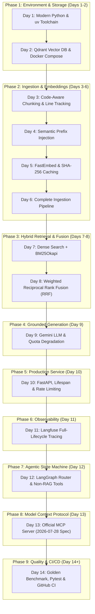

# Step-by-Step Implementation Curriculum
## Build the Complete AEIA Intelligence System from Scratch in 14 Days

> **Overview**: This curriculum provides an actionable, day-by-day implementation roadmap. If you were handed an empty directory today, this guide walks you through building every subsystem of AEIA in chronological sequence.
> 
> Each day includes:
> 1. **Core Learning Objective**.
> 2. **Technical Deep-Dive & Architecture**.
> 3. **Step-by-Step Code Implementation**.
> 4. **Milestone Verification**: Concrete commands to prove your implementation works.
> 5. **AEIA Source Reference**: The corresponding relative file in the repository.

---

## Curriculum Roadmap



---

## Phase 1: Environment & Storage (Days 1–2)

### Day 1: Modern Python Environment, `uv`, and Target Exploration
- **Objective**: Establish the development workspace, configure Astral `uv`, configure environment variables, and inspect the target codebase.
- **Technical Context**:
  Traditional `pip` and `poetry` setups are slow and suffer from platform resolution discrepancies. `uv` provides instant dependency resolution and universal lockfile determinism ([ADR 0004](../decisions/0004-python-toolchain-uv.md)).
- **Action Steps**:
  1. Initialize project directory and create [`pyproject.toml`](../../pyproject.toml):
     ```bash
     mkdir aeia && cd aeia
     uv init --no-workspace
     ```
  2. Populate [`pyproject.toml`](../../pyproject.toml) with core dependencies:
     ```bash
     uv add fastapi uvicorn pydantic pydantic-settings python-dotenv slowapi
     uv add fastembed qdrant-client rank-bm25 google-genai langgraph mcp langfuse
     uv add --dev pytest pytest-asyncio
     ```
  3. Create `.env` and `.gitignore`:
     ```ini
     GEMINI_API_KEY="your-gemini-key"
     QDRANT_URL="http://localhost:6333"
     COLLECTION_NAME="campus_connect"
     API_KEY="dev-key-change-me"
     RATE_LIMIT="20/minute"
     ```
  4. Inspect the target corpus in `corpus/campus-connect/`: notice the mix of Next.js TypeScript, Prisma schemas, SQL migrations, and Docker configurations.
- **Verification Milestone**: Run `uv sync` and verify `.venv/` is cleanly populated.
- **Codebase Reference**: [`../../pyproject.toml`](../../pyproject.toml), [`../../.env`](../../.env).

---

### Day 2: Qdrant Vector Database & Docker Compose
- **Objective**: Deploy Qdrant vector database with persistent storage and healthchecks.
- **Technical Context**:
  A robust vector database must persist state across restarts and expose both REST and gRPC interfaces ([ADR 0002](../decisions/0002-zero-cost-embedding-and-vector-db.md), [ADR 0009](../decisions/0009-docker-containerization.md)).
- **Action Steps**:
  1. Write [`compose.yml`](../../compose.yml) defining the `qdrant` service:
     ```yaml
     services:
       qdrant:
         image: qdrant/qdrant:latest
         container_name: aeia_qdrant
         ports:
           - "6333:6333"
           - "6334:6334"
         volumes:
           - ./qdrant_data:/qdrant/storage
         restart: unless-stopped
         healthcheck:
           test: ["CMD-SHELL", "bash -c 'echo > /dev/tcp/localhost/6333' 2>/dev/null || exit 1"]
           interval: 5s
           timeout: 5s
           retries: 10
     ```
  2. Launch Qdrant: `docker compose up -d qdrant`.
  3. Write a small sanity check script connecting via `qdrant_client.QdrantClient(url="http://localhost:6333")` and querying `client.get_collections()`.
- **Verification Milestone**: `curl http://localhost:6333/readyz` returns HTTP 200 `ok`.
- **Codebase Reference**: [`../../compose.yml`](../../compose.yml).

---

## Phase 2: Ingestion & Embeddings (Days 3–6)

### Day 3: Code-Aware Chunking & Line Tracking
- **Objective**: Build a text splitter that preserves code structure and calculates exact 1-indexed line numbers.
- **Technical Context**:
  Code files cannot be split by character counts alone. Language splitters split on class/interface boundaries. Citations must point to exact line numbers (`[file#Lstart-Lend]`) ([ADR 0005](../decisions/0005-code-aware-chunking-strategy.md)).
- **Action Steps**:
  1. Define the `CodeChunk` dataclass in [`src/ingestion/chunker.py`](../../src/ingestion/chunker.py):
     ```python
     @dataclass
     class CodeChunk:
         content: str
         file_path: str
         start_line: int
         end_line: int
         file_type: str
         chunk_index: int
     ```
  2. Implement `RecursiveCharacterTextSplitter.from_language(Language.TS)` for TypeScript and `Language.MARKDOWN` for documentation.
  3. Write `_find_line_number()`: find the chunk substring in the original file content and count `\n` characters up to that offset to compute 1-indexed line numbers.
- **Verification Milestone**: Run `uv run pytest tests/test_chunker.py` and verify line numbers match actual source lines.
- **Codebase Reference**: [`../../src/ingestion/chunker.py`](../../src/ingestion/chunker.py).

---

### Day 4: Semantic Prefix Injection for Configs & Schemas
- **Objective**: Resolve the "semantic opacity" problem in Docker Compose files, SQL migrations, and `.env` files.
- **Technical Context**:
  As discovered in Postmortem `001`, embedding models cannot match natural-language queries ("What depends on Redis?") to raw YAML blocks (`redis: image: redis:8.2.1-alpine`). Prepending natural language descriptions acts as a semantic anchor.
- **Action Steps**:
  1. In [`src/ingestion/chunker.py`](../../src/ingestion/chunker.py), implement `_build_semantic_prefix(file_path, rel_path)`:
     - For `compose*.yml`: Inject header describing application stack services, databases, caches, and queues.
     - For `.sql` migrations: Inject header with migration folder name explaining table schema changes.
     - For `.env*`: Inject header describing environment variables.
  2. Prepend prefix to `text_to_split` while ensuring line number tracking offsets remain anchored to original source content.
- **Verification Milestone**: Chunk `corpus/campus-connect/compose.yml` and inspect that the first chunk begins with the injected header.
- **Codebase Reference**: [`../../src/ingestion/chunker.py`](../../src/ingestion/chunker.py#L53-L93), [`../postmortems/001-semantic-bias-config-retrieval.md`](../postmortems/001-semantic-bias-config-retrieval.md).

---

### Day 5: Local CPU Embeddings & Content-Hash Caching
- **Objective**: Implement zero-cost local embeddings with FastEmbed and a persistent SHA-256 disk cache.
- **Technical Context**:
  Re-embedding 1,500+ chunks on every ingestion run wastes CPU cycles. Caching embeddings by `sha256(chunk_content)` allows incremental ingestion in seconds ([ADR 0002](../decisions/0002-zero-cost-embedding-and-vector-db.md)).
- **Action Steps**:
  1. In [`src/ingestion/pipeline.py`](../../src/ingestion/pipeline.py), implement `EmbeddingCache`:
     ```python
     class EmbeddingCache:
         def __init__(self, cache_path: Path = Path(".cache/embedding_cache.json")):
             self.cache_path = cache_path
             self._cache: Dict[str, List[float]] = {}
             self._load()

         def _hash(self, text: str) -> str:
             return hashlib.sha256(text.encode("utf-8")).hexdigest()

         def get(self, content: str) -> List[float] | None:
             return self._cache.get(self._hash(content))

         def put(self, content: str, embedding: List[float]):
             self._cache[self._hash(content)] = embedding
     ```
  2. Initialize `fastembed.TextEmbedding(model_name="BAAI/bge-small-en-v1.5")`.
- **Verification Milestone**: Embed 10 sample strings, save cache, reload, and verify cache hits return immediately without invoking the model.
- **Codebase Reference**: [`../../src/ingestion/pipeline.py`](../../src/ingestion/pipeline.py#L52-L95).

---

### Day 6: Assembling the Ingestion Pipeline
- **Objective**: Wire file scanning, chunking, caching, embedding, and Qdrant upsertion into an automated pipeline.
- **Action Steps**:
  1. In [`src/ingestion/pipeline.py`](../../src/ingestion/pipeline.py), implement `IngestionPipeline`:
     - `init_collection()`: Creates `campus_connect` collection with `VectorParams(size=384, distance=Distance.COSINE)`.
     - `scan_files()`: Recursively scans corpus, excluding `node_modules`, `.next`, `.git`, while explicitly allowing `.env.example`.
     - `run()`: Batches chunks into groups of 128, embeds misses, and executes `client.upsert(points=[PointStruct(...)])`.
  2. Save cache to disk upon completion.
- **Verification Milestone**:
  ```bash
  PYTHONPATH=. uv run python -m src.ingestion.pipeline
  ```
  Output shows ~1,500+ chunks upserted into Qdrant in < 25 seconds.
- **Codebase Reference**: [`../../src/ingestion/pipeline.py`](../../src/ingestion/pipeline.py).

---

## Phase 3: Hybrid Retrieval & Fusion Ranking (Days 7–8)

### Day 7: Dense Search + BM25Okapi Inverted Index
- **Objective**: Combine vector search with in-memory sparse lexical keyword matching.
- **Technical Context**:
  Dense vectors find concepts; BM25 finds exact function identifiers, route names, and filenames. Code needs both ([ADR 0012](../decisions/0012-v2-hybrid-retrieval-and-semantic-prefixing.md)).
- **Action Steps**:
  1. In [`src/retrieval/retriever.py`](../../src/retrieval/retriever.py), implement `_tokenize()`: split camelCase and snake_case into sub-words.
  2. On startup, scroll all payloads from Qdrant (`client.scroll()`), tokenize contents, and initialize `BM25Okapi(tokenized)`.
  3. Implement `_retrieve_dense(query, top_k)` using Qdrant vector search.
  4. Implement `_retrieve_bm25(query, top_k)` using `bm25.get_scores()`.
- **Verification Milestone**: Query `retriever._retrieve_bm25("AUTH_COOKIE_NAME")` and confirm exact file matches appear in top results.
- **Codebase Reference**: [`../../src/retrieval/retriever.py`](../../src/retrieval/retriever.py#L33-L135).

---

### Day 8: Weighted Reciprocal Rank Fusion (RRF 70/30)
- **Objective**: Merge dense and sparse result lists using weighted rank positions.
- **Technical Context**:
  Raw cosine scores and BM25 scores cannot be added directly. RRF normalizes by rank:
  $$\text{Score}(d) = \frac{0.7}{60 + \text{rank}_{\text{dense}}} + \frac{0.3}{60 + \text{rank}_{\text{sparse}}}$$
- **Action Steps**:
  1. In [`src/retrieval/retriever.py`](../../src/retrieval/retriever.py), implement `_reciprocal_rank_fusion()`.
  2. Deduplicate candidates using the composite tuple key `(chunk.file_path, chunk.start_line)`.
  3. Sort combined candidate keys in descending order of RRF score.
- **Verification Milestone**:
  ```bash
  PYTHONPATH=. uv run python -m src.retrieval.retriever "Where is user authentication implemented?"
  ```
  Returns top 5 chunks with balanced semantic and keyword hits.
- **Codebase Reference**: [`../../src/retrieval/retriever.py`](../../src/retrieval/retriever.py#L138-L177).

---

## Phase 4: Grounded Answer Generation (Day 9)

### Day 9: Gemini LLM Integration & Quota Resilience
- **Objective**: Generate grounded engineering answers with exact citations, candidate model fallback, and 429 quota degradation.
- **Technical Context**:
  AI engineering tools must never hallucinate non-existent files and must remain resilient during upstream cloud quota exhaustion ([ADR 0003](../decisions/0003-llm-provider-gemini.md), [ADR 0017](../decisions/0017-error-handling-and-upstream-degradation.md)).
- **Action Steps**:
  1. In [`src/generation/generator.py`](../../src/generation/generator.py), define `SYSTEM_PROMPT` requiring strict `[filepath#Lstart-Lend]` citations.
  2. Connect to Google Gemini using `google.genai.Client(api_key=...)`.
  3. Implement candidate model loop: try `gemini-3.6-flash`, on error try `gemini-2.5-flash-lite`.
  4. Implement **Graceful Degradation**: If `RESOURCE_EXHAUSTED` (429) occurs, format the top retrieved code chunks directly as the answer.
- **Verification Milestone**: Run `uv run pytest tests/test_error_handling.py -k test_generator_graceful_degradation_on_quota`.
- **Codebase Reference**: [`../../src/generation/generator.py`](../../src/generation/generator.py).

---

## Phase 5: Production Service Interface (Day 10)

### Day 10: FastAPI, Lifespan Singletons & Rate Limiting
- **Objective**: Package retrieval and generation into an authenticated, rate-limited REST API.
- **Action Steps**:
  1. In [`src/api/main.py`](../../src/api/main.py), configure `@asynccontextmanager async def lifespan(app: FastAPI)` to load `Retriever` and `AnswerGenerator` once during startup.
  2. Implement `verify_api_key` dependency verifying `X-API-Key` header against `settings.api_key`.
  3. Configure `slowapi` rate limiter with `@limiter.limit("20/minute")`.
  4. Implement endpoints: `POST /ask`, `GET /health`, `POST /ingest`, `GET /ingest/status`.
  5. In [`src/api/tasks.py`](../../src/api/tasks.py), implement async background ingestion execution with `loop.run_in_executor`.
- **Verification Milestone**:
  ```bash
  uv run pytest tests/test_api.py -v
  ```
  All authentication, rate limiting, and route tests pass.
- **Codebase Reference**: [`../../src/api/main.py`](../../src/api/main.py), [`../../src/api/tasks.py`](../../src/api/tasks.py).

---

## Phase 6: Distributed Observability (Day 11)

### Day 11: Langfuse Request Tracing
- **Objective**: Instrument full-lifecycle tracing across retrieval and generation spans.
- **Action Steps**:
  1. In [`src/observability/__init__.py`](../../src/observability/__init__.py), initialize `langfuse.Langfuse` if keys are present.
  2. Implement `traced_ask()`:
     - Opens top-level trace `rag-ask`.
     - Opens span `retrieval` (records query, chunk count, file paths, scores).
     - Opens generation span `gemini-generate` (records model, input context, output answer).
  3. Flush trace buffer on server shutdown in FastAPI lifespan `finally` block.
- **Verification Milestone**: Send a request to `POST /ask` with Langfuse keys configured and view the hierarchical trace waterfall in your Langfuse dashboard.
- **Codebase Reference**: [`../../src/observability/__init__.py`](../../src/observability/__init__.py).

---

## Phase 7: Agentic Reasoning Layer (Day 12)

### Day 12: LangGraph State Machine & Non-RAG Tools
- **Objective**: Implement a state machine router that routes git and dependency queries away from RAG to deterministic tools.
- **Action Steps**:
  1. In [`src/agent/state.py`](../../src/agent/state.py), define `AgentState(TypedDict)`.
  2. In [`src/agent/tools.py`](../../src/agent/tools.py), implement safe tools:
     - `get_git_commit_history`: Safe `git log`.
     - `get_commit_details`: Safe `git show` with hex validation `^[0-9a-fA-F]{4,40}$`.
     - `find_file_dependents`: Regex-based reverse import scanner.
  3. In [`src/agent/router.py`](../../src/agent/router.py), implement `classify_route_fast` (regex classifier) and `classify_route_llm` (fallback).
  4. In [`src/agent/graph.py`](../../src/agent/graph.py), build `StateGraph(AgentState)`, add nodes, conditional routing edges, and compile the agent.
- **Verification Milestone**:
  ```bash
  uv run pytest tests/test_agent_router.py tests/test_agent_tools.py tests/test_agent_api.py -v
  ```
- **Codebase Reference**: [`../../src/agent/`](../../src/agent/).

---

## Phase 8: Model Context Protocol (Day 13)

### Day 13: Official MCP Server (2026-07-28 Spec)
- **Objective**: Expose codebase intelligence to AI IDEs and agents via the Model Context Protocol.
- **Action Steps**:
  1. In [`src/mcp/server.py`](../../src/mcp/server.py), initialize `MCPServer(name="aeia-campus-connect")`.
  2. Register 5 tools: `search_campus_connect`, `explain_codebase_query`, `get_commit_history`, `get_commit_diff`, and `find_module_dependents`.
  3. Enforce strict `ALLOWED_MCP_TOOLS` permission allowlist.
  4. Create streamable HTTP Starlette app with `TransportSecuritySettings` and mount at `/mcp` on the FastAPI application.
  5. Add stdio entrypoint for local execution: `asyncio.run(mcp_server.run_stdio_async())`.
- **Verification Milestone**:
  ```bash
  uv run pytest tests/test_mcp_protocol.py tests/test_mcp_tools.py -v
  ```
- **Codebase Reference**: [`../../src/mcp/server.py`](../../src/mcp/server.py).

---

## Phase 9: Evaluation, Testing & CI/CD (Day 14+)

### Day 14: Golden Benchmark Evaluation & GitHub CI
- **Objective**: Measure retrieval accuracy against the 20 golden queries and automate testing in GitHub Actions.
- **Action Steps**:
  1. Inspect [`evals/dataset.json`](../../evals/dataset.json): review the 20 test queries and expected ground-truth files.
  2. In [`evals/run_eval.py`](../../evals/run_eval.py), compute:
     - **Recall@5**: Percentage of queries where expected file is in top 5 results.
     - **Recall@10**: Percentage of queries where expected file is in top 10 results.
     - **MRR (Mean Reciprocal Rank)**: Average of $\frac{1}{\text{rank}_{\text{first\_hit}}}$.
  3. Create [`.github/workflows/ci.yml`](../../.github/workflows/ci.yml) provisioning Qdrant service container, syncing `uv`, running ingestion, and executing `pytest`.
- **Verification Milestone**:
  ```bash
  PYTHONPATH=. uv run python evals/run_eval.py
  ```
  Confirms Recall@5 $\ge$ 85.0%, Recall@10 $\ge$ 95.0%, MRR $\ge$ 0.588.
- **Codebase Reference**: [`../../evals/run_eval.py`](../../evals/run_eval.py), [`../../.github/workflows/ci.yml`](../../.github/workflows/ci.yml).

---

Proceed to **[05 — Benchmarking, Evaluation & Contributing](05-benchmarking-evaluation-and-contributing.md)** to learn how to author golden test cases, maintain evaluation benchmarks, and contribute pull requests.

