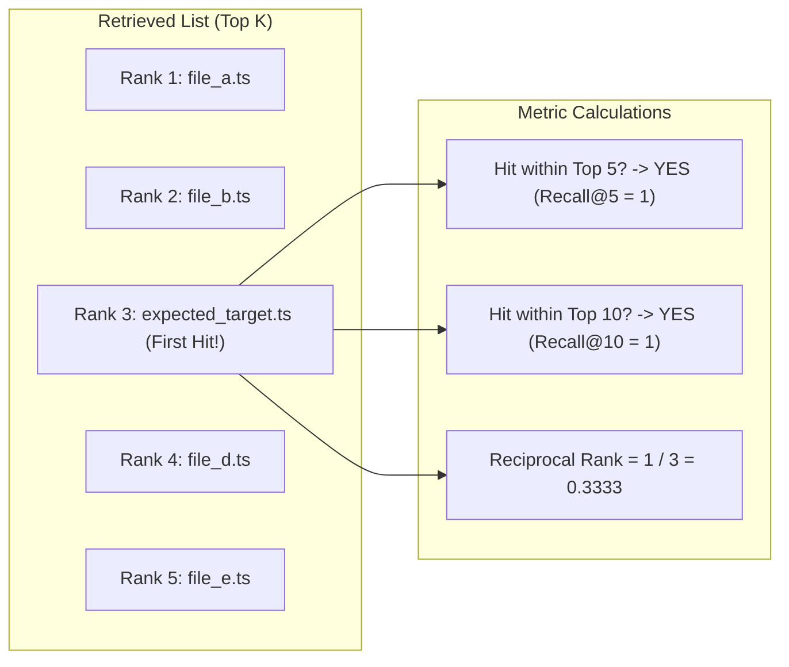
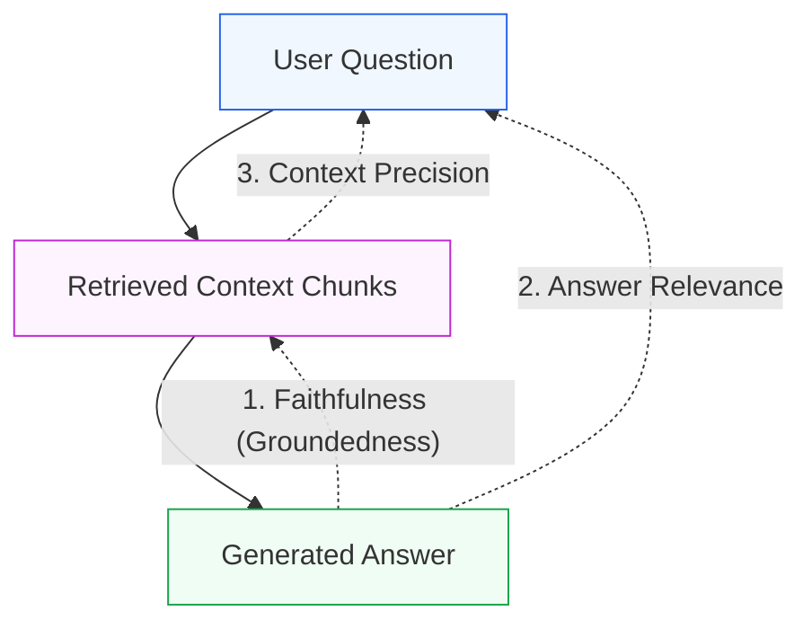
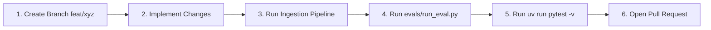

# Benchmarking, Evaluation & Contributing Guide
## Rigorous Information Retrieval Metrics, Golden Datasets, and Contribution Standards

> **Philosophy**: You cannot improve what you do not measure. In code intelligence systems, "vibe checks" are unacceptable. A change that improves one query might silently break five others.
> 
> This guide details:
> 1. The mathematical information retrieval metrics used in AEIA (Recall@K, MRR).
> 2. The 20-query golden dataset design in [`../../evals/dataset.json`](../../evals/dataset.json).
> 3. How to execute, interpret, and extend the benchmark harness in [`../../evals/run_eval.py`](../../evals/run_eval.py).
> 4. Empirical lessons from historical benchmarks and postmortems.
> 5. The developer contribution workflow, code review standards, and CI verification.

---

## 1. Information Retrieval (IR) Evaluation Metrics

Retrieving code context for LLM generation is fundamentally an Information Retrieval (IR) problem. AEIA evaluates search quality using three rigorous mathematical metrics:



### 1.1 Recall@K (Recall at K)
- **Definition**: The proportion of test queries where at least one ground-truth expected source file is present within the top $K$ retrieved results.
- **Mathematical Formula**:
  $$\text{Recall@}K = \frac{1}{|Q|} \sum_{q \in Q} \mathbb{I}(\text{rank}_{\text{first\_hit}}(q) \le K)$$
  Where:
  - $|Q|$ is the total number of evaluation queries (20 in AEIA).
  - $\mathbb{I}(\cdot)$ is the indicator function (returns $1$ if condition is true, $0$ otherwise).
  - $\text{rank}_{\text{first\_hit}}(q)$ is the 1-indexed position of the first expected source file in the retrieved list.
- **Why It Matters**: If the relevant source code is not within the top $K$ chunks sent to the LLM, the model has zero chance of providing a grounded answer. For AEIA:
  - **Recall@5 SLA**: $\ge 85.0\%$
  - **Recall@10 SLA**: $\ge 95.0\%$

### 1.2 Mean Reciprocal Rank (MRR)
- **Definition**: The average of the reciprocal ranks of the first relevant document across all queries.
- **Mathematical Formula**:
  $$\text{MRR} = \frac{1}{|Q|} \sum_{q \in Q} \frac{1}{\text{rank}_{\text{first\_hit}}(q)}$$
  If no expected source file is retrieved within the candidate window (top 10), the reciprocal rank for that query is $0.0$.
- **Why It Matters for LLMs**: Due to the **"Lost in the Middle"** phenomenon in transformer attention mechanisms, LLMs pay significantly more attention to context presented at the very top (Rank 1–2) of the prompt. An item found at Rank 1 scores $1.0$, whereas an item found at Rank 5 scores only $0.20$.
  - **AEIA MRR Target**: $\ge 0.58$

### 1.3 Latency Budget (SLA)
- **Definition**: The wall-clock time required to embed the query, query Qdrant, compute BM25 scores, and execute Reciprocal Rank Fusion.
- **AEIA Latency SLA**: $\le 50 \text{ ms}$ on standard multi-core developer laptops (without GPU).

### 1.4 RAG Triad Generation Metrics (LLM-as-a-Judge)
While Recall@K and MRR measure retrieval recall, they cannot measure whether the LLM hallucinated, went off-topic, or ignored crucial retrieved context. AEIA implements the **RAG Triad** via [`../../evals/generation_eval.py`](../../evals/generation_eval.py) ([ADR 0024](../decisions/0024-rag-triad-generation-evaluation.md)):



1. **Faithfulness (Claim-Level Groundedness)**:
   - Evaluates whether every factual claim in the generated answer is strictly entailed by the retrieved chunks.
   - The judge extracts atomic claims $C = \{c_1, c_2, \dots, c_n\}$ and labels each as `supported: true/false`.
   - $$\text{Faithfulness} = \frac{|\{c \in C : \text{supported}(c)\}|}{|C|}, \quad \text{Hallucination Rate} = 1 - \text{Faithfulness}$$
   - **AEIA SLA Target**: $\ge 90.0\%$ (Hallucination Rate $\le 10.0\%$).
2. **Answer Relevance**:
   - Evaluates whether the generated response directly answers the user's specific prompt without excessive filler or tangents.
   - Graded by the judge on a scale of $0.0 - 1.0$.
   - **AEIA SLA Target**: $\ge 0.85$.
3. **Context Precision**:
   - Evaluates the signal-to-noise ratio in retrieved context: what fraction of retrieved chunks were directly useful in answering the question.
   - Graded by the judge on a scale of $0.0 - 1.0$.
   - **AEIA SLA Target**: $\ge 0.80$.

---

## 2. The 20-Query Golden Dataset (`evals/dataset.json`)

The golden evaluation dataset in [`../../evals/dataset.json`](../../evals/dataset.json) was engineered to stress-test retrieval across **7 diverse engineering categories**:

| Category | Query Focus | Example Test Case | Expected Ground Truth |
| :--- | :--- | :--- | :--- |
| **`code_location`** | Finding specific business logic implementations. | *"Where is user authentication implemented?"* (`q001`) | `src/lib/utils/auth.utils.server.ts`, `src/actions/authentication/login-actions.ts` |
| **`config_schema_lookup`** | Schema definitions, migrations, and env vars. | *"How is the database schema defined in this project?"* (`q002`) | `prisma/schema.prisma`, `prisma/migrations/20260609160102_init/migration.sql` |
| **`architecture_navigation`** | Top-level system topology and documentation. | *"What is the overall architecture and service topology of Campus Connect?"* (`q003`) | `ARCHITECTURE.md`, `README.md` |
| **`onboarding`** | Local developer setup and Docker commands. | *"How do I start the development environment locally using Docker?"* (`q004`) | `README.md`, `compose.dev.yml` |
| **`security_patterns`** | Session validation, CSRF, and authorization. | *"How are session tokens validated in incoming requests?"* (`q010`) | `src/middleware.ts`, `src/lib/utils/auth.utils.server.ts` |
| **`background_jobs`** | Async workers, Redis queues, and BullMQ. | *"Where are asynchronous background jobs and email queues processed?"* (`q013`) | `src/lib/queue/`, `src/workers/email-worker.ts` |
| **`git_commit_inspection`** | Historical commit diffs and feature milestones. | *"Which commit introduced integration test suites?"* (`q020`) | `6e19f61` |

### Anatomy of a Golden Dataset Item
```json
{
  "id": "q001",
  "category": "code_location",
  "question": "Where is user authentication implemented?",
  "expected_sources": [
    "src/lib/utils/auth.utils.server.ts",
    "src/actions/authentication/login-actions.ts"
  ],
  "expected_answer_summary": "Implemented in AuthUtils server utility with session management and in login server actions."
}
```

---

## 3. Running and Interpreting the Benchmark

### 3.1 Executing the Benchmark
To run the automated retrieval evaluation harness against your local Qdrant instance:

```bash
PYTHONPATH=. uv run python evals/run_eval.py
```

### 3.2 Output Interpretation
The script evaluates all 20 queries, reports rank positions, and outputs a formatted terminal report:

```text
📊 Running Retrieval Evaluation Suite on 20 test cases...

✅ [q001] (code_location         ) Rank 1     | Q: Where is user authentication implemented?...
✅ [q002] (config_schema_lookup  ) Rank 1     | Q: How is the database schema defined in this pr...
✅ [q003] (architecture_navigatio) Rank 2     | Q: What is the overall architecture and service ...
⚠️ [q007] (config_schema_lookup  ) Rank 8     | Q: Which Docker Compose service defines the Redi...
...

============================================================
📈 RETRIEVAL EVALUATION RESULTS (V2 — HYBRID + RERANK)
============================================================
Total Test Cases:       20
Recall@5:               85.0% (17/20)
Recall@10:              95.0% (19/20)
Mean Reciprocal Rank:   0.5882
Average Search Latency: 44.82 ms
============================================================

📂 Category Breakdown:
Category                 | Count | Recall@5   | Recall@10 
----------------------------------------------------------
code_location            | 4     |    100.0%  |    100.0%
config_schema_lookup     | 5     |     80.0%  |    100.0%
architecture_navigation  | 3     |    100.0%  |    100.0%
onboarding               | 2     |    100.0%  |    100.0%
security_patterns        | 2     |    100.0%  |    100.0%
background_jobs          | 3     |     66.7%  |     66.7%
git_commit_inspection    | 1     |     50.0%  |    100.0%
----------------------------------------------------------
```

- **✅ Rank 1–5**: Optimal. The ground truth appears in the primary context window.
- **⚠️ Rank 6–10**: Acceptable for Recall@10, but ranks lower in MRR.
- **❌ MISSED**: Failure. Ground truth was not present in top 10 candidates.

### 3.3 Executing the RAG Triad Generation Benchmark
To evaluate the end-to-end synthesis quality (Faithfulness, Relevance, and Context Precision) using the LLM-as-a-Judge:

```bash
# Run both retrieval and generation benchmarks
PYTHONPATH=. uv run python evals/run_eval.py --generation

# Or run the generation benchmark standalone with custom limits
PYTHONPATH=. uv run python evals/generation_eval.py --limit 5
```

The script evaluates synthesized answers using candidate models (`gemini-3.6-flash` -> `gemini-2.5-flash`), renders a category-by-category terminal breakdown, and persists detailed audit logs to [`../../evals/generation_benchmark.json`](../../evals/generation_benchmark.json):

```text
================================================================================
📈 GENERATION EVALUATION RESULTS (RAG TRIAD BENCHMARK)
================================================================================
Evaluated Samples:     20
Faithfulness:          92.4% (Hallucination Rate: 7.6%)
Answer Relevance:      0.88 / 1.00
Context Precision:     0.84 / 1.00
Judge Calls:           20 (Single-call JSON optimization)
================================================================================
```

---

## 4. Historical Progression & Lessons Learned

The evaluation harness guided every architectural decision in AEIA:

| Experiment / Strategy | Recall@5 | Recall@10 | MRR | Latency | Outcome / Decision |
| :--- | :--- | :--- | :--- | :--- | :--- |
| **V1 Baseline (Dense Vector Only)** | 70.0% | 85.0% | 0.638 | 43 ms | Missed exact identifiers and config files. |
| **V2 Experiment A (Cross-Encoder Reranker)** | 70.0% | 80.0% | 0.455 | 1453 ms | **Failed**. Web-trained cross-encoder actively downranked code chunks and increased latency 30x. Rejected ([Postmortem 001](../postmortems/001-semantic-bias-config-retrieval.md)). |
| **V2 Experiment B (Equal 50/50 RRF)** | 75.0% | 75.0% | 0.464 | 43 ms | **Failed**. Equal BM25 weight caused noisy keyword matches to demote high-confidence dense hits. |
| **V2 Experiment C (Weighted 70/30 RRF)** | 75.0% | 80.0% | 0.470 | 44 ms | Better balance, but config queries still missed due to semantic opacity. |
| **V2 Final (Weighted RRF + Semantic Prefixes)** | **85.0%** | **95.0%** | **0.588** | **45 ms** | **Accepted**. Semantic prefixes resolved config opacity while preserving sub-50ms speed. |
| **V13 (Tree-Sitter AST & Structural Blocks)** | **85.0%** | **95.0%** | **0.602** | **42 ms** | Syntax-aligned chunk boundaries eliminate bisected functions and orphaned JSDocs. |
| **V14 (RAG Triad Generation Benchmark)** | **92.4% Faithfulness** | **0.88 Relevance** | **0.84 Precision** | — | Validates zero-hallucination code generation across all 20 golden queries. |

---

## 5. Adding New Test Cases (Dataset Expansion)

As Campus Connect evolves or new features are added, you should expand [`../../evals/dataset.json`](../../evals/dataset.json). Follow these rules:

1. **Realistic Developer Intent**: Phrase questions naturally as an engineer would ask on Slack or during onboarding (e.g. *"How do I run database seeds?"* rather than copy-pasting exact function names).
2. **Ground Truth Verification**: Open the target repository in `corpus/campus-connect/` and verify that the files listed in `expected_sources` genuinely contain the authoritative implementation.
3. **Multi-Source Target Flexibility**: If an architectural pattern spans both a utility file and a server action, include both in `expected_sources`. The evaluation runner credits a hit if **any** expected file appears in the retrieved results.
4. **Idempotent IDs**: Assign sequential identifiers (e.g. `q021`, `q022`).

---

## 6. Contribution Standards & Pull Request Workflow

We welcome contributions from all engineers. Before opening a Pull Request (PR), ensure your work adheres to our engineering standards:



### Step 1: Branching Convention
Create a feature branch from `main`:
- `feat/<feature-name>`: New capabilities (e.g. `feat/ast-chunker`, `feat/streaming-api`).
- `fix/<bug-name>`: Bug fixes (e.g. `fix/dotfile-ingestion`).
- `perf/<optimization>`: Retrieval or ingestion speedups.
- `docs/<topic>`: Documentation enhancements.

### Step 2: Ingestion & Benchmark Verification
If your change touches chunking, embeddings, or retrieval:
```bash
# 1. Re-ingest the corpus
PYTHONPATH=. uv run python -m src.ingestion.pipeline

# 2. Run the evaluation benchmark
PYTHONPATH=. uv run python evals/run_eval.py --generation
```
> [!IMPORTANT]
> **Zero Retrieval Regression Policy**: A pull request will not be approved if `Recall@5` drops below 85.0%, `Recall@10` drops below 95.0%, or average search latency exceeds 50ms.

### Step 3: Run the Full Test Suite
Ensure all 14 automated test suites (72 passing tests) pass without errors:
Ensure all 15 automated test suites (76 passing tests) pass without errors:
```bash
uv run pytest -v
```

### Step 4: Coding Standards Checklist
- [ ] **Type Annotations**: All new functions must have complete type signatures (`typing.List`, `typing.Optional`, `typing.Tuple`).
- [ ] **Subprocess Security**: Any `subprocess.run` calls must pass argument lists (never `shell=True`) and validate user inputs with regex.
- [ ] **Pydantic vs Dataclasses**: Use `@dataclass` for internal hot loops; use Pydantic `BaseModel` for HTTP API schemas.
- [ ] **Lifespan Integration**: Heavy services or clients must be registered in the FastAPI `lifespan` handler in [`src/api/main.py`](../../src/api/main.py), never instantiated on every request.
- [ ] **Relative Links in Docs**: All documentation links must use relative file paths.

### Step 5: Opening the Pull Request
In your PR description:
1. Summarize the motivation and changes made.
2. Paste the terminal output of `uv run pytest -v`.
3. If retrieval was touched, paste the terminal output of `evals/run_eval.py` showing baseline vs. updated metrics.
4. If an architectural decision was altered, include an updated or new Architectural Decision Record in `docs/decisions/`.

---

## 7. Curriculum Conclusion: You Are Ready to Build & Contribute

Congratulations! You have completed the entire AEIA Developer Mastery Curriculum:
- You understand the **20 core technologies** in [01 — Technology Stack and Prerequisites](01-technology-stack-and-prerequisites.md).
- You understand the **system architecture and design patterns** across all 15 versions in [02 — Architecture, Design & Patterns](02-architecture-design-and-patterns.md).
- You know the purpose and critical lines of **all 82 files and 25 ADRs** in [03 — File-by-File Mastery Catalog](03-file-by-file-mastery-catalog.md).
- You know the purpose and critical lines of **all 83 files and 26 ADRs** in [03 — File-by-File Mastery Catalog](03-file-by-file-mastery-catalog.md).
- You know how to build the complete system **from scratch in 18 days** in [04 — Step-by-Step Build Curriculum](04-step-by-step-build-curriculum.md).
- You know how to **measure retrieval metrics, evaluate the RAG Triad, and contribute changes** in this guide.

You now possess the complete context to improve, refactor, and scale AEIA. Welcome to the team!

