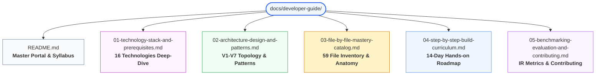
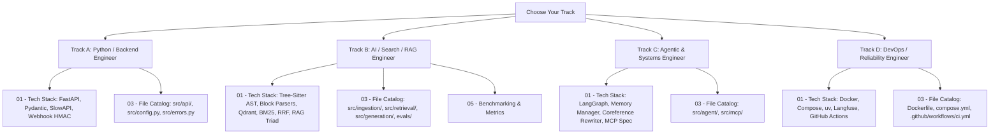

# AEIA Developer Mastery & Onboarding Curriculum
## The Complete Engineering Guide to Building, Understanding, and Extending AEIA

> **Mission**: This curriculum provides a complete, line-by-line understanding of the **AI Engineering Intelligence Assistant (AEIA)** codebase. By completing this guide, any software engineer will possess the exact theoretical knowledge, hands-on experience, and architectural intuition required to build this system from scratch, reason about every design decision, and contribute production-grade improvements.

---

## 1. System Overview: What is AEIA?

**AEIA (AI Engineering Intelligence Assistant)** is an industrial-grade, grounded code intelligence and agentic reasoning system designed to analyze and answer engineering queries about the **Campus Connect** repository (~94k lines of TypeScript, Prisma schemas, SQL migrations, Docker configs, and documentation).

Unlike generic chatbots or naive vector search demos, AEIA solves the fundamental challenges of **Codebase RAG (Retrieval-Augmented Generation)**:
1. **Multi-Format Syntax-Aware Chunking**: Plain text splitters slice through function bodies, interfaces, and Docker configs. AEIA uses **Tree-Sitter AST parsing** for TypeScript/TSX (preserving functions, classes, interfaces, and leading JSDocs) and **Structural Block Parsers** for Prisma schemas, YAML (Compose/Actions), Markdown heading hierarchies, and SQL DDL transactions ([ADR 0005](../decisions/0005-code-aware-chunking-strategy.md), [ADR 0023](../decisions/0023-multi-format-syntax-aware-chunking.md)).
2. **Semantic Opacity in Code & Configs**: Plain embedding models fail on YAML service definitions, SQL DDL, and environment variables. AEIA introduces **Semantic Prefix Enrichment** to bridge the natural-language to syntax gap ([ADR 0012](../decisions/0012-v2-hybrid-retrieval-and-semantic-prefixing.md)).
3. **Precision vs. Recall**: Code retrieval requires both exact keyword matching (function signatures, variable names) and conceptual semantic matching ("user authentication flow"). AEIA implements **Hybrid Retrieval** fusing dense vectors (BGE-small) with sparse lexical search (BM25Okapi) via **Weighted Reciprocal Rank Fusion (RRF 70/30)** ([ADR 0012](../decisions/0012-v2-hybrid-retrieval-and-semantic-prefixing.md)).
4. **Strict Grounding & Zero Hallucination**: AI responses cite exact source locations using `[filepath#Lstart-Lend]` line numbers ([ADR 0007](../decisions/0007-grounded-retrieval-and-citations.md)).
5. **Beyond RAG (Agentic Reasoning)**: Queries about git history, commit diffs, or reverse module dependencies cannot be answered by vector search alone. AEIA employs a **LangGraph State Machine** with a **Fast Regex + LLM Router** that dispatches queries to specialized deterministic tools ([ADR 0015](../decisions/0015-v5-agentic-router-langgraph.md)).
6. **Multi-Turn Conversational Memory & Coreference Rewriting**: Supports persistent multi-turn chat sessions with a thread-safe sliding window (`max_turns=5`) and an automated **Coreference Query Rewriter** that resolves follow-up pronouns (e.g. "what does it do?") into self-contained retrieval queries ([ADR 0025](../decisions/0025-conversational-memory-and-coreference-rewriter.md)).
7. **Decoupled Next.js Web Console**: Modern Next.js 16 / React 19 web console with real-time SSE streaming, interactive code modal inspector, client-side Gemini API key injection, quota resilience alerts, and route telemetry ([ADR 0028](../decisions/0028-decoupled-nextjs-frontend-console.md), superseding [ADR 0022](../decisions/0022-interactive-web-playground-ui.md)).
8. **Automated RAG Triad Generation Evaluation Suite**: Built-in LLM-as-a-Judge benchmark evaluating Faithfulness (claim-level hallucination rate), Answer Relevance, and Context Precision in a single structured JSON call ([ADR 0024](../decisions/0024-rag-triad-generation-evaluation.md)).
9. **Automated Git Sync & Webhook Ingestion**: Live repository synchronization, deterministic point ID delta upserts, and GitHub push webhook automation with HMAC-SHA256 signature verification ([ADR 0019](../decisions/0019-git-corpus-sync-and-diff-tracking.md)–[ADR 0021](../decisions/0021-github-push-webhook-automation.md)).
10. **Standardized Tool Protocol & Production Hardening**: Official **Model Context Protocol (MCP)** server (2026-07-28 stateless HTTP and stdio specifications) alongside API key security, client rate limiting (`slowapi`), and upstream LLM quota degradation ([ADR 0013](../decisions/0013-v3-production-hardening.md), [ADR 0016](../decisions/0016-v6-model-context-protocol-server.md), [ADR 0017](../decisions/0017-error-handling-and-upstream-degradation.md)).
11. **Client-Side Dynamic API Key Injection & Quota Resilience**: Per-request client Gemini API keys, local browser storage, and auto-retry countdown alerts avoiding shared server quota exhaustion ([ADR 0029](../decisions/0029-client-side-api-key-injection-and-quota-resilience.md)).
12. **Unified SSE Streaming Protocol**: Single universal streaming endpoint routing across hybrid RAG and deterministic Git/AST agent tools with immediate citation streaming ([ADR 0030](../decisions/0030-unified-sse-streaming-protocol-for-rag-and-agent.md)).
13. **Modern Python 3.12+ Standards & Ingestion Progress**: Codebase-wide PEP 585/604 type standardization, `tqdm` progress tracking for ingestion batches, and Qdrant Cloud API key authentication ([ADR 0031](../decisions/0031-codebase-type-modernization-and-ingestion-telemetry.md)).

---

## 2. Curriculum Architecture & Document Roadmap

This onboarding curriculum is organized into modular, deep-dive documents. Read them sequentially or navigate directly to your area of focus:



### Document Summary

| Document | Purpose | Key Question Answered |
| :--- | :--- | :--- |
| [**01 — Technology Stack & Prerequisites**](01-technology-stack-and-prerequisites.md) | Comprehensive reference for all core technologies, tools, libraries, algorithms, and theoretical concepts used in AEIA. | *"What technologies do I need to learn, and what hands-on exercises should I build first?"* |
| [**02 — Architecture, Design & Patterns**](02-architecture-design-and-patterns.md) | Deep exploration of the architectural versions, software patterns, data flows, and error mitigation strategies. | *"How do the components connect together, and why was the system designed this way?"* |
| [**03 — File-by-File Mastery Catalog**](03-file-by-file-mastery-catalog.md) | Comprehensive line-by-line inspection of all repository files, test suites, and 31 ADRs. | *"What does this line do, why is it here, and how do I safely edit or improve this file?"* |
| [**04 — Step-by-Step Build Curriculum**](04-step-by-step-build-curriculum.md) | Structured 18-day interactive learning roadmap with concrete coding exercises from blank slate to production. | *"How do I build this entire system on my own from scratch?"* |
| [**05 — Benchmarking, Evaluation & Contributing**](05-benchmarking-evaluation-and-contributing.md) | Explains retrieval metrics (Recall@K, MRR), the RAG Triad generation evaluation suite, CI automation, and contribution rules. | *"How do I verify my changes without regressing retrieval or generation performance?"* |

---

## 3. Tailored Learning Tracks (Developer Archetypes)

Depending on your engineering background, select the recommended path below to ramp up efficiently:



### Track A: The Python & API Backend Engineer
- **Goal**: Understand the service interface, concurrency, dependency injection, and security.
- **Priority Reading**:
  1. Read [01 — Tech Stack](01-technology-stack-and-prerequisites.md) sections on **Python 3.12+**, **FastAPI**, **Pydantic V2**, **SlowAPI**, and **HMAC Webhook Auth**.
  2. Read [02 — Architecture](02-architecture-design-and-patterns.md) on **Lifespan Management**, **Dual-Content Negotiation**, and **Typed Exceptions**.
  3. Study [03 — File Catalog](03-file-by-file-mastery-catalog.md) entries for [`src/api/main.py`](../../src/api/main.py), [`src/api/tasks.py`](../../src/api/tasks.py), [`src/api/webhook.py`](../../src/api/webhook.py), [`src/config.py`](../../src/config.py), and [`src/errors.py`](../../src/errors.py).
  4. Run tests: `uv run pytest tests/test_api.py tests/test_ui.py tests/test_incremental_ingestion.py tests/test_error_handling.py -v`.

### Track B: The AI, Search & Information Retrieval Engineer
- **Goal**: Master the RAG pipeline, Tree-Sitter AST parsing, structural block parsers, dense embeddings, BM25 Okapi, RRF ranking, LLM synthesis, and RAG Triad evaluations.
- **Priority Reading**:
  1. Read [01 — Tech Stack](01-technology-stack-and-prerequisites.md) sections on **Tree-Sitter AST**, **Block Grammars**, **Qdrant**, **FastEmbed / BGE-small**, **BM25**, **Weighted RRF**, **Google GenAI**, and **RAG Triad LLM-as-a-Judge**.
  2. Read [02 — Architecture](02-architecture-design-and-patterns.md) on **Multi-Format Chunking**, **Hybrid Retrieval Strategy**, and **Semantic Prefix Injection**.
  3. Read Postmortem [`docs/postmortems/001-semantic-bias-config-retrieval.md`](../postmortems/001-semantic-bias-config-retrieval.md).
  4. Study [03 — File Catalog](03-file-by-file-mastery-catalog.md) entries for [`src/ingestion/chunker.py`](../../src/ingestion/chunker.py), [`src/ingestion/ast_chunker.py`](../../src/ingestion/ast_chunker.py), [`src/ingestion/block_parsers.py`](../../src/ingestion/block_parsers.py), [`src/ingestion/pipeline.py`](../../src/ingestion/pipeline.py), [`src/retrieval/retriever.py`](../../src/retrieval/retriever.py), [`src/generation/generator.py`](../../src/generation/generator.py), and [`evals/generation_eval.py`](../../evals/generation_eval.py).
  5. Run benchmarks: `uv run python evals/run_eval.py --generation`.

### Track C: The Agentic Systems & Protocol Engineer
- **Goal**: Understand state graph routing, tool dispatch, multi-turn conversational session memory, coreference query rewriting, and Model Context Protocol (MCP) integrations.
- **Priority Reading**:
  1. Read [01 — Tech Stack](01-technology-stack-and-prerequisites.md) sections on **LangGraph**, **Conversational Memory**, **Coreference Rewriting**, and **Model Context Protocol (MCP)**.
  2. Read [02 — Architecture](02-architecture-design-and-patterns.md) on the **Agentic Router State Machine**, **Session Sliding Window**, and **Stateless HTTP MCP Mounting**.
  3. Study [03 — File Catalog](03-file-by-file-mastery-catalog.md) entries for [`src/agent/state.py`](../../src/agent/state.py), [`src/agent/tools.py`](../../src/agent/tools.py), [`src/agent/router.py`](../../src/agent/router.py), [`src/agent/graph.py`](../../src/agent/graph.py), [`src/agent/memory.py`](../../src/agent/memory.py), and [`src/mcp/server.py`](../../src/mcp/server.py).
  4. Run tests: `uv run pytest tests/test_agent_router.py tests/test_agent_tools.py tests/test_agent_api.py tests/test_memory.py tests/test_mcp_protocol.py tests/test_mcp_tools.py -v`.

### Track D: The Platform, DevOps & Reliability Engineer
- **Goal**: Master local container topology, production packaging, GitHub Actions CI, live git synchronization, and observability.
- **Priority Reading**:
  1. Read [01 — Tech Stack](01-technology-stack-and-prerequisites.md) sections on **uv**, **Docker / Compose**, **Langfuse**, and **GitHub Actions**.
  2. Study [03 — File Catalog](03-file-by-file-mastery-catalog.md) entries for [`Dockerfile`](../../Dockerfile), [`compose.yml`](../../compose.yml), [`.github/workflows/ci.yml`](../../.github/workflows/ci.yml), [`src/ingestion/git_sync.py`](../../src/ingestion/git_sync.py), and [`src/observability/__init__.py`](../../src/observability/__init__.py).
  3. Run full test suite: `uv run pytest -v`.

---

## 4. Repository Quick-Reference Map

Every file in the repository serves a distinct operational purpose. Below is the master blueprint:

```mermaid
flowchart TD
    Root["<b>aeia/ (Root Workspace)</b>"]

    Root --> Cfg["<b>Root Config & Entrypoints</b><br/><code>pyproject.toml, uv.lock, Dockerfile, compose.yml, main.py</code>"]
    Root --> CI["<b>CI/CD Automation</b><br/><code>.github/workflows/ci.yml</code>"]
    Root --> Src["<b>Application Core (src/)</b>"]
    Root --> Evals["<b>Evaluations (evals/)</b><br/><code>dataset.json, run_eval.py, generation_eval.py</code>"]
    Root --> Tests["<b>Test Suites (tests/)</b><br/><code>14 test modules (72 automated unit & integration tests)</code>"]
    Root --> Docs["<b>Documentation (docs/)</b><br/><code>decisions/ (25 ADRs), postmortems/, developer-guide/</code>"]
    Root --> Tests["<b>Test Suites (tests/)</b><br/><code>15 test modules (76 automated unit & integration tests)</code>"]
    Root --> Docs["<b>Documentation (docs/)</b><br/><code>decisions/ (26 ADRs), postmortems/, developer-guide/</code>"]
    Root --> Corpus["<b>Target Corpus (corpus/)</b><br/><code>campus-connect (~94k LOC full-stack app)</code>"]

    Src --> S_Ingest["<code>ingestion/</code><br/><i>chunker.py, ast_chunker.py, block_parsers.py, pipeline.py, git_sync.py</i>"]
    Src --> S_Ret["<code>retrieval/</code><br/><i>retriever.py (Hybrid RRF 70/30)</i>"]
    Src --> S_Gen["<code>generation/</code><br/><i>generator.py (Gemini 2.5 Flash / 3.6 Flash)</i>"]
    Src --> S_Agent["<code>agent/</code><br/><i>state.py, router.py, tools.py, graph.py, memory.py</i>"]
    Src --> S_Mcp["<code>mcp/</code><br/><i>server.py (2026-07-28 HTTP & Stdio)</i>"]
    Src --> S_Api["<code>api/</code><br/><i>main.py, tasks.py, webhook.py, static/index.html (UI)</i>"]
    Src --> S_Obs["<code>observability/</code><br/><i>Langfuse spans & latency</i>"]
    Src --> S_Base["<code>src/</code> Base<br/><i>config.py, errors.py</i>"]

    style Root fill:#f0f7ff,stroke:#2563eb,stroke-width:2px
    style Src fill:#fdf4ff,stroke:#c026d3,stroke-width:2px
    style Corpus fill:#f0fdf4,stroke:#16a34a,stroke-width:2px
    style Docs fill:#fef3c7,stroke:#d97706,stroke-width:2px
    style Tests fill:#eff6ff,stroke:#3b82f6,stroke-width:1px
    style Evals fill:#faf5ff,stroke:#a855f7,stroke-width:1px
```



---

## 5. Development Environment Setup

To begin working with AEIA, run the following commands in your shell:

### Step 1: Install `uv` (Fast Python Package Manager)
```bash
# Linux / macOS
curl -LsSf https://astral.sh/uv/install.sh | sh
```

### Step 2: Clone and Synchronize Virtual Environment
```bash
cd /home/krotrn/coding/aeia

# uv sync creates the virtual environment and installs all dependencies exactly as locked in uv.lock
uv sync --dev
```

### Step 3: Configure Environment Variables
Create or verify your `.env` file at the repository root:
```ini
# Required for Gemini answer generation (Free tier key from https://aistudio.google.com/)
GEMINI_API_KEY="your_api_key_here"

# Qdrant vector database URL
QDRANT_URL="http://localhost:6333"
COLLECTION_NAME="campus_connect"

# Authentication & Rate Limiting
API_KEY="dev-key-change-me"
RATE_LIMIT="20/minute"

# Optional: Langfuse tracing (leave empty to disable)
LANGFUSE_PUBLIC_KEY=""
LANGFUSE_SECRET_KEY=""
LANGFUSE_HOST="https://cloud.langfuse.com"
```

### Step 4: Start Qdrant and Ingest Corpus
```bash
# Start Qdrant container in background
docker compose up -d qdrant

# Ingest corpus (chunks codebase, embeds with FastEmbed, uploads to Qdrant)
PYTHONPATH=. uv run python -m src.ingestion.pipeline
```

### Step 5: Run the API Server & Verification Tests
```bash
# Start FastAPI development server with hot reload
PYTHONPATH=. uv run uvicorn src.api.main:app --reload --port 8000

# In a separate terminal, run the automated test suite:
uv run pytest -v

# Run the retrieval benchmark:
uv run python evals/run_eval.py
```

---

## 6. Next Steps

Proceed immediately to **[01 — Technology Stack and Prerequisites](01-technology-stack-and-prerequisites.md)** to begin learning the exact technologies, mathematical concepts, and engineering patterns required to master this system.

